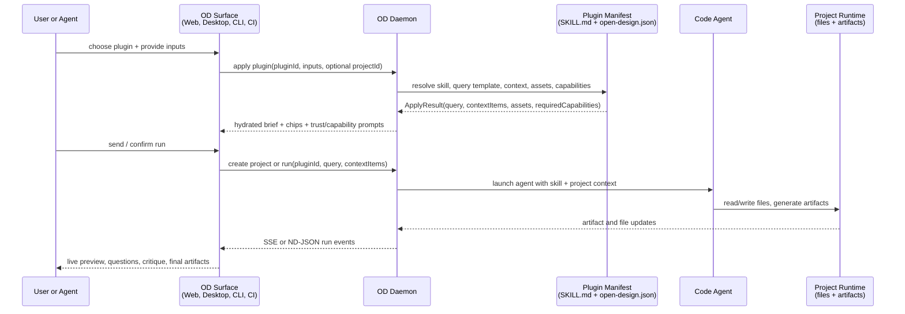
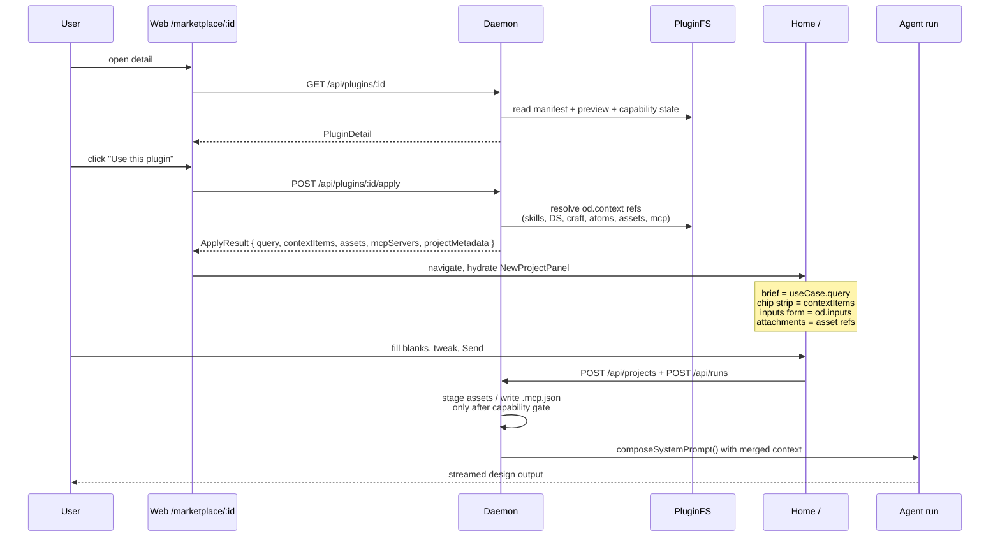
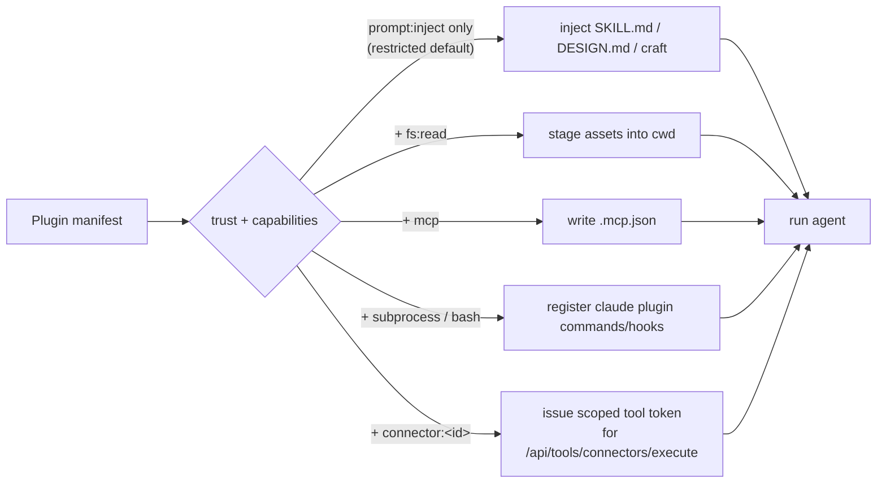

# Open Design Plugin & Marketplace Spec (v1)

> **In one sentence:** Open Design plugins turn portable `SKILL.md` capabilities into marketplace-ready, one-click design workflows while preserving compatibility with existing agent skill catalogs, headless CLI use, and self-hosted deployment.

**Parent:** [`spec.md`](spec.md) · **Siblings:** [`skills-protocol.md`](skills-protocol.md) · [`architecture.md`](architecture.md) · [`agent-adapters.md`](agent-adapters.md) · [`modes.md`](modes.md)

A **Plugin** is the unit of distribution for Open Design. Where a [Skill](skills-protocol.md) describes a single capability that an agent can run, a Plugin is the shippable bundle around it: one or more skills, an optional design system reference, optional craft rules, optional Claude-plugin assets, a preview, a use-case query, an asset folder, and a small machine-readable sidecar that powers OD's marketplace surface. A plugin is always anchored to a portable `SKILL.md` so it is publishable to every existing skill catalog without modification.

> **Compatibility promise (extends [`skills-protocol.md`](skills-protocol.md)):** Any plugin folder that ships a `SKILL.md` works as a plain agent skill in Claude Code, Cursor, Codex, Gemini CLI, OpenClaw, Hermes, etc. Adding `open-design.json` is purely additive — it unlocks OD's marketplace card, preview, one-click "use" flow, and typed context-chip strip, but it never changes how the underlying skill runs. **One repo, two consumption modes.**

## Executive map for readers

This is an **agent-era plugin system**, not a Figma-era UI extension system. A plugin does not directly mount inside the canvas, own a local panel lifecycle, or talk to the app through bespoke `postMessage` / RPC channels. Instead, the plugin is a packaged intent and context layer that the user, UI, CLI, or another agent can select; OD resolves it into a query, context chips, assets, design-system references, MCP/tool capabilities, and run metadata; then the selected code agent consumes that package through the same project/run pipeline as any other OD task.

The shortest mental model:

1. **Plugin author ships portable capability.** `SKILL.md` remains the executable agent contract; `open-design.json` adds OD marketplace metadata, input fields, defaults, previews, and context wiring.
2. **User or agent picks a workflow.** The selection can happen from the marketplace, inline in the home input, inside an existing project chat, from CLI, or from CI.
3. **OD applies the plugin without making the plugin a UI process.** Apply returns a hydrated brief, typed context chips, assets, and capability requirements. It does not start a hidden plugin runtime.
4. **Agent drives generation.** The daemon creates or updates a project, starts a run, streams events over SSE / CLI ND-JSON, and records artifacts.
5. **UI is a collaboration surface.** The web/desktop UI can show forms, previews, direction pickers, critique panels, and live artifacts, but the same flow must work headlessly through `od`.

### Figma-era vs agent-era boundary

| Question | Figma-era plugin assumption | Open Design v1 answer |
| --- | --- | --- |
| Who consumes the plugin? | The host UI runtime. | A code agent through OD's project/run pipeline. |
| Does the plugin need a live UI lifecycle? | Usually yes: mount panel, listen to messages, mutate document. | No. The plugin is static files plus manifest; the agent run is the active process. |
| Is there a plugin-to-app RPC protocol? | Often yes. | Not as the primary contract. OD uses HTTP internally, CLI for agents, MCP where useful, and SSE/ND-JSON for run events. |
| What does "Use plugin" do? | Opens or runs a UI extension. | Hydrates a query, context chips, assets, inputs, and capability gates, then starts or continues an agent run. |
| What is persisted? | Host document mutations. | OD project metadata, artifacts, conversation/run history, and plugin provenance. |

### Core interaction sequence



### Mode-specific query examples

| Mode | Entry | Example query | What the plugin contributes |
| --- | --- | --- | --- |
| Marketplace detail | User clicks **Use** on a plugin page | `Make a 12-slide investor deck for a Series A SaaS startup targeting enterprise design teams.` | Deck skill, slide craft rules, example assets, required inputs, preview samples. |
| Home inline input | User types a brief, then picks a suggested plugin | `Create a landing page for a new AI browser extension, use a dark neon visual direction.` | Landing-page skill, suggested design system, prompt rewrite, starter assets. |
| Project chat follow-up | User is already inside a generated project | `Turn this landing page into a launch announcement deck.` | Existing project context, selected artifact refs, deck conversion skill, preserved brand tokens. |
| Headless CLI / code agent | Claude Code, Cursor, Codex, CI, or script shells out to `od` | `od run create --plugin make-a-deck --input audience=investors --input topic='AI design ops'` | Same manifest resolution, same context chips, same run events without opening desktop. |
| Self-hosted marketplace | Team runs a private catalog | `Create an internal QBR deck using the Acme design system and sales metrics CSV.` | Private plugin index, trusted internal design system, asset attachments, restricted data policy. |

The important product shift: **plugins are not local UI addons; they are reusable agent workflows.** UI components can collaborate with those workflows, but consumption and processing belong to the agent run.

### One-click long-task delivery, atomic pipelines, and devloop

OD's core unit is not "one prompt, one output" — it is a **long-running design agent task**: a single run typically spans discovery → direction picking → generation → critique → secondary refinement, sometimes lasting tens of minutes to hours. A plugin's job is to **slice that long-running task into a shippable unit** that a user, UI, CLI, or another agent can launch with one click.

Concretely, this spec promotes the existing "first-party atoms" from a flat capability list into an **atomic pipeline that plugins assemble**:

- **Atom (§10):** a named capability exposed by the OD daemon and first-party tools (discovery-question-form, direction-picker, todo-write, file-read/write, research-search, media-image, live-artifact, critique-theater, etc.).
- **Pipeline (§5 / §10.1):** the plugin uses `od.pipeline` to compose atoms into ordered stages. The spec ships a default reference pipeline of `discovery → plan → generate → critique`; plugins can add, reorder, or loop over any stage.
- **Devloop (§10.2):** when a stage is marked `repeat: true` with an `until` termination condition (critique score, user confirmation, preview load success, etc.), the agent automatically iterates on the previous artifact until the condition holds or the user explicitly cancels.
- **Generative UI (§10.3):** when a stage needs human-in-the-loop input (information, authorization, direction picking, optimization confirmation), the agent triggers a surface that the plugin **declares ahead of time** in its manifest's `od.genui.surfaces[]`. The daemon broadcasts the request through an AG-UI–compatible event stream so every collaboration surface (web / desktop / CLI / other code agent) can render it. Once the user answers, the daemon writes the answer back to the project; the surface's `persist` field decides whether the answer is remembered at run / conversation / project tier so that multi-turn chats do not pester the user with the same question twice.

In one sentence: **a plugin describes "what this long-running task's pipeline looks like and which GenUI surfaces it needs to collaborate with the user", the daemon supplies atoms and the surface bus, the agent runs a devloop on the pipeline, and artifacts carry provenance (§11.5) recording every plugin that touched the task.**

### Four product scenarios

| Scenario (`od.taskKind`) | User entry point | Plugin contribution | Typical atom sequence |
| --- | --- | --- | --- |
| `new-generation` | A one-line brief or a marketplace pick | Workflow + design-system suggestion + craft + starter assets | discovery → direction-picker → generate → critique |
| `code-migration` | An existing repo / local path | Source-code ingest atom + design-token extraction + rewrite plan + diff preview | code-import → design-extract → rewrite-plan → generate → diff-review |
| `figma-migration` | Figma file URL / screenshots | figma-extract atom + token mapping + high-fidelity web implementation strategy | figma-extract → token-map → generate → critique |
| `tune-collab` | An existing OD project + artifact | Critique-tune, brand swap, A/B variants, stakeholder review on top of an existing artifact | direction-picker → patch-edit → critique → handoff |

All four scenarios share the same `ApplyResult`, the same run pipeline, and the same artifact provenance contract (§11.5); only the inputs shape, the initial assets, and the pipeline starting point differ.

---

## Table of contents

0. [Status](#0-status)
1. [Vision](#1-vision)
2. [Goals and non-goals](#2-goals-and-non-goals)
3. [Compatibility matrix](#3-compatibility-matrix--what-makes-a-folder-a-valid-plugin-for-whom)
4. [Plugin folder shape](#4-plugin-folder-shape)
5. [`open-design.json` schema](#5-open-designjson--schema-v1)
6. [`open-design-marketplace.json` schema](#6-open-design-marketplacejson--federated-catalog)
7. [Discovery and install](#7-discovery-and-install)
8. [The Apply pipeline](#8-the-apply-pipeline)
9. [Trust and capabilities](#9-trust-and-capabilities)
10. [First-party atoms](#10-first-party-atoms--open-designs-atomic-capabilities)
11. [Architecture — what changes in the existing repo](#11-architecture--what-changes-in-the-existing-repo)
12. [CLI surface](#12-cli-surface)
13. [Public web surface](#13-public-web-surface-open-designaimarketplace)
14. [Publishing and catalog distribution](#14-publishing-and-catalog-distribution)
15. [Deployment and portability — Docker, any cloud](#15-deployment-and-portability--docker-any-cloud)
16. [Phased implementation plan](#16-phased-implementation-plan)
17. [Examples](#17-examples)
18. [Risks and open questions](#18-risks-and-open-questions)
19. [Why this is a meaningful step for Open Design](#19-why-this-is-a-meaningful-step-for-open-design)

---

## 0. Status

- Authoring stage: draft, awaiting review.
- Defaults locked from the planning round (overridable in review):
  - **Compatibility = wrap-then-extend.** Existing `SKILL.md` and `.claude-plugin/plugin.json` repos run as-is; `open-design.json` is an additive sidecar.
  - **Trust = tiered and provenance-aware.** Bundled plugins and official-marketplace plugins are `trusted` by default; user-added third-party marketplaces, arbitrary GitHub / URL / local plugins start `restricted` unless the marketplace or plugin is explicitly trusted.

## 1. Vision

Open Design becomes a **server + CLI + atomic core engine + plugin/marketplace system**. The product surface inverts: instead of "click a button, fill a form", users open a marketplace, click a plugin, and the input box hydrates with a query plus a typed strip of context chips above it. The same plugin folder is also a valid agent skill for Claude Code, Cursor, Codex, Gemini CLI, OpenClaw, Hermes, and is publishable as a standalone GitHub repo to:

- [`anthropics/skills`](https://github.com/anthropics/skills)
- [`anthropics/claude-code/plugins`](https://github.com/anthropics/claude-code/tree/main/plugins)
- [`VoltAgent/awesome-agent-skills`](https://github.com/VoltAgent/awesome-agent-skills)
- [`openclaw/clawhub`](https://github.com/openclaw/clawhub)
- [`skills.sh`](https://skills.sh/)

Each catalog needs a different listing format, but all of them index `SKILL.md`-shaped folders. By keeping `SKILL.md` canonical and `open-design.json` strictly sidecar, a single repo lands in every catalog without per-target rewrites.

A second axis of the same vision: **the CLI is the canonical agent-facing API for Open Design.** Code agents (Claude Code, Cursor, Codex, OpenClaw, Hermes, in-house orchestrators) drive OD by shelling out `od …`, not by hitting `/api/*` directly. The CLI wraps every server capability — project creation, conversation/run lifecycle, plugin apply, file system operations on a project, design library introspection, daemon control — behind a stable subcommand contract. The HTTP server is an implementation detail that backs the desktop UI and the CLI itself; agents that talk HTTP are bypassing the contract.

A third axis, derived from the second: **OD runs fully headless; the UI is a productivity layer, not a runtime dependency.** A user with nothing but Claude Code (or Cursor, Codex, Gemini CLI) and `od` installed can browse the marketplace, install a plugin, create a project, run a task, and consume the produced artifacts end-to-end without ever launching the desktop app. The desktop UI is exactly the same value-add Cursor's IDE adds on top of `cursor-agent` CLI: faster discovery, live artifact preview, chat/canvas side-by-side, marketplace browsing, direction-picker GUI, critique-theater panel — all sugar on the same primitives. Every UI feature is implementable as a CLI subcommand or a streaming event first; the UI consumes those primitives and adds presentation. The decoupling is enforced architecturally (§11.7).

A fourth axis, the foundation for ecosystem reach and commercial viability: **OD is one Docker image, deployable to any cloud.** Because the headless mode of (3) has no electron and no GUI dependencies, a single multi-arch container image (`linux/amd64` + `linux/arm64`) brings up the full daemon + CLI + web UI on AWS, Google Cloud, Azure, Alibaba, Tencent, Huawei, or any self-hosted Kubernetes / docker-compose / k3s setup, with no per-cloud rewrite. Self-hosted enterprises can run a private marketplace; partners can embed OD inside their stack; CI pipelines can spin up ephemeral OD containers for "generate slides for the daily report"-shaped tasks. The technical contract is in §15.

A fifth axis is the product-shape co-evolution with the agent: **UI is dynamically generated by the agent (Generative UI), not just developer-prewritten static components.** While running a long-horizon design pipeline, the agent will need to ask the user for information (figma OAuth, target-audience confirmation, etc.), seek authorization (approving an expensive media generation run), pick a direction (one of three critique alternatives), or fill missing content (a missing brand asset). These UIs are **not** pre-shipped marketplace chip strips; they are **declared by the plugin** in its manifest, **triggered by the agent** during the run, and **published by the daemon** through an AG-UI–compatible event stream that any collaboration surface (web / desktop / CLI / other code agent) can render (see §10.3). OD v1 ships four built-in surface kinds (`form` / `choice` / `confirmation` / `oauth-prompt`) as the minimum set; Phase 4 adds plugin-bundled React components and full wire-format alignment with the [AG-UI protocol](https://github.com/CopilotKit/CopilotKit). Tied to this axis, the project record persists a layer of **GenUI surface state**: an authorization or confirmation the user once gave is reused across multi-turn conversations and runs in the same project, instead of re-asking. This is the natural landing point of "plugin = long-horizon task wrapper" plus "project = long-lived work artifact".

## 2. Goals and non-goals

**Goals**

1. Every runnable, distributable OD plugin is a valid agent skill (`SKILL.md`- or `.claude-plugin/plugin.json`-anchored). No fork of the skill spec.
2. A vanilla skill or claude-plugin repo becomes an OD plugin by adding an optional `open-design.json` sidecar — no rename, no body changes.
3. Three install sources: local folder, GitHub repo (with optional ref/subpath), arbitrary HTTPS archive, plus federated `open-design-marketplace.json` indexes.
4. One-click "use" auto-fills the brief input and a strip of `ContextItem` chips above it (skills, design-system, craft, assets, MCP, claude-plugin, atom).
5. Tiered trust by default; capability scoping is declarative and optional.
6. The OD core engine, atomic capabilities, and plugin runtime are all reachable from CLI so any code agent can drive Open Design headlessly.
7. **A plugin is a long-task wrapper.** Each plugin targets exactly one of the four product scenarios (new-generation / code-migration / figma-migration / tune-collab) and uses `od.pipeline` to assemble OD's first-party atoms into ordered stages plus an optional devloop (§10).
8. **Reproducible + auditable.** Every apply persists an immutable `AppliedPluginSnapshot` (§8.2.1); runs and artifacts back-reference the snapshot id. A plugin upgrade never breaks an old run's prompt reconstruction.
9. **Same artifact, many surfaces.** The artifact manifest (§11.5.1) records plugin provenance plus the export and deploy history across downstream surfaces (cli / other code agents / cloud / desktop) so subsequent tuning, migration, and collaboration always pick up the same artifact.
10. **Generative UI is a first-class plugin output.** Plugins declare `od.genui.surfaces[]` (§10.3) in the manifest; at runtime the agent emits form / choice / confirmation / oauth-prompt surfaces through an AG-UI–compatible event stream that any collaboration surface (web / desktop / CLI / other code agent) can render; the user's answer lands in project metadata at `run` / `conversation` / `project` persist tier and is reused across subsequent multi-turn chats and runs in the same project.

**Non-goals (v1)**

- Replacing SKILL.md / claude-plugin spec — OD never forks.
- Hosting plugin binaries — OD points to GitHub / CDN URLs; storage is the publisher's responsibility.
- A signing/PKI ecosystem — capability gating relies on user consent, not signatures.
- A web-hosted SaaS marketplace running OD agents on behalf of users — local-first only in v1.

## 3. Compatibility matrix — what makes a folder a valid plugin for whom

| File present                                                       | OD installs    | Claude Code / Cursor / Codex / Gemini CLI | OpenClaw / Hermes | awesome-agent-skills | clawhub | skills.sh |
| ------------------------------------------------------------------ | -------------- | ----------------------------------------- | ----------------- | -------------------- | ------- | --------- |
| `SKILL.md` only                                                    | yes            | yes                                       | yes               | yes                  | yes     | yes       |
| `.claude-plugin/plugin.json` only                                  | yes            | yes (claude)                              | partial           | listable             | listable| listable  |
| `open-design.json` only                                            | metadata-only  | no                                        | no                | no                   | no      | no        |
| `SKILL.md` + `open-design.json`                                    | enriched       | yes                                       | yes               | yes                  | yes     | yes       |
| `.claude-plugin/...` + `open-design.json`                          | enriched       | yes (claude)                              | partial           | listable             | listable| listable  |
| `SKILL.md` + `.claude-plugin/...` + `open-design.json`             | fully enriched | yes                                       | yes               | yes                  | yes     | yes       |

The takeaway: **`SKILL.md` is the lowest common denominator**. Every plugin recommended for distribution should ship a `SKILL.md` so it lands cleanly in every major catalog, then add `open-design.json` to gain OD's product surface.

A folder that contains only `open-design.json` is not a runnable plugin in v1; it is a **metadata-only preset**. OD may read it to show a marketplace card, aggregate remote references, or act as a future install stub, but it cannot trigger an agent run and cannot be listed in cross-agent catalogs. `od plugin doctor` must mark this shape as `metadata-only` and prompt the author to add `SKILL.md` or `.claude-plugin/plugin.json` before publishing it as a runnable plugin.

## 4. Plugin folder shape

```
my-plugin/
├── SKILL.md                          # required for portability; anchors agent behavior
├── .claude-plugin/                   # optional: claude-plugin compat (commands/agents/hooks/.mcp.json)
│   └── plugin.json
├── open-design.json                  # optional sidecar — unlocks OD product surface
├── README.md                         # standard catalog readme
├── preview/                          # OD preview assets
│   ├── index.html
│   ├── poster.png
│   └── demo.mp4
├── examples/                         # sample outputs (rendered on detail page)
│   └── b2b-saas/index.html
├── assets/                           # files staged into project cwd at run time
├── skills/                           # nested skills (bundle plugins)
├── design-systems/                   # nested DESIGN.md(s)
├── craft/                            # nested craft .md(s)
└── plugins/                          # nested claude-plugins (bundle plugins)
```

Rules of authorship:

- `SKILL.md` body never carries OD-specific metadata; it stays clean and portable.
- `open-design.json` only ever **points** at SKILL.md / DESIGN.md / craft files; it never duplicates their bodies.
- Existing OD-specific frontmatter on SKILL.md (the `od:` namespace already documented in [`skills-protocol.md`](skills-protocol.md) and used in [`skills/blog-post/SKILL.md`](../skills/blog-post/SKILL.md)) is honored as a fallback for plugins without `open-design.json`. We do not deprecate it; we layer over it.
- A runnable v1 plugin must contain at least one of `SKILL.md` or `.claude-plugin/plugin.json`. `open-design.json` does not define agent behavior by itself; it only tells OD how to display, resolve, and apply that behavior.

## 5. `open-design.json` — schema v1

```json
{
  "$schema": "https://open-design.ai/schemas/plugin.v1.json",
  "name": "make-a-deck",
  "title": "Make a deck",
  "version": "1.0.0",
  "description": "Generate a 12-slide investor deck from a one-line brief.",
  "author":   { "name": "Open Design", "url": "https://open-design.ai" },
  "license":  "MIT",
  "homepage": "https://github.com/open-design/plugins/make-a-deck",
  "icon":     "./icon.svg",
  "tags":     ["deck", "marketing", "investor"],

  "compat": {
    "agentSkills":   [{ "path": "./SKILL.md" }],
    "claudePlugins": [{ "path": "./.claude-plugin/plugin.json" }]
  },

  "od": {
    "kind": "skill",
    "taskKind": "new-generation",
    "mode": "deck",
    "platform": "desktop",
    "scenario": "marketing",
    "engineRequirements": { "od": ">=0.4.0" },

    "preview": {
      "type": "html",
      "entry":  "./preview/index.html",
      "poster": "./preview/poster.png",
      "video":  "./preview/demo.mp4",
      "gif":    "./preview/demo.gif"
    },

    "useCase": {
      "query": "Make a 12-slide investor deck for a Series A SaaS startup targeting {{audience}} on {{topic}}.",
      "exampleOutputs": [
        { "path": "./examples/b2b-saas/", "title": "B2B SaaS deck" }
      ]
    },

    "context": {
      "skills":         [{ "ref": "./skills/deck-skeleton" }],
      "designSystem":   { "ref": "linear-clone" },
      "craft":          ["typography", "deck-pacing"],
      "assets":         ["./assets/sample-data.csv"],
      "claudePlugins":  [{ "ref": "./plugins/code-review" }],
      "mcp": [
        { "name": "tavily", "command": "npx", "args": ["-y", "@tavily/mcp"] }
      ],
      "atoms": ["discovery-question-form", "todo-write", "research-search"]
    },

    "pipeline": {
      "stages": [
        { "id": "discovery",  "atoms": ["discovery-question-form"] },
        { "id": "plan",       "atoms": ["direction-picker", "todo-write"] },
        { "id": "generate",   "atoms": ["file-write", "live-artifact"] },
        { "id": "critique",   "atoms": ["critique-theater"], "repeat": true,
          "until": "critique.score>=4 || iterations>=3" }
      ]
    },

    "genui": {
      "surfaces": [
        {
          "id": "audience-clarify",
          "kind": "form",
          "persist": "conversation",
          "trigger": { "stageId": "discovery", "atom": "discovery-question-form" },
          "schema": {
            "type": "object",
            "required": ["audience"],
            "properties": {
              "audience": { "type": "string", "enum": ["VC", "Customer", "Internal"] },
              "tone":     { "type": "string" }
            }
          }
        },
        {
          "id": "direction-pick",
          "kind": "choice",
          "persist": "conversation",
          "trigger": { "stageId": "plan", "atom": "direction-picker" },
          "schema": {
            "type": "object",
            "required": ["direction"],
            "properties": { "direction": { "type": "string" } }
          }
        },
        {
          "id": "media-spend-approval",
          "kind": "confirmation",
          "persist": "run",
          "trigger": { "atom": "media-image" },
          "capabilitiesRequired": ["mcp"]
        }
      ]
    },

    "connectors": {
      "required": [
        { "id": "slack",  "tools": ["channels.list", "messages.search"] },
        { "id": "notion", "tools": ["pages.create", "blocks.append"] }
      ],
      "optional": [
        { "id": "google_drive", "tools": ["files.list"] }
      ]
    },

    "inputs": [
      { "name": "topic",    "label": "Topic",    "type": "string", "required": true },
      { "name": "audience", "label": "Audience", "type": "select",
        "options": ["VC", "Customer", "Internal"] }
    ],

    "capabilities": ["prompt:inject", "fs:read", "connector:slack", "connector:notion"]
  }
}
```

### 5.1 Field reference

- `compat.*` — relative paths to inherited files. The loader concatenates their content into the OD prompt stack assembled by [`composeSystemPrompt()`](../apps/daemon/src/prompts/system.ts).
- `od.kind` — registry classification (`skill` / `scenario` / `atom` / `bundle`).
- `od.taskKind` — one of the four product scenarios (`new-generation` / `code-migration` / `figma-migration` / `tune-collab`, see §1 "Four product scenarios"). Drives marketplace filters, default input templates, and the recommended pipeline starting point.
- `od.preview` — drives the marketplace card and detail page. `entry` is served sandboxed via the daemon (the existing `/api/skills/:id/example` plumbing extended to plugins).
- `od.useCase.query` — the exact text that lands in the brief field on click-to-use. `{{var}}` placeholders bind to `od.inputs`.
- `od.context.*` — typed chips that hydrate the `ContextChipStrip` above the input. Each entry compiles to a `ContextItem` (§5.2).
- `od.context.atoms` — **unordered set** declaring the atoms a plugin needs. The daemon uses them in default order; intended for simple plugins that don't customize flow.
- `od.pipeline` — **ordered pipeline** in which the plugin author explicitly composes atoms into stages, loops, and termination conditions (§10.1). When both `od.pipeline` and `od.context.atoms` are present, `pipeline` wins; `context.atoms` is treated only as chip-strip metadata.
- `od.genui.surfaces[]` — **Generative UI declaration**: the set of surfaces the agent may trigger during a run (§10.3). Each entry's `kind` is one of the v1 built-ins (`form` / `choice` / `confirmation` / `oauth-prompt`); `persist` decides where the answer is remembered (`run` / `conversation` / `project`); `trigger` binds the surface to a specific stage / atom so the agent cannot summon arbitrary UI; `schema` is a JSON Schema used to render the default form and validate the answer. **Surface kinds not declared in the manifest cannot be raised at runtime** — `od plugin doctor` plus daemon runtime jointly enforce that no unknown UI is ever produced.
- `od.connectors` — **connector dependency declaration**: `required[]` lists the daemon-built-in connectors ([`apps/daemon/src/connectors/`](../apps/daemon/src/connectors/), currently Composio-backed) the plugin needs, each `{ id, tools[] }` mapping to `ConnectorCatalogDefinition.id` and a subset of its `allowedToolNames`; `optional[]` is "use if connected, degrade gracefully if not". `od plugin doctor` validates at install/apply time: (a) every `id` exists in `connectorService.listAll()`; (b) every `tools[]` is a subset of that connector's `allowedToolNames`; (c) every `required[].id` has a matching `connector:<id>` capability declared (§5.3 / §9). Required connectors that are not yet connected at apply time auto-derive an `oauth-prompt` GenUI surface (§10.3.1 with `route: 'connector'`); optional connectors do not, but the agent can trigger one explicitly during the run. **Plugins never hold OAuth tokens directly** — tokens stay in `<dataDir>/connectors/credentials.json`; the plugin only declares dependencies.
- `od.inputs` — surfaced as form fields on the detail page; their values template `useCase.query` and any string-valued context entries.
- `od.capabilities` — declarative; defaults to `['prompt:inject']` if omitted on a `restricted` plugin.

### 5.2 `ContextItem` union (TypeScript)

```ts
export type ContextItem =
  | { kind: 'skill';         id: string; label: string }
  | { kind: 'design-system'; id: string; label: string; primary?: boolean }
  | { kind: 'craft';         id: string; label: string }
  | { kind: 'asset';         path: string; label: string; mime?: string }
  | { kind: 'mcp';           name: string; label: string; command?: string }
  | { kind: 'claude-plugin'; id: string; label: string }
  | { kind: 'atom';          id: string; label: string }
  | { kind: 'plugin';        id: string; label: string };
```

Lives in a new `packages/contracts/src/plugins/context.ts` (TypeScript-only, no runtime deps — matches the contracts boundary in the root [`AGENTS.md`](../AGENTS.md)).

### 5.3 Capability vocabulary

| Capability             | Effect granted                                                                |
| ---------------------- | ----------------------------------------------------------------------------- |
| `prompt:inject`        | SKILL/DESIGN/craft content injected into system prompt (always allowed)       |
| `fs:read`              | Stage plugin assets into project cwd during project create / run start        |
| `fs:write`             | Plugin-owned post-run write (e.g. publish artifacts)                          |
| `mcp`                  | Daemon writes `.mcp.json` during run start so MCP servers from the plugin start |
| `subprocess` / `bash`  | Claude-plugin hooks execute, agent-callable bash tools enabled                |
| `network`              | Plugin scripts may make outbound HTTP                                         |
| `connector`            | Coarse: allow the plugin to call any connected Composio tool through the daemon connector subsystem ([`apps/daemon/src/connectors/`](../apps/daemon/src/connectors/)) |
| `connector:<id>`       | Scoped (recommended): allow only the connector named `<id>` (e.g. `connector:slack`). When a plugin declares multiple `connector:<id>` capabilities, only those listed get a tool token; `connector:<id>` takes precedence over the coarse `connector`. |

Capabilities are not isolated strings; the resolver must compute **implied capabilities**:

- Declaring `mcp` with any command that is not an OD built-in stdio tool implies `subprocess`.
- MCP commands that use `npx`, `uvx`, `pipx`, remote URLs, or package-manager installs imply `network`.
- Declaring `.claude-plugin` hooks implies `subprocess`; if a hook reads bundled assets, it also requires `fs:read`.
- `bash` and `subprocess` are elevated capabilities: once granted, a plugin can effectively bypass fine-grained `fs:*` / `network` limits. The UI and CLI must present them as elevated capabilities and must not preselect them in a low-risk "Grant all" path.
- Declaring `od.connectors.required[]` implies a `connector:<id>` for each `required[].id`; the resolver appends any missing `connector:<id>` to `capabilitiesRequired`, and `restricted` plugins fail with exit 66 / §9.1 unless the user grants them.
- `connector:<id>` does **not** imply `network`: connector calls always go through the daemon's HTTP path, so the plugin itself never opens an outbound socket. The coarse `connector` capability, on the other hand, is treated as elevated (any connected provider becomes reachable) and must be confirmed explicitly in UI/CLI.
- Provider credentials are not a v1 capability. Plugins cannot directly declare access to `ANTHROPIC_API_KEY`, media provider keys, or connector secrets. Capabilities that need credentials must go through OD-owned first-party atoms / tools.

### 5.4 `SKILL.md` frontmatter to `PluginManifest` mapping

When a plugin has no `open-design.json`, but its `SKILL.md` already contains the `od:` frontmatter defined in [`skills-protocol.md`](skills-protocol.md), `adapters/agent-skill.ts` synthesizes a minimal `PluginManifest`. The mapping must be stable so the legacy skill protocol and the new plugin schema do not drift into two semantics:

| `SKILL.md` field | Plugin manifest field | Rule |
| --- | --- | --- |
| `name` | `name`, fallback `title` | Humanize `name` when `title` is absent |
| `description` | `description` | Preserved as-is |
| `od.mode` | `od.mode` | Preserved as-is; if absent, use the keyword inference from `skills-protocol.md` |
| `od.preview` | `od.preview` | Only `type` and `entry` enter the v1 manifest; `reload` is kept as adapter metadata and does not enter the public contract |
| `od.design_system.requires` | `od.context.designSystem` | `true` means use the active project design system at run time; `sections` is preserved in resolved context as a prompt-pruning hint |
| `od.craft.requires` | `od.context.craft` | Slug array maps directly |
| `od.inputs` | `od.inputs` | `string` → `string`, `integer` → `number`, `enum` → `select`, `values` → `options`; `min` / `max` are preserved as future metadata, and v1 UI may ignore but must not discard them |
| `od.parameters` | adapter metadata | v1 plugin apply does not render live sliders; fields are preserved for Phase 4 and do not enter `ApplyResult.inputs` |
| `od.outputs` | `projectMetadata` hints | Used for artifact bookkeeping and preview defaults, not surfaced as user-editable inputs |
| `od.capabilities_required` | `od.capabilities` | Map only capabilities that can be expressed; unknown capabilities are kept in `compatWarnings[]`, and `od plugin doctor` must surface them |

If `open-design.json` and `SKILL.md` frontmatter both exist, `open-design.json` wins, but the loader must preserve adapter warnings. Authors can migrate incrementally: first keep the old skill runnable as-is, then add OD marketplace metadata.

## 6. `open-design-marketplace.json` — federated catalog

Mirrors [`anthropics/skills/.claude-plugin/marketplace.json`](https://raw.githubusercontent.com/anthropics/skills/main/.claude-plugin/marketplace.json) so existing community catalogs need only a rename to be reusable.

```json
{
  "name": "open-design-official",
  "owner":    { "name": "Open Design", "url": "https://open-design.ai" },
  "metadata": { "description": "First-party plugins", "version": "1.0.0" },
  "plugins": [
    { "name": "make-a-deck", "source": "github:open-design/plugins/make-a-deck", "tags": ["deck"] },
    { "name": "tweet-card",  "source": "https://files.../tweet-card-1.0.0.tgz",  "tags": ["marketing"] }
  ]
}
```

Multiple marketplaces coexist — the user runs `od marketplace add <url>` to register additional indexes (Vercel's, OpenClaw's clawhub, an enterprise team's private catalog). By default, a user-added marketplace is only a discovery source and plugins from it still install as `restricted`; only the built-in official marketplace or a marketplace explicitly trusted through `od marketplace add <url> --trust` / `od marketplace trust <id>` can pass through default `trusted` status.

## 7. Discovery and install

### 7.1 Discovery tiers (unifies legacy skill locations and plugin locations)

| Priority | Path                                             | Resource shape     | Source                                                                 |
| -------- | ------------------------------------------------ | ------------------ | ---------------------------------------------------------------------- |
| 1        | `<projectCwd>/.open-design/plugins/<id>/`        | plugin bundle      | New; explicitly installed into the project and committed with user code |
| 2        | `<projectCwd>/.claude/skills/<id>/`              | legacy `SKILL.md`  | Keeps the project-private skill path from [`skills-protocol.md`](skills-protocol.md) compatible |
| 3        | `~/.open-design/plugins/<id>/`                   | plugin bundle      | New; written by `od plugin install`                                    |
| 4        | `~/.open-design/skills/<id>/`                    | legacy `SKILL.md`  | OD canonical skill install path; may symlink into other agents          |
| 5        | `~/.claude/skills/<id>/`                         | legacy `SKILL.md`  | Compatibility scan for external Claude Code / skills tooling            |
| 6        | repo root `skills/`, `design-systems/`, `craft/` | bundled resources  | Existing first-party resources, unchanged                              |

Conflict resolution uses normalized `name` / plugin id; lower numeric priority wins. Legacy `SKILL.md` locations are synthesized into plugin records by the adapter, but are not copied into `~/.open-design/plugins/` unless the user explicitly runs `od plugin install`. This keeps existing Claude skills zero-config while giving plugin bundles a clear install root.

### 7.2 Install sources

```
od plugin install ./folder
od plugin install github:owner/repo
od plugin install github:owner/repo@v1.2.0
od plugin install github:owner/repo/path/to/subfolder
od plugin install https://example.com/plugin.tar.gz
od plugin install make-a-deck                   # via configured marketplaces
od marketplace add https://.../open-design-marketplace.json
```

GitHub install path uses `https://codeload.github.com/owner/repo/tar.gz/<ref>`, no git binary required, with path-traversal guards and a configurable size cap.

## 8. The Apply pipeline

The plugin system exposes two apply surfaces; both call the same daemon endpoint and receive the same `ApplyResult`. In v1, **apply is pure by default**: it reads the manifest, templates the query, and returns context chips, inputs, asset refs, and MCP specs; it does not write the project cwd, copy assets, write `.mcp.json`, or start any process. Side effects happen later in `POST /api/projects` or `POST /api/runs`, after the same trust/capability gate runs.

- **Detail-page apply** (deep): user navigates to `/marketplace/:id`, reviews the preview and capability checklist, clicks "Use this plugin". The composer is hydrated and the user lands back on Home or in the project. If the user cancels before sending, the daemon has no staged files to clean up.
- **Inline apply** (shallow, the primary product surface): the input box on Home and the input box inside an existing project (ChatComposer) both render an **inline plugins rail** directly below them. Clicking a plugin card in the rail applies the plugin **in place** — no navigation, no context loss. The brief input prefills, the chip strip above the input populates, and the plugin's `od.inputs` form blanks render between the input and the Send button. The user fills a few blanks, tweaks the brief, hits Send. This is the natural-language, fill-in-the-blank interaction that drives both project creation and per-project tasks.

The two surfaces share the same primitives (`InlinePluginsRail`, `ContextChipStrip`, `PluginInputsForm`) and the same `applyPlugin()` state helper. The only difference is the terminal endpoint: Home calls `POST /api/projects` to create a new project; ChatComposer calls `POST /api/runs` to create a new task in the active project.

### 8.1 Sequence diagrams

**Mode A — Detail-page apply (deep, after browsing the marketplace):**



**Mode B — Inline apply (shallow, primary; runs on Home and inside ChatComposer):**

```mermaid
sequenceDiagram
  participant U as User
  participant Rail as InlinePluginsRail<br/>(below input)
  participant C as Composer<br/>(NewProjectPanel or ChatComposer)
  participant D as Daemon
  participant A as Agent run

  Note over C,Rail: User is staring at an input box;<br/>plugin cards listed below it
  U->>Rail: click plugin card (no navigation)
  Rail->>D: POST /api/plugins/:id/apply<br/>{ projectId? }
  D-->>Rail: ApplyResult
  Rail->>C: hydrate in place
  Note over C: brief = useCase.query<br/>chip strip = contextItems<br/>inputs form = od.inputs (visible blanks)<br/>attachments = asset refs
  U->>C: fill required blanks, edit brief, Send
  alt Home (no project yet)
    C->>D: POST /api/projects + POST /api/runs
  else Existing project
    C->>D: POST /api/runs { projectId, pluginId }
  end
  D->>D: stage assets / write .mcp.json<br/>only after capability gate
  D->>A: composeSystemPrompt() with merged context
  A-->>U: streamed design output
```

### 8.2 `ApplyResult` shape (new contract)

```ts
export interface ApplyResult {
  query: string;
  contextItems: ContextItem[];
  inputs: InputFieldSpec[];
  assets: PluginAssetRef[];
  mcpServers: McpServerSpec[];
  pipeline?: PluginPipeline;
  genuiSurfaces?: GenUISurfaceSpec[];
  projectMetadata: Partial<ProjectMetadata>;
  trust: 'trusted' | 'restricted';
  capabilitiesGranted: string[];
  capabilitiesRequired: string[];
  appliedPlugin: AppliedPluginSnapshot;
}

export interface AppliedPluginSnapshot {
  snapshotId: string;
  pluginId: string;
  pluginVersion: string;
  manifestSourceDigest: string;
  sourceMarketplaceId?: string;
  pinnedRef?: string;
  inputs: Record<string, string | number | boolean>;
  resolvedContext: ResolvedContext;
  capabilitiesGranted: string[];
  assetsStaged: PluginAssetRef[];
  taskKind: 'new-generation' | 'code-migration' | 'figma-migration' | 'tune-collab';
  appliedAt: number;

  // Mirror of the §11.4 SQLite columns; the snapshot freezes the apply-time view so replay is reproducible
  // even after the plugin upgrades.
  connectorsRequired: PluginConnectorRef[];     // from manifest od.connectors.required[]
  connectorsResolved: PluginConnectorBinding[]; // (id, accountLabel, status) actually connected at apply time
  mcpServers: McpServerSpec[];                  // MCP server set that was active at apply time; same payload as ApplyResult.mcpServers but frozen
}

export interface PluginConnectorRef {
  id: string;          // must exist in the daemon connector catalog
  tools: string[];     // must be a subset of the connector's allowedToolNames
  required: boolean;   // false = came from od.connectors.optional[]
}

export interface PluginConnectorBinding extends PluginConnectorRef {
  accountLabel?: string;       // taken from ConnectorDetail.accountLabel
  status: 'connected' | 'pending' | 'unavailable';
}

export interface PluginAssetRef {
  path: string;
  src: string;
  mime?: string;
  stageAt: 'project-create' | 'run-start';
}

export interface InputFieldSpec {
  name: string;
  label: string;
  type: 'string' | 'text' | 'select' | 'number' | 'boolean';
  required?: boolean;
  options?: string[];
  placeholder?: string;
  default?: string | number | boolean;
}
```

Lives in `packages/contracts/src/plugins/apply.ts`. Re-exported from [`packages/contracts/src/index.ts`](../packages/contracts/src/index.ts).

#### 8.2.1 Snapshot persistence and reproducible runs

`appliedPlugin` is not a decorative field; it is the **contract** between "plugin" and "run". Passing only `pluginId` is not enough, because:

- A plugin can be upgraded between two runs via `od plugin update`.
- The same `pluginId` may resolve to different git SHAs on different marketplaces.
- Refs inside `od.pipeline` / `od.context.*` may point to a moving default branch.
- Asset staging plans and `capabilitiesGranted` must match the view used when the prompt was generated.

The daemon therefore must:

1. **At apply time** — hash the hydrated manifest plus inputs into `manifestSourceDigest`, then write `pluginVersion`, `pinnedRef`, `sourceMarketplaceId`, `resolvedContext`, `capabilitiesGranted`, `assetsStaged`, **`connectorsRequired` / `connectorsResolved` (cross-checked against the connector subsystem's current `status`)**, and **`mcpServers` (the MCP server set active at apply time)** into `appliedPlugin` and return it to the caller.
2. **At project create / run start** — write the client-supplied `appliedPlugin` (or the daemon's server-side re-resolved snapshot) into the SQLite `applied_plugin_snapshots` table (§11.4) and FK-link it from `runs` / `conversations`.
3. **Replay** — `od run replay <runId>` and `od plugin export <runId>` must reconstruct prompt and assets from the snapshot rather than the live manifest, so old runs remain reproducible after plugin upgrades.
4. **Audit** — UI ProjectView shows snapshot id + version + digest at the top; artifact provenance (§11.5 ArtifactManifest) reverse-resolves plugin source via the snapshot id.

Only the daemon writes `AppliedPluginSnapshot`; CLI/UI clients are read-only. Plugin upgrades or marketplace ref drift cause `od plugin doctor` to mark affected historical snapshots as `stale`, but **never** to rewrite them: reproducibility wins over freshness.

### 8.3 Inline `od.inputs` form

When the applied plugin declares `od.inputs`, the composer renders a `PluginInputsForm` between the brief textarea and the Send button. Behavior:

- Required fields gate Send (the button is disabled with a tooltip listing missing fields).
- As the user types, `{{var}}` placeholders inside `useCase.query` and inside any string-valued `context` entry re-render live, so the user sees the final brief and final chip labels before sending.
- The form is compact by default — short fields render inline like a search bar; long-text fields collapse to a "Add details" expander.
- On Send, input values are sent alongside the run request; the daemon also passes them into the prompt under a small `## Plugin inputs` block so the agent has the literal user-supplied values, not just the post-template brief.
- Inputs persist in component state until the user clears the chip strip — re-applying the same plugin on the same composer pre-fills last-used values.

### 8.4 Apply inside an existing project (new chat task)

ChatComposer (per-project conversation input, [`apps/web/src/components/ChatComposer.tsx`](../apps/web/src/components/ChatComposer.tsx)) renders the same `InlinePluginsRail` under its input. The rail surfaces "what next?" plugins, filtered by the active project's `kind` / `scenario` / current artifacts. Clicking a card calls `POST /api/plugins/:id/apply` with the current `projectId`; the daemon resolves context against the project (skipping any context items already pinned at project creation, e.g. the design system) and returns an `ApplyResult` whose `query` and chips hydrate the composer in place. Send creates a new run via `POST /api/runs` (existing endpoint), now accepting an optional `pluginId` so the agent runtime composes prompt with the plugin context.

Net effect: a single project can be steered through many plugin-driven tasks — *"first apply make-a-deck, refine; then apply tweet-card to repackage the same brief into social posts; then apply critique-theater to grade everything"* — all without leaving the project. Each task is one chat turn; the project history is the audit log.

### 8.5 Generative UI runtime contract

`apply` already records the plugin-declared `genuiSurfaces` into the `AppliedPluginSnapshot`, but **the surface lifecycle actually plays out during the run**. Full wire-format and persistence rules live in §10.3; here are the four hand-off rules between the apply pipeline and the GenUI runtime:

1. **Apply does not render any surface.** Apply remains a pure resolver. UI / CLI surfaces only translate `genuiSurfaces` into a "this long task may ask you these questions" advisory card. As soon as a plugin declares an `oauth-prompt`, the detail-page capability checklist gains a row "This plugin will ask you to authorize <provider>", so the user knows ahead of Send what surfaces may pop during the run.
2. **At runtime, the agent triggers surfaces only through declared atoms.** Each surface's `trigger.atom` (and optional `trigger.stageId`) acts as an allowlist: the daemon rejects any `genui_surface_request` event coming from an undeclared atom — this is the enforcement point for "no UI is ever produced unless declared" (doctor + runtime double-check).
3. **Existing answers in the same project are reused.** When `persist` is `project` or `conversation`, the daemon checks the `genui_surfaces` table (§11.4) before emitting a request; if a valid stored value exists (not expired, not invalidated), it short-circuits with that value and never broadcasts the request. This is exactly how "the plugin creates a project, the user keeps interacting across multiple turns and conversations, and these meta-info are reused" lands in practice.
4. **A non-response does not block the run forever.** Every surface declares `timeout` (default 5 minutes) and `onTimeout` (`abort` / `default` / `skip`); the CLI exposes the same surface description on the ND-JSON stream as a `genui_surface_request` event, so headless automation can answer it from another process via `od ui respond --surface-id …`, or skip cleanly when not needed (§10.3).

`ApplyResult.genuiSurfaces` plus `appliedPlugin.snapshotId` jointly form the GenUI contract between plugin and project: the snapshot is immutable; once a surface answer is written into `genui_surfaces`, the project owns it and any subsequent plugin (even a different plugin or a different conversation) can look it up by `surface.id` if it also declares the same id with a compatible `schema`.

## 9. Trust and capabilities



A `restricted` plugin can never reach P3/P4/P5 unless the user grants the capability — either through `od plugin trust <id>` or "Grant capabilities" on the detail page. Only two sources are trusted by default: repo-bundled first-party plugins and the official OD marketplace. User-added third-party marketplaces are discovery sources; plugins from them still install as `restricted` unless the marketplace itself is explicitly trusted, or an individual plugin is granted capabilities by id + version + capability.

**Connector capability gate.** Plugin calls into Composio connectors travel through daemon HTTP (`/api/tools/connectors/execute`, served by [`apps/daemon/src/tool-tokens.ts`](../apps/daemon/src/tool-tokens.ts) issuing scoped tool tokens) — a different path from MCP. A `restricted` plugin granted `mcp` does **not** automatically gain connector access; it must hold either the coarse `connector` capability or the specific `connector:<id>`. When the daemon issues a tool token for a plugin run, it embeds the `applied_plugin_snapshot_id` and the current `capabilitiesGranted`; on each `/api/tools/connectors/execute` call, the daemon re-checks that the requested `connector_id` is on the granted list (a `trusted` plugin implicitly carries `connector:*`). Otherwise the call returns `403`. The daemon module that owns this check is `apps/daemon/src/plugins/connector-gate.ts` (§11.3).

Trust records must bind to provenance, not just a name:

- `pluginId`
- `version` or resolved git SHA / archive digest
- source marketplace id, if any
- granted capabilities
- granted at / updated at

When a plugin upgrades, its resolved ref changes, or its source marketplace changes, elevated capabilities (`mcp`, `subprocess`, `bash`, `network`, `connector`, `connector:<id>`) must be confirmed again.

### 9.1 Headless capability grant flow (CLI / automation)

The UI capability gate is a modal + checklist; headless / CI / third-party code agent flows complete the same gate through the three mechanisms below. The behavior is locked here so it does not depend on an interactive prompt:

1. **Pre-trust** (recommended for hosted / CI).

   ```bash
   od plugin trust make-a-deck   --caps fs:read,mcp,subprocess
   od plugin trust make-a-digest --caps fs:read,connector:slack,connector:notion
   od plugin trust make-a-deck   --caps all          # equivalent to all capabilities the manifest declares
   ```

   Writes to SQLite `installed_plugins.capabilities_granted`. Applies to all subsequent apply / run calls until the plugin is upgraded or the source marketplace changes (§9 provenance rules), at which point re-confirmation is required. `connector:<id>` is given as the full id (`connector:slack`, `connector:notion`); globs are not accepted.

2. **Per-call temporary grant**.

   ```bash
   od plugin apply make-a-deck   --project p_abc --grant-caps fs:read,mcp --json
   od plugin apply make-a-digest --project p_abc --grant-caps fs:read,connector:slack --json
   od plugin run   make-a-deck   --project p_abc --grant-caps fs:read --follow
   ```

   Scoped to the `AppliedPluginSnapshot` produced by this apply only. Persisted in `snapshot.capabilitiesGranted`; **not** written back to `installed_plugins`.

3. **Call without authorization → recoverable error.** When a plugin needs capabilities not granted via either path above, the daemon does not silently degrade, prompt, or block: the CLI exits immediately with **exit code 66** and a structured JSON error on stderr:

   ```json
   {
     "error": {
       "code": "capabilities-required",
       "message": "Plugin make-a-deck requires capabilities not yet granted.",
       "data": {
         "pluginId": "make-a-deck",
         "pluginVersion": "1.0.0",
         "required": ["mcp", "subprocess"],
         "granted": ["prompt:inject", "fs:read"],
         "remediation": [
           "od plugin trust make-a-deck --caps mcp,subprocess",
           "or pass --grant-caps mcp,subprocess to this command"
         ]
       }
     }
   }
   ```

   On reading exit 66, a code agent can retry with `--grant-caps`, degrade gracefully, or surface the remediation text to the upstream user. The HTTP equivalent is `409 Conflict` with the same body shape; desktop UI uses it to auto-build the capability checklist.

Elevated capabilities (`bash` / `subprocess` / `network`, plus the coarse `connector` **without** an `:<id>` suffix) **never** support `--grant-caps all` shorthand on its own: the CLI requires each one to be listed explicitly to prevent scripted over-authorization. `connector:<id>` is the scoped form of an elevated capability and may appear inside `--caps all`, but hosted operators typically prefer enumerating each connector id for audit.

### 9.2 Preview sandbox

Plugin previews may come from untrusted GitHub repos or archives, so they cannot run with the same privileges as the OD app. `od.preview.entry` HTML previews must follow these constraints:

- Preview iframes start with `sandbox="allow-scripts"` only. They do not get `allow-same-origin`, `allow-forms`, `allow-popups`, or `allow-downloads` by default. If a first-party preview needs an extra flag, it must declare that in the manifest and `od plugin doctor` must mark it as an elevated preview.
- Preview content is served through a read-only daemon preview endpoint. It cannot read `/api/*`, cannot attach `Authorization` headers, cannot access provider credentials, and cannot access the project filesystem.
- Preview responses use a dedicated CSP: `default-src 'none'; img-src 'self' data: blob:; media-src 'self' data: blob:; style-src 'self' 'unsafe-inline'; script-src 'self' 'unsafe-inline'; connect-src 'none'; frame-ancestors 'self'`. Remote fonts, remote images, and analytics are rejected in v1.
- Preview asset paths must pass normalized relative path checks: reject absolute paths, `..` traversal, symlink escapes, hidden credential files, and resources over the size cap.
- A restricted plugin may still render a preview, but preview rendering does not grant plugin capabilities. MCP, bash, network, and asset staging only happen after the run-start capability gate.

## 10. First-party atoms — the atomic pipeline plugins assemble

Promote what already exists in [`apps/daemon/src/prompts/system.ts`](../apps/daemon/src/prompts/system.ts) and the daemon-backed bash tools into **named, declarative, plugin-assemblable** atoms. An atom is not a standalone capability tag — it is a node in OD's long-running design-agent pipeline that plugins can compose into ordered stages and loop over via devloop. v1 is still **declarative**: the daemon already knows how to emit prompt fragments and tool gating for each atom; plugins only declare pipeline topology.

| Atom id | Source today | What it does | taskKind fit |
| --- | --- | --- | --- |
| `discovery-question-form` | `DISCOVERY_AND_PHILOSOPHY` in `system.ts` | Turn-1 question form for ambiguous briefs | new-generation, tune-collab |
| `direction-picker` | same | 3–5 direction picker before final | new-generation, tune-collab |
| `todo-write` | same | TodoWrite-driven plan | all |
| `file-read` / `file-write` / `file-edit` | code-agent native | File ops | all |
| `research-search` | `od research search` ([`apps/daemon/src/cli.ts`](../apps/daemon/src/cli.ts)) | Tavily web research | new-generation |
| `media-image` / `media-video` / `media-audio` | `od media generate` | Media generation with provider config | new-generation, tune-collab |
| `live-artifact` | MCP `mcp__live-artifacts__*` | Create/refresh live artifacts | all |
| `connector` | MCP `mcp__connectors__*` | Composio connectors | all |
| `critique-theater` | `system.ts` critique addendum | 5-dim panel critique; devloop convergence signal | all |
| `code-import` *(planned)* | tbd: repo handle ingestion | Clone / read existing repo, extract design-relevant structure | code-migration |
| `design-extract` *(planned)* | tbd | Extract design tokens from source code / Figma / screenshot | code-migration, figma-migration |
| `figma-extract` *(planned)* | tbd: Figma REST + node walk | Extract Figma node tree + tokens + assets | figma-migration |
| `token-map` *(planned)* | tbd | Map extracted tokens onto the active design system | code-migration, figma-migration |
| `rewrite-plan` / `patch-edit` *(planned)* | tbd | Long-running multi-file rewrite planning + small-step patches | code-migration, tune-collab |
| `diff-review` *(planned)* | tbd | Render rewrite as diff for user/agent review | code-migration, tune-collab |
| `handoff` *(planned)* | tbd | Push artifact to cli / other code agents / cloud / desktop surfaces | tune-collab |

`(planned)` atoms are **not** implemented in v1, but their IDs are reserved here and in §5 schema to avoid a future name churn. `GET /api/atoms` returns only implemented atoms in v1; planned atoms emit a clear "not yet implemented" warning from `od plugin doctor` rather than a generic "unknown atom" error.

### 10.1 `od.pipeline` — the ordered atomic pipeline plugins assemble

```ts
export interface PluginPipeline {
  stages: PipelineStage[];
}

export interface PipelineStage {
  id: string;
  atoms: string[];
  repeat?: boolean;
  until?: string;
  onFailure?: 'abort' | 'skip' | 'retry';
}
```

Constraints:

- `stages[*].id` is unique within a pipeline; the same atom may appear in multiple stages (typical example: critique runs after generate and again before final handoff).
- Default order is array order; v1 does not support DAG branching — if a plugin needs branches, the author should split it into chained plugins.
- `until` is a lightweight expression evaluated by the daemon (only comparisons and known signal variables: `critique.score`, `iterations`, `user.confirmed`, `preview.ok`); it is **not** arbitrary JS. `od plugin doctor` validates syntax.
- When `od.pipeline` is omitted, the daemon picks a reference pipeline based on `od.taskKind` (the typical sequence listed for that scenario in §1 "Four product scenarios").

The pipeline is declarative; the agent does not read pipeline JSON directly. The daemon compiles each stage into a system-prompt block with an anchor id and emits `pipeline_stage_started` / `pipeline_stage_completed` SSE/ND-JSON events (aligned with the existing `PersistedAgentEvent` discriminated union) on stage entry/exit. UI and CLI render those as progress bars / stage timelines / devloop iteration counters.

### 10.2 Devloop — artifact-driven iterative convergence

A stage's `repeat: true` flag promotes single-step execution into a **loop**:

1. The agent completes the stage once.
2. The daemon evaluates the stage's `until` condition by reading the most recent critique-theater output, the `live-artifact` preview state, the user's response, or a built-in `iterations >= N` counter.
3. Condition unmet → re-enter the stage with the previous round's artifact as input. Condition met → advance to the next stage.
4. The user can break out anytime via `od run respond <runId> --json '{"action":"break-loop"}'` or the UI "Stop refining" button.

Two hard constraints on devloop:

- **`until` is required.** Pipelines with `repeat: true` but no `until` fail `od plugin doctor` and the daemon refuses to execute them.
- **Iteration ceiling.** The daemon enforces `iterations <= 10` (configurable via `OD_MAX_DEVLOOP_ITERATIONS`) to keep a buggy plugin from burning provider quota in an infinite loop.

Each devloop iteration writes the round's artifact diff, critique output, and consumed tokens into `runs.devloop_iterations` (§11.4 SQLite extension), which feeds audit and a future per-iteration pricing model.

`GET /api/atoms` returns atoms plus the known reference pipelines. A future Phase 4 can extract each atom into `skills/_official/<atom>/SKILL.md` to make the system prompt fully data-driven, but that is **not required for v1** — the pipeline abstraction itself already grounds the "plugins assemble the core pipeline" claim.

### 10.3 Generative UI: AG-UI–inspired surfaces

OD adopts the core mental model of [CopilotKit / the AG-UI protocol](https://github.com/CopilotKit/CopilotKit) — that the agent **dynamically generates UI** during the run — without locking into AG-UI's exact wire schema in v1. v1 ships our own `GenUISurface*` discriminated union and reuses the existing `PersistedAgentEvent` SSE / ND-JSON channel. Phase 4 introduces a full AG-UI wire-format adapter so an OD plugin can be consumed unchanged by any AG-UI–compatible frontend (CopilotKit React, other SDKs).

#### 10.3.1 Four built-in surface kinds (v1)

| `kind` | Purpose | Default render | Likely trigger atom | Default `persist` |
| --- | --- | --- | --- | --- |
| `form` | Collect structured info (audience, brand, target, resolution, etc.) | JSON-Schema–driven form rendered from `schema` | `discovery-question-form`, `media-image`, any atom needing parameters | `conversation` |
| `choice` | Pick one of N options (direction, headline, version) | Card grid or radio list | `direction-picker`, `critique-theater` | `conversation` |
| `confirmation` | Two-way confirm (continue / cancel, approve / reject) | Inline Yes/No buttons | High-cost atoms such as `media-image` or `subprocess`-class hooks | `run` |
| `oauth-prompt` | Launch third-party OAuth (Figma, Notion, Slack, etc.) | Modal + guidance copy | Connector / MCP authorization | `project` |

Each surface carries the following v1 fields:

```ts
export interface GenUISurfaceSpec {
  id: string;                                  // unique within a plugin
  kind: 'form' | 'choice' | 'confirmation' | 'oauth-prompt';
  persist: 'run' | 'conversation' | 'project';
  trigger?: { stageId?: string; atom?: string };
  schema?: object;                             // JSON Schema (required for form / choice)
  prompt?: string;                             // question / instruction shown by the default renderer
  capabilitiesRequired?: string[];             // e.g. oauth-prompt with route='connector' needs 'connector:<id>'
  timeout?: number;                            // ms, default 300_000
  onTimeout?: 'abort' | 'default' | 'skip';    // default 'abort'
  default?: unknown;                           // fallback value when onTimeout='default'

  // oauth-prompt only: which existing OAuth subsystem the daemon should route through
  oauth?: {
    route: 'connector' | 'mcp';                // v1 ships these two; 'plugin' is reserved for Phase 4
    connectorId?: string;                      // required when route='connector'; references od.connectors.required[].id
    mcpServerId?: string;                      // required when route='mcp'; references a name from the plugin's MCP server set
  };
}
```

**`oauth-prompt` routing rules (locked in v1):**

| `oauth.route` | Daemon behavior | UI behavior | Persistence |
| --- | --- | --- | --- |
| `connector` | Reuses the existing `apps/daemon/src/connectors/` flow: hits `POST /api/connectors/:connectorId/connect/start` for the redirect URL; on completion the token lands in `<dataDir>/connectors/credentials.json` | Renders the connector card (the visual style of [`apps/web/src/components/ConnectorsBrowser.tsx`](../apps/web/src/components/ConnectorsBrowser.tsx)) inside a modal or drawer; the user clicks through the standard connector OAuth | `genui_surfaces.value_json = { connectorId, accountLabel }`; the token never enters SQLite |
| `mcp` | Reuses `POST /api/mcp/oauth/start`; the token lands in `<dataDir>/mcp-tokens.json` | Reuses the Settings → MCP servers OAuth visuals | `genui_surfaces.value_json = { mcpServerId }`; the token never enters SQLite |
| `plugin` (Phase 4) | Plugin supplies arbitrary third-party OAuth metadata; daemon goes through a generic PKCE adapter | TBD | TBD |

`od plugin doctor` enforces at install / apply time that: (1) when `oauth.route === 'connector'`, `oauth.connectorId` is present in the plugin's own `od.connectors.required[]` or `od.connectors.optional[]`; (2) when `oauth.route === 'mcp'`, `oauth.mcpServerId` matches a name in the plugin's MCP server set.

**Auto-derivation from `od.connectors.required[]`.** If a plugin declares `od.connectors.required[]` but does **not** declare an explicit `oauth-prompt` surface, the daemon auto-derives one for each not-yet-connected required connector at apply time, with `kind: 'oauth-prompt'`, `persist: 'project'`, `oauth.route: 'connector'`, and `id: __auto_connector_<connectorId>`. These implicit surfaces are still recorded in `AppliedPluginSnapshot.genuiSurfaces`, and they receive the same §10.3.3 cross-conversation reuse — **a one-time authorization for the same connector inside a project means subsequent runs do not re-prompt.** A plugin author may also declare a same-id surface explicitly to override the implicit one (custom `prompt` / `schema`).

#### 10.3.2 Runtime events (joined into the SSE / ND-JSON `PersistedAgentEvent` union)

```ts
export type GenUIEvent =
  | { kind: 'genui_surface_request';   surfaceId: string; runId: string; payload: GenUIPayload; requestedAt: number }
  | { kind: 'genui_surface_response';  surfaceId: string; runId: string; value: unknown;          respondedAt: number; respondedBy: 'user' | 'agent' | 'auto' | 'cache' }
  | { kind: 'genui_surface_timeout';   surfaceId: string; runId: string; resolution: 'abort' | 'default' | 'skip' }
  | { kind: 'genui_state_synced';      surfaceId: string; runId: string; persistTier: 'run' | 'conversation' | 'project' };
```

`genui_*` events share the same SSE channel as `pipeline_stage_*` and `message_chunk` but carry a dedicated schema tag so desktop / web / CLI / other code agents can subscribe selectively.

#### 10.3.3 Cross-conversation, cross-run persisted state

```sql
-- See §11.4 for the full migration; only the shape is reproduced here.
CREATE TABLE genui_surfaces (
  id                    TEXT PRIMARY KEY,         -- composite of (project_id, conversation_id?, surface_id) for project tier
  project_id            TEXT NOT NULL,
  conversation_id       TEXT,                     -- null when persist='project'
  run_id                TEXT,                     -- null when persist!='run'
  plugin_snapshot_id    TEXT NOT NULL,            -- §8.2.1
  surface_id            TEXT NOT NULL,            -- plugin-declared id
  kind                  TEXT NOT NULL,
  persist               TEXT NOT NULL,            -- run | conversation | project
  schema_digest         TEXT,                     -- digest of the JSON Schema; invalidates on schema drift
  value_json            TEXT,                     -- answer from user / agent; null = pending
  status                TEXT NOT NULL,            -- pending | resolved | timeout | invalidated
  requested_at          INTEGER NOT NULL,
  responded_at          INTEGER,
  expires_at            INTEGER,                  -- e.g. OAuth token expiry
  FOREIGN KEY (project_id)         REFERENCES projects(id)                  ON DELETE CASCADE,
  FOREIGN KEY (conversation_id)    REFERENCES conversations(id)             ON DELETE SET NULL,
  FOREIGN KEY (run_id)             REFERENCES runs(id)                      ON DELETE SET NULL,
  FOREIGN KEY (plugin_snapshot_id) REFERENCES applied_plugin_snapshots(id)  ON DELETE SET NULL
);

CREATE INDEX idx_genui_proj_surface ON genui_surfaces(project_id, surface_id);
CREATE INDEX idx_genui_conv_surface ON genui_surfaces(conversation_id, surface_id);
```

Lookup rules:

1. `persist='project'`: the daemon looks up the latest `resolved` row by `(project_id, surface_id)`; if hit and `schema_digest` matches and `expires_at` has not passed, it reuses the value and skips the broadcast.
2. `persist='conversation'`: same lookup using `(conversation_id, surface_id)`. A new conversation invalidates reuse.
3. `persist='run'`: only valid within the current run.
4. **Schema drift demotes to `invalidated`:** when the plugin upgrades and the surface schema changes, old rows auto-invalidate and the new run re-asks the user.
5. **User revoke:** UI / CLI provide `od ui revoke <surface-id>` to flip a row to `invalidated`. Common case: OAuth logout.

This rule directly answers the user's request: **"Once the user has authorized or confirmed something inside the same project, do not pester them again across multi-turn / multi-conversation interactions."**

#### 10.3.4 Headless / CLI behavior

The ND-JSON stream from `od run watch` / `od run start --follow` includes `genui_surface_request` events. A third-party code agent has three response paths:

```bash
# Inspect pending surfaces on a run
od ui list --run <runId> --json

# Read a single surface (kind / schema / prompt) for rendering or auto-fill
od ui show <runId> <surface-id> --json

# Respond from any process; daemon writes to genui_surfaces, the run continues
od ui respond <runId> <surface-id> --value-json '{"audience":"VC"}'
od ui respond <runId> <surface-id> --skip          # triggers onTimeout='skip'
od ui revoke  <projectId> <surface-id>             # cross-conversation revoke
```

If the CLI caller never responds, the run converges per `onTimeout` once `surface.timeout` elapses and never hangs forever. A code agent can also **pre-answer** for an entire plugin:

```bash
od ui prefill <projectId> --plugin <pluginId> --json '{"figma-oauth":"<token>","direction-pick":"editorial"}'
```

Prefill writes rows in `resolved` state; when the plugin triggers the surface, the daemon serves the cached value and still emits `genui_surface_response { respondedBy: 'cache' }` for audit.

#### 10.3.5 Alignment roadmap with the AG-UI protocol

| Dimension | v1 (OD-native) | Phase 4 / AG-UI compatible |
| --- | --- | --- |
| Wire format | OD-native `PersistedAgentEvent` over SSE / ND-JSON | Also emit AG-UI canonical events (`agent.message`, `tool_call`, `state_update`, `ui.surface_requested`, `ui.surface_responded`) |
| Surface kinds | Four built-ins + plugin-declared in manifest | Adopt AG-UI's three tiers (Static / Declarative / Open-Ended); plugins can ship a React component path (capability gate `genui:custom-component`) |
| Shared state | `genui_surfaces` table + `genui_state_synced` event | Two-way sync against AG-UI's `state` channel, mapped onto `applied_plugin_snapshots` + `genui_surfaces` |
| Frontend SDK compatibility | OD desktop / web with built-in renderer | Ship `@open-design/agui-adapter` so CopilotKit / other AG-UI clients can consume an OD run unchanged |

Phase 4 does **not** modify the v1 manifest schema — only adds new emitters in the daemon and a new adapter package. v1 plugins **need no change** to be consumable inside the AG-UI ecosystem.

## 11. Architecture — what changes in the existing repo

### 11.1 New package: `packages/plugin-runtime`

Pure TypeScript, no Next/Express/SQLite/browser deps:

- `parsers/manifest.ts` — read `open-design.json` → `PluginManifest` (Zod-validated).
- `adapters/agent-skill.ts` — read `SKILL.md` → synthesize a `PluginManifest` from the `od:` frontmatter documented in [`skills-protocol.md`](skills-protocol.md).
- `adapters/claude-plugin.ts` — read `.claude-plugin/plugin.json` → synthesize a `PluginManifest`.
- `merge.ts` — merge sidecar + adapters with `open-design.json` winning; foreign content lands in `compat.*`.
- `resolve.ts` — resolve `od.context.*` refs against the registry → `ResolvedContext`.
- `validate.ts` — JSON Schema (drives both runtime checks and `od plugin doctor`).

### 11.2 New contracts: `packages/contracts/src/plugins/`

`manifest.ts`, `context.ts`, `apply.ts`, `marketplace.ts`, `installed.ts`. Re-exported from [`packages/contracts/src/index.ts`](../packages/contracts/src/index.ts). Pure TypeScript only; honors the boundary rule in the root [`AGENTS.md`](../AGENTS.md).

### 11.3 Daemon changes

| File | Change |
| --- | --- |
| [`apps/daemon/src/skills.ts`](../apps/daemon/src/skills.ts), [`design-systems.ts`](../apps/daemon/src/design-systems.ts), [`craft.ts`](../apps/daemon/src/craft.ts) | Refactor each loader to delegate to a unified `apps/daemon/src/plugins/registry.ts`. Existing endpoints continue to work for backward compat. |
| New `apps/daemon/src/plugins/registry.ts` | Three-tier scan, conflict resolution, hot-reload watcher. |
| New `apps/daemon/src/plugins/installer.ts` | github / https / local / marketplace install paths; tar/zip extraction; SQLite write. |
| New `apps/daemon/src/plugins/apply.ts` | Implements `ApplyResult` assembly: resolves refs, returns asset refs / MCP specs / capability requirements / `appliedPlugin` snapshot; performs no writes. Actual staging and `.mcp.json` writes happen in project create / run start after the capability gate. |
| New `apps/daemon/src/plugins/snapshots.ts` | §8.2.1 immutable snapshot read/write; `status='stale'` flips driven by `od plugin doctor`; provides the replay helper backing `POST /api/runs/:runId/replay`. |
| New `apps/daemon/src/plugins/pipeline.ts` | Parses `od.pipeline` (including the `until` expression evaluator), schedules stages, and drives §10.2 devloop (with `OD_MAX_DEVLOOP_ITERATIONS` ceiling and break signaling). |
| New `apps/daemon/src/genui/{registry,events,store}.ts` | §10.3 GenUI: registers surfaces from `od.genui.surfaces[]`, publishes `genui_surface_*` events, reads/writes the cross-conversation persisted state, and serializes the AG-UI–inspired event union. |
| New `apps/daemon/src/plugins/connector-gate.ts` | §9 connector capability gate: (a) `apply.ts` calls into it to resolve `od.connectors.required[]` against `connectorService.listAll()`, populating `connectorsResolved` and deriving the implicit `oauth-prompt` GenUI surface (§10.3.1) for any not-yet-connected required connector; (b) before [`apps/daemon/src/tool-tokens.ts`](../apps/daemon/src/tool-tokens.ts) issues a connector tool token, this module validates plugin trust × `connector:<id>` capability (a `trusted` plugin implicitly carries `connector:*`; a `restricted` plugin must list each id explicitly); (c) `/api/tools/connectors/execute` re-validates on every call, so a token replacement attack never bypasses the gate. This module is the runtime landing point for the P5 path in §9. |
| [`apps/daemon/src/prompts/system.ts`](../apps/daemon/src/prompts/system.ts) `composeSystemPrompt()` | Accepts optional `pluginContext: ResolvedContext` and `pipelineStage: PipelineStage`; appends `## Active plugin`, `## Active pipeline stage`, and `## Plugin inputs` blocks above the project metadata block. Existing layer order untouched. Daemon-only implementation until Phase 4 (§11.8). |
| New SQLite migration | `installed_plugins`, `plugin_marketplaces`, `applied_plugin_snapshots`, `run_devloop_iterations`, plus `applied_plugin_snapshot_id` ALTERs on `runs` / `conversations` / `projects` (§11.4). |
| [`apps/daemon/src/server.ts`](../apps/daemon/src/server.ts) | Mount new endpoints (§11.5); `POST /api/projects` and `POST /api/runs` accept optional `pluginId` / `pluginInputs` / `appliedPluginSnapshotId`; new `GET /api/applied-plugins/:snapshotId`, `POST /api/runs/:runId/replay`, `GET /api/runs/:runId/devloop-iterations`. |
| [`apps/daemon/src/cli.ts`](../apps/daemon/src/cli.ts) | New `plugin`, `marketplace`, `project`, `run`, and `files` subcommand routers (Phase 1 ships plugin verbs plus the headless MVP project/run/files loop; §16). |

### 11.4 SQLite migrations (new tables only)

```sql
CREATE TABLE installed_plugins (
  id                   TEXT PRIMARY KEY,
  title                TEXT NOT NULL,
  version              TEXT NOT NULL,
  source_kind          TEXT NOT NULL,    -- bundled | user | project | marketplace | github | url | local
  source               TEXT NOT NULL,
  pinned_ref           TEXT,
  source_digest        TEXT,
  trust                TEXT NOT NULL,    -- trusted | restricted
  capabilities_granted TEXT NOT NULL,    -- JSON array
  manifest_json        TEXT NOT NULL,    -- cached open-design.json (or synthesized)
  fs_path              TEXT NOT NULL,
  installed_at         INTEGER NOT NULL,
  updated_at           INTEGER NOT NULL
);

CREATE TABLE plugin_marketplaces (
  id            TEXT PRIMARY KEY,
  url           TEXT NOT NULL,
  trust         TEXT NOT NULL,           -- official | trusted | untrusted
  manifest_json TEXT NOT NULL,
  added_at      INTEGER NOT NULL,
  refreshed_at  INTEGER NOT NULL
);

-- §8.2.1: immutable apply-time snapshot; runs/artifacts back-reference it via snapshot_id
CREATE TABLE applied_plugin_snapshots (
  id                      TEXT PRIMARY KEY,            -- snapshot_id
  project_id              TEXT NOT NULL,
  conversation_id         TEXT,
  run_id                  TEXT,                        -- nullable: apply followed by user cancel = no run yet
  plugin_id               TEXT NOT NULL,
  plugin_version          TEXT NOT NULL,
  manifest_source_digest  TEXT NOT NULL,               -- see §8.2.1
  source_marketplace_id   TEXT,
  pinned_ref              TEXT,
  task_kind               TEXT NOT NULL,               -- §1: new-generation | code-migration | figma-migration | tune-collab
  inputs_json             TEXT NOT NULL,
  resolved_context_json   TEXT NOT NULL,
  pipeline_json           TEXT,                        -- materialized PluginPipeline; if absent, the reference pipeline used
  capabilities_granted    TEXT NOT NULL,               -- JSON array
  assets_staged_json      TEXT NOT NULL,               -- assets actually staged into cwd
  connectors_required_json TEXT NOT NULL DEFAULT '[]', -- §5 od.connectors.required + optional, frozen as PluginConnectorRef[]
  connectors_resolved_json TEXT NOT NULL DEFAULT '[]', -- PluginConnectorBinding[] (id, accountLabel, status) at apply time
  mcp_servers_json        TEXT NOT NULL DEFAULT '[]',  -- MCP server set active at apply time, frozen as McpServerSpec[]
  status                  TEXT NOT NULL DEFAULT 'fresh', -- fresh | stale (set by `od plugin doctor` after upgrade)
  applied_at              INTEGER NOT NULL,
  FOREIGN KEY (project_id)      REFERENCES projects(id)      ON DELETE CASCADE,
  FOREIGN KEY (conversation_id) REFERENCES conversations(id) ON DELETE SET NULL,
  FOREIGN KEY (run_id)          REFERENCES runs(id)          ON DELETE SET NULL
);

CREATE INDEX idx_snapshots_project ON applied_plugin_snapshots(project_id);
CREATE INDEX idx_snapshots_run     ON applied_plugin_snapshots(run_id);
CREATE INDEX idx_snapshots_plugin  ON applied_plugin_snapshots(plugin_id, plugin_version);

-- Optional pointers from runs / conversations / projects to the snapshot in force.
-- OD primary keys unchanged; backwards compatible.
ALTER TABLE runs          ADD COLUMN applied_plugin_snapshot_id TEXT REFERENCES applied_plugin_snapshots(id);
ALTER TABLE conversations ADD COLUMN applied_plugin_snapshot_id TEXT REFERENCES applied_plugin_snapshots(id);
ALTER TABLE projects      ADD COLUMN applied_plugin_snapshot_id TEXT REFERENCES applied_plugin_snapshots(id);

-- §10.2 devloop audit and future per-iteration billing
CREATE TABLE run_devloop_iterations (
  id                      TEXT PRIMARY KEY,
  run_id                  TEXT NOT NULL,
  stage_id                TEXT NOT NULL,
  iteration               INTEGER NOT NULL,
  artifact_diff_summary   TEXT,
  critique_summary        TEXT,
  tokens_used             INTEGER,
  ended_at                INTEGER NOT NULL,
  FOREIGN KEY (run_id) REFERENCES runs(id) ON DELETE CASCADE
);

-- §10.3 GenUI surface persisted state; reused at run / conversation / project tier
CREATE TABLE genui_surfaces (
  id                    TEXT PRIMARY KEY,
  project_id            TEXT NOT NULL,
  conversation_id       TEXT,
  run_id                TEXT,
  plugin_snapshot_id    TEXT NOT NULL,
  surface_id            TEXT NOT NULL,            -- plugin-declared id
  kind                  TEXT NOT NULL,            -- form | choice | confirmation | oauth-prompt
  persist               TEXT NOT NULL,            -- run | conversation | project
  schema_digest         TEXT,
  value_json            TEXT,
  status                TEXT NOT NULL,            -- pending | resolved | timeout | invalidated
  responded_by          TEXT,                     -- user | agent | auto | cache
  requested_at          INTEGER NOT NULL,
  responded_at          INTEGER,
  expires_at            INTEGER,
  FOREIGN KEY (project_id)         REFERENCES projects(id)                  ON DELETE CASCADE,
  FOREIGN KEY (conversation_id)    REFERENCES conversations(id)             ON DELETE SET NULL,
  FOREIGN KEY (run_id)             REFERENCES runs(id)                      ON DELETE SET NULL,
  FOREIGN KEY (plugin_snapshot_id) REFERENCES applied_plugin_snapshots(id)  ON DELETE SET NULL
);

CREATE INDEX idx_genui_proj_surface ON genui_surfaces(project_id, surface_id);
CREATE INDEX idx_genui_conv_surface ON genui_surfaces(conversation_id, surface_id);
CREATE INDEX idx_genui_run          ON genui_surfaces(run_id);
```

Migrations are additive only; existing `projects` / `runs` / `conversations` column semantics are untouched. The daemon writes per the schema at install / apply / run start / stage end. `od plugin doctor` flips affected snapshots to `status='stale'` after a plugin upgrade by comparing `manifest_source_digest`, but **never** deletes or rewrites a snapshot row — historical reproducibility wins over storage cost.

### 11.5 New HTTP endpoints

| Method | Path                                  | Purpose                                                       |
| ------ | ------------------------------------- | ------------------------------------------------------------- |
| GET    | `/api/plugins`                        | list installed plugins (filters: kind, scenario, mode, trust) |
| GET    | `/api/plugins/:id`                    | detail (manifest, preview URLs, capability state)             |
| GET    | `/api/plugins/:id/preview`            | serve preview HTML / poster / video                           |
| GET    | `/api/plugins/:id/example/:name`      | serve example output                                          |
| POST   | `/api/plugins/install`                | body `{ source }`; streaming progress over SSE                |
| POST   | `/api/plugins/:id/uninstall`          | remove + db cleanup                                           |
| POST   | `/api/plugins/:id/trust`              | grant capabilities                                            |
| POST   | `/api/plugins/:id/apply`              | request `{ projectId? }`, returns `ApplyResult`               |
| GET    | `/api/marketplaces`                   | configured marketplaces                                       |
| POST   | `/api/marketplaces`                   | add a marketplace                                             |
| POST   | `/api/marketplaces/:id/trust`         | trust / untrust marketplace (body trust is `trusted` or `untrusted`) |
| GET    | `/api/marketplaces/:id/plugins`       | catalog (paginated)                                           |
| GET    | `/api/atoms`                          | list first-party atoms                                        |

`POST /api/projects` and `POST /api/runs` (today at `server.ts:2362` / `6009`) accept additional optional `pluginId`, `pluginInputs`, and `appliedPluginSnapshotId` (any combination is accepted; the server prefers `appliedPluginSnapshotId`, falling back to fresh resolution). New endpoints:

| Method | Path | Purpose |
| --- | --- | --- |
| GET | `/api/applied-plugins/:snapshotId` | read an immutable snapshot; used for audit, replay, `od plugin export` |
| POST | `/api/runs/:runId/replay` | rerun the long-task starting from the run's snapshot id |
| GET | `/api/runs/:runId/devloop-iterations` | read §10.2 devloop iteration history |
| GET | `/api/runs/:runId/genui` | list pending / resolved §10.3 surfaces for the run |
| GET | `/api/projects/:projectId/genui` | list project-tier surfaces (reused across conversations) |
| POST | `/api/runs/:runId/genui/:surfaceId/respond` | write a surface answer; emits `genui_surface_response` |
| POST | `/api/projects/:projectId/genui/:surfaceId/revoke` | flip a row to `invalidated` (OAuth logout etc.) |
| POST | `/api/projects/:projectId/genui/prefill` | bulk pre-answer surfaces; body `{ pluginId, values }` |

> **Transport equivalence (rule of thumb).** Every endpoint above is also exposed as a CLI subcommand and, where it fits MCP semantics, as an MCP tool. Code agents should use the CLI; only the desktop web app and `od …` itself use HTTP directly. See §12 for the full CLI surface.

#### 11.5.1 ArtifactManifest extension: plugin provenance

To let "migration / secondary tuning / collaboration / deployment" continue around the same artifact, the existing `ArtifactManifest` in [`packages/contracts/src/api/registry.ts`](../packages/contracts/src/api/registry.ts) keeps every existing field (`sourceSkillId`, etc.) and **adds** the optional provenance fields below:

```ts
export interface ArtifactManifest {
  // ... existing fields kept verbatim ...

  /** §8.2.1 immutable snapshot; reading this row alone fully reconstructs the plugin state that produced this artifact */
  sourcePluginSnapshotId?: string;

  /** Redundant fields for join-free filtering and marketplace-side aggregation */
  sourcePluginId?: string;
  sourcePluginVersion?: string;
  sourceTaskKind?: 'new-generation' | 'code-migration' | 'figma-migration' | 'tune-collab';
  sourceRunId?: string;
  sourceProjectId?: string;

  /** Which downstream collaboration surfaces this artifact has been pushed to,
   *  serving §1's "distribution to cli / other code agents / cloud / desktop" claim */
  exportTargets?: Array<{
    surface: 'cli' | 'desktop' | 'web' | 'docker' | 'github' | 'figma' | 'code-agent';
    target: string;
    exportedAt: number;
  }>;

  /** Deployment targets (for hosted / cloud scenarios) */
  deployTargets?: Array<{
    provider: 'aws' | 'gcp' | 'azure' | 'aliyun' | 'tencent' | 'huawei' | 'self-hosted';
    location: string;
    deployedAt: number;
  }>;
}
```

Write rules:

- On run completion, the daemon writes the current `appliedPluginSnapshotId` plus redundant fields into every newly produced artifact manifest.
- Every `od plugin export` / `od files upload --to <target>` / `od deploy ...` appends an `exportTargets` / `deployTargets` row but **never** mutates `sourcePluginSnapshotId`.
- Tuning-class artifacts (`tune-collab`) record both `sourcePluginSnapshotId` (the current plugin) and `parentArtifactId` (the previous version being tuned), forming a back-pointer chain.

This contract makes "the same artifact flows across collaboration surfaces" a first-class operation: a CLI viewer of an artifact can always look up the source plugin / inputs / design system; a cloud collaborator can always reproduce a local result; subsequent code-migration / Figma-migration outputs are linked to their predecessors via `parentArtifactId`.

### 11.6 Web changes

The web surface gets two coexisting surfaces backed by the same primitives:

- **Deep / browsing surface** at `/marketplace` and `/marketplace/:id` — for discovery, install, capability review.
- **Shallow / inline surface** below the input box on Home (`NewProjectPanel`) and inside every project's chat composer (`ChatComposer`) — the primary daily-driver flow described in §8. User stares at an input, sees plugin cards under it, clicks one, fills blanks, sends.

Both surfaces share `ContextChipStrip`, `PluginInputsForm`, `InlinePluginsRail` (used as a strip on Home and a slim row in ChatComposer), and the `applyPlugin(pluginId, projectId?)` state helper.

| File                                                                                                            | Change                                                                                       |
| --------------------------------------------------------------------------------------------------------------- | -------------------------------------------------------------------------------------------- |
| [`apps/web/src/router.ts`](../apps/web/src/router.ts)                                                           | Extend `Route` union with `marketplace` and `marketplace-detail`.                            |
| New `apps/web/src/components/MarketplaceView.tsx`                                                               | Grid of plugin cards (reuses ExamplesTab card style). The deep browsing surface.             |
| New `apps/web/src/components/PluginDetailView.tsx`                                                              | Preview, use-case query, context items, sample outputs, capabilities, install/use button.    |
| New `apps/web/src/components/InlinePluginsRail.tsx`                                                             | The plugins shown directly under the input box on Home and inside ChatComposer. Filterable, ranked by recency / project relevance / `featured`. Click a card → calls `applyPlugin()` in place. Same component is used in two layouts: Home renders it as a wide grid; ChatComposer renders it as a slim horizontal strip with overflow scroll. |
| New `apps/web/src/components/ContextChipStrip.tsx`                                                              | Chip strip rendered above the brief input on both NewProjectPanel and ChatComposer. Each chip is a `ContextItem`; click opens a popover; X removes. |
| New `apps/web/src/components/PluginInputsForm.tsx`                                                              | Renders `od.inputs` as inline form fields between the brief input and Send. Required fields gate Send. As inputs change, `{{var}}` placeholders in `useCase.query` and chip labels re-render live. |
| [`apps/web/src/components/NewProjectPanel.tsx`](../apps/web/src/components/NewProjectPanel.tsx)                 | Add `contextItems` + `pluginInputs` + `appliedPluginId` state. Layout becomes: name input on top, `ContextChipStrip` above it, `PluginInputsForm` between input and Send (when a plugin is applied), and `InlinePluginsRail` below the Send button as the discovery surface. Send creates the project and the first run (existing flow), passing `pluginId` and inputs through. |
| [`apps/web/src/components/ChatComposer.tsx`](../apps/web/src/components/ChatComposer.tsx)                       | Same composer modifications as NewProjectPanel: chip strip above, inputs form between input and Send, plugins rail below. Apply calls `POST /api/plugins/:id/apply` with the current `projectId`; Send calls `POST /api/runs` with `pluginId` so the run uses the plugin's prompt context. Filters in the rail are seeded from the project's `kind` / `scenario`. |
| [`apps/web/src/components/ExamplesTab.tsx`](../apps/web/src/components/ExamplesTab.tsx)                         | Stays. Phase 3 folds it into Marketplace as a "Local skills" tab. The "Use this prompt" button there is rerouted through `applyPlugin()` so behavior matches the inline rail. |
| [`apps/web/src/state/projects.ts`](../apps/web/src/state/projects.ts)                                           | Add `applyPlugin(pluginId, projectId?)` helper hitting `POST /api/plugins/:id/apply`. Add `setPluginInputs()`, `clearAppliedPlugin()`. |
| New `apps/web/src/components/GenUISurfaceRenderer.tsx`                                                          | Default React renderer for the four §10.3 built-in surface kinds (form / choice / confirmation / oauth-prompt). Subscribes to `genui_surface_request` and renders an inline card or modal; calls `POST /api/runs/:runId/genui/:surfaceId/respond`. |
| New `apps/web/src/components/GenUIInbox.tsx`                                                                    | Project-level panel that lists every cross-conversation persisted surface for the project (figma OAuth, brand confirmations, etc.) with revoke entry points. |
| [`apps/web/src/components/ProjectView.tsx`](../apps/web/src/components/ProjectView.tsx)                         | Mount `GenUISurfaceRenderer` inside the chat stream; mount `GenUIInbox` inside a side drawer. |

### 11.7 Headless and UI: a clean decoupling

OD runs in three operating modes that share **one** daemon, **one** CLI, and **one** plugin runtime. The differences are purely presentational. This is the same shape Cursor uses: `cursor-agent` (CLI) is sufficient on its own; the IDE is sugar.

| Mode                | What runs                                              | When to use                                          | Entry                                            |
| ------------------- | ------------------------------------------------------ | ---------------------------------------------------- | ------------------------------------------------ |
| **Headless**        | Daemon process only — no web bundle, no electron       | CI, servers, containers, Claude-Code-driven flows    | `od daemon start --headless` (new flag, Phase 2) |
| **Web**             | Daemon + local web UI (no electron)                    | Browser-only setups, Linux without GUI dependencies  | `od daemon start --serve-web` (new, Phase 2)     |
| **Desktop**         | Daemon + web bundle + electron shell                   | Full product experience (today's default)            | `od` (current default, unchanged)                |

The split is enforced by a single rule:

> **Decoupling rule.** Every UI feature is implementable as a CLI subcommand or a streaming event first. The desktop UI is allowed to render those primitives more richly; it is not allowed to introduce capabilities that have no CLI equivalent. Reviewers reject any PR that adds UI-only behavior (matches §12.6).

In practice this means:

- **Marketplace browsing** — UI: grid + filters + previews. CLI: `od plugin list/info`, `od marketplace search`, `od plugin info <id> --json` returns the same manifest the UI renders.
- **Plugin apply** — UI: click card, chips and inputs hydrate in place. CLI: `od plugin apply <id> --json` returns the identical `ApplyResult`.
- **Run streaming** — UI: chat bubbles, todo list, progress chrome. CLI: `od run start --follow` emits ND-JSON events from the same `PersistedAgentEvent` discriminated union the UI consumes.
- **Direction picker / question form** — UI: rendered as inline cards. CLI: emitted as structured events on stdout; agent or scripted wrapper picks an option by writing to stdin or via `od run respond <runId> --json '{...}'`.
- **Live artifact preview** — UI: hot-reloading iframe. CLI: `od files watch <projectId> --path <relpath>` streams change events; user opens the file with their own tool of choice.
- **Critique theater** — UI: 5-panel side-by-side. CLI: emitted as a structured `critique` event the agent or wrapper renders however it likes.

What this unlocks:

- A user with **only Claude Code** (or any code agent) plus `npm i -g @open-design/cli` plus a running headless daemon can do the entire user journey: install plugin → create project → run → consume artifacts. No OD desktop required.
- The OD desktop UI installs the same daemon and the same CLI; it just adds a window. Users who later install the desktop find the same projects, plugins, and history that the headless flow produced — there is no "headless project format" vs. "desktop project format". Same `.od/projects/<id>/`, same SQLite db.
- CI is a first-class citizen: a GitHub Action can `npm i -g @open-design/cli && od daemon start --headless && od plugin install … && od run start --project … --follow`. No display, no electron, no per-step UI scripting.
- External products can embed OD by spawning a headless daemon and shelling out — `od` is the public surface, internals are free to evolve.

The cost: a small handful of `od daemon` flags and one new lifecycle subcommand (`od daemon start/stop/status` with `--headless` / `--serve-web`). Implementation lands in Phase 2 alongside the CLI parity slice.

### 11.8 Prompt composition: v1 plugin runs go through the daemon, no fork

OD already has **two** `composeSystemPrompt()` implementations:

- [`apps/daemon/src/prompts/system.ts`](../apps/daemon/src/prompts/system.ts) — daemon-side composer with access to design library / craft / project metadata.
- [`packages/contracts/src/prompts/system.ts`](../packages/contracts/src/prompts/system.ts) — used by the web API-fallback mode where the browser talks to the provider directly. Pure-TS, contracts-bounded.

If the `## Active plugin` block is added only to the daemon composer, web API-fallback runs would silently produce plugin-context-less prompts; if it is added to both, drift is almost guaranteed. The spec locks the rule:

1. **v1: plugin-driven runs are supported only in daemon-orchestrated mode** (desktop / web both go through the daemon over HTTP; headless / Docker talk to the daemon directly). Web API-fallback (browser-to-provider, daemon out of the path) does **not** support `pluginId` in v1: when a fallback-mode client tries to create a run with `pluginId`, the web sidecar detects the missing daemon hop and returns `409 plugin-requires-daemon`; the UI prompts the user to start the daemon or switch to desktop / headless. Phase 2A validation explicitly tests this.
2. **Phase 4: lift the plugin prompt block into the contracts shared layer.** Once `composeSystemPrompt()` in contracts gains an optional `pluginContext: ResolvedContext` parameter, the daemon composer delegates plugin-block emission to contracts and only appends its own daemon-only blocks (DB-backed metadata, SQLite project tags, etc.). With one definition of the plugin-block prompt expression, API fallback automatically gains plugin support.
3. **Test guardrail.** CI fixtures in `apps/daemon/tests/prompts/system.test.ts` and `packages/contracts/tests/package-runtime.test.ts` cross-check that, given the same `ResolvedContext`, both composers emit a plugin block that is **byte-for-byte identical**. Until Phase 4 lifts the block to contracts, the two implementations share a simple string template to prevent drift.

The consequence: of the three consumption modes in §14.2 (skill-only / headless OD / full OD), only the latter two ever carry plugin context — consistent with §1, where a plugin is a wrapper around a long-running task that needs the daemon (or its headless equivalent) to assemble.

## 12. CLI surface

The CLI (`od …`) is **the canonical agent-facing API** for Open Design. Plugin verbs are one slice of it; the rest of the CLI wraps the daemon's core capabilities — projects, conversations, runs, file operations, design library introspection, daemon control — so that any code agent can drive OD end-to-end through shell calls. This is the "natural-language project + task creation through CLI" path: a code agent reads a user's request, then issues a sequence of `od …` calls instead of speaking HTTP.

### 12.1 Three transports of one logical API

| Transport             | Use case                                              | Implementation                                                   |
| --------------------- | ----------------------------------------------------- | ---------------------------------------------------------------- |
| HTTP (`/api/*`)       | Desktop web app, internal tooling, the CLI's own use  | [`apps/daemon/src/server.ts`](../apps/daemon/src/server.ts)      |
| **CLI (`od …`)**      | **Code agents shelling out, scripts, CI**             | [`apps/daemon/src/cli.ts`](../apps/daemon/src/cli.ts)            |
| MCP stdio             | MCP-aware agents (Claude Code, Cursor, etc.)          | `od mcp` and `od mcp live-artifacts` (existing)                  |

When a new capability ships, the CLI subcommand is the primary contract. The HTTP route exists to back the CLI; the MCP server exposes a curated subset of CLI subcommands as tools. Versioning: subcommand names, argument names, and `--json` schemas are governed by `packages/contracts` and tested in CI; breaking changes follow a major-version bump of the `od` bin.

### 12.2 Command groups

Existing commands ([`apps/daemon/src/cli.ts`](../apps/daemon/src/cli.ts)) stay; new groups added below them.

#### Project lifecycle (new)

```
od project create [--name "<title>"] [--skill <id>] [--design-system <id>]
                  [--plugin <id>] [--input k=v ...] [--brief "<text>"]
                  [--metadata-json <path|->] [--json]
od project list   [--json]
od project info   <id> [--json]
od project delete <id>
od project import <path> [--name "<title>"] [--json]   # wraps existing /api/import/folder
od project open   <id>                                 # opens browser at /projects/<id>
```

Result of `od project create --json`:

```json
{ "projectId": "p_abc", "conversationId": "c_xyz", "url": "http://127.0.0.1:17456/projects/p_abc" }
```

#### Conversation lifecycle (new)

```
od conversation list <projectId> [--json]
od conversation new  <projectId> [--name "<title>"] [--json]
od conversation info <conversationId> [--json]
```

#### Run / task lifecycle (new)

```
od run start --project <projectId> [--conversation <conversationId>]
             [--message "<text>"] [--plugin <pluginId>] [--input k=v ...]
             [--agent claude|codex|gemini] [--model <id>] [--reasoning <level>]
             [--attachments <relpath,...>] [--follow] [--json]

od run watch  <runId>                # ND-JSON SSE-equivalent events on stdout
od run cancel <runId>
od run list   [--project <id>] [--status running|done|failed] [--json]
od run logs   <runId>                # historical tail; --since for incremental
```

`--follow` on `run start` is shorthand for `start && watch`. Both stream the same event schema, defined in `packages/contracts/src/api/chat.ts` (the existing `PersistedAgentEvent` discriminated union, exposed as one event per line).

#### File system operations on a project (new)

The daemon already owns project filesystems under `.od/projects/<id>/` (or `metadata.baseDir` for imported folders). These commands are project-scoped — agents do not need to know where the project lives on disk.

```
od files list   <projectId> [--path <subdir>] [--json]
od files read   <projectId> <relpath>                   # writes to stdout
od files write  <projectId> <relpath> [< stdin]         # reads from stdin
od files upload <projectId> <localpath> [--as <relpath>]
od files delete <projectId> <relpath>
od files diff   <projectId> <relpath>                   # vs. last committed version (when imported from git)
```

A code agent typically uses `od files read` / `od files write` instead of native file ops when targeting OD-managed projects, because the daemon owns artifact bookkeeping (`ArtifactManifest.sourceSkillId`, etc. in [`packages/contracts/src/api/registry.ts`](../packages/contracts/src/api/registry.ts)).

#### Plugin verbs

```
od plugin install   <source>                            # github: | https://… | ./folder | <name from marketplace>
od plugin uninstall <id>
od plugin list      [--kind skill|scenario|atom|bundle] [--trust trusted|restricted] [--json]
od plugin info      <id> [--json]
od plugin update    [<id>]
od plugin trust     <id> [--caps fs:write,mcp,bash,hooks]   # permanent grant; persisted on installed_plugins
od plugin apply     <id> --project <projectId> [--input k=v ...] [--grant-caps fs:read,mcp ...] [--json]
                                                            # returns ApplyResult; pure (no run)
                                                            # --grant-caps: scoped to this apply's snapshot only
od plugin run       <id> --project <projectId> [--input k=v ...] [--grant-caps ...] [--follow] [--json]
                                                            # shorthand: apply + run start --follow
od plugin replay    <runId> [--follow] [--json]             # rerun the long-task using the run's applied_plugin_snapshot
od plugin export    <projectId> --as od|claude-plugin|agent-skill --out <dir>
od plugin doctor    <id>
od plugin scaffold
```

#### Generative UI verbs (§10.3)

```
od ui list      [--run <runId> | --project <projectId>] [--status pending|resolved|timeout|invalidated] [--json]
od ui show      <runId> <surface-id> [--json]                 # surface kind / schema / prompt
od ui respond   <runId> <surface-id> --value-json '{...}'     # write answer, unblock the run
od ui respond   <runId> <surface-id> --skip                   # trigger onTimeout='skip'
od ui revoke    <projectId> <surface-id>                      # invalidate persisted answer (e.g. OAuth logout)
od ui prefill   <projectId> --plugin <pluginId> --json '{ "<surface-id>": <value>, ... }'
                                                              # bulk pre-answer, used before the run starts
```

#### Marketplace verbs

```
od marketplace add     <url> [--trust]
od marketplace remove  <id>
od marketplace trust   <id>
od marketplace untrust <id>
od marketplace list    [--json]
od marketplace refresh [<id>]
od marketplace search  "<query>" [--tag <tag>] [--json]   # search across configured catalogs
```

#### Design library introspection (new)

```
od skills list             [--json] [--scenario <s>] [--mode <m>]
od skills show             <id> [--json]
od design-systems list     [--json]
od design-systems show     <id> [--json]
od craft list              [--json]
od atoms list              [--json]                       # first-party atoms (§10)
```

#### Daemon control (new)

```
od daemon start  [--headless] [--serve-web] [--port <n>] [--host <h>] [--namespace <ns>]
                                                           # explicit lifecycle (§11.7);
                                                           # default `od` (no args) keeps current behavior
od daemon stop   [--namespace <ns>]
od daemon status [--json]                                   # alias of `od status`
od status        [--json]                                   # daemon up? port? namespace? installed plugins count
od doctor                                                   # diagnostics: skills/DS/craft/plugins, providers, MCP
od version       [--json]
od config get|set|list|unset  [--key ...] [--value ...]     # backed by media-config.json + db
```

`od daemon start --headless` is the entry for the headless mode in §11.7 (no web bundle, no electron). `od daemon start --serve-web` adds the local web UI without electron. Both keep using the existing tools-dev port conventions ([`OD_PORT`, `OD_WEB_PORT`](../AGENTS.md)).

#### Existing agent-callable tools (unchanged)

```
od research search ...
od media generate  ...
od tools live-artifacts ...
od tools connectors  ...
od mcp                       # stdio MCP server
od mcp live-artifacts        # specialized MCP server
```

### 12.3 Output conventions

- `--json` on every command emits structured output. Default is human-readable.
- Streaming commands (`run watch`, `run start --follow`, `plugin install`) emit ND-JSON: one JSON object per line, terminated by `\n`. Each event matches the existing `PersistedAgentEvent` schema or a small command-specific superset (e.g. install progress lines).
- Exit codes:
  - `0` — success.
  - `1` — generic failure (unstructured stderr).
  - `2` — bad usage / argument validation.
  - `64–79` — known agent-recoverable errors with structured stderr (see §12.4).
  - `>=80` — daemon errors (HTTP 5xx, etc.).

### 12.4 Recoverable error codes (for agents)

| Exit | Meaning | Recovery hint | Structured stderr `data` (excerpt) |
| --- | --- | --- | --- |
| 64 | Daemon not running | `od status`, then start daemon | `{ host, port, namespace }` |
| 65 | Plugin not found / not installed | `od plugin list` then `od plugin install <source>` | `{ pluginId, candidateSources[] }` |
| 66 | Plugin restricted, capability required | `od plugin trust <id> --caps …` or retry with `--grant-caps …` | `{ pluginId, pluginVersion, required[], granted[], remediation[] }` |
| 67 | Required input missing on apply | re-run with `--input k=v` for each missing field | `{ pluginId, missing[], schema }` |
| 68 | Project not found | `od project list` | `{ projectId }` |
| 69 | Run not found / already terminal | `od run list --project <id>` | `{ runId, status }` |
| 70 | Provider not configured | `od config set ...` for the provider key | `{ provider, requiredKeys[] }` |
| 71 | Plugin requires daemon mode | start daemon or switch to desktop / headless | `{ pluginId, mode: 'api-fallback' }` (§11.8) |
| 72 | Applied plugin snapshot stale | `od plugin replay <runId>` or `od plugin upgrade <id>` then re-apply | `{ snapshotId, pluginId, currentVersion, snapshotVersion }` |
| 73 | GenUI surface awaiting response | inspect via `od ui show <runId> <surface-id>` then answer with `od ui respond`, or `od ui prefill` before the run | `{ runId, surfaceId, kind, schema, prompt, persist, timeoutAt }` (§10.3) |

When `--json` is set, structured error output is `{ "error": { "code": "<short-code>", "message": "<human>", "data": { ... } } }` on stderr. The exit codes above remain stable; the human prose may evolve. The exit-66 `data` shape matches §9.1's capability gate JSON; an agent reading 66 can retry with `--grant-caps` or surface remediation text upstream.

### 12.5 Authoring patterns for code agents

A code agent driving Open Design through the CLI typically does:

```bash
# 1. (Optional) Inspect what's available.
od skills list --json
od plugin list --json

# 2. Create a project bound to a skill or design system.
PID=$(od project create --skill blog-post --design-system linear-clone --json | jq -r .projectId)

# 3. Apply a plugin to preview the brief and context (pure; no run yet).
od plugin apply make-a-deck --project "$PID" --input topic="agentic design" --input audience=VC --json

# 4. Start the run, follow events live (ND-JSON on stdout).
od run start --project "$PID" --plugin make-a-deck \
             --input topic="agentic design" --input audience=VC \
             --message "Make it concise; investor-ready." --follow \
  | jq -r 'select(.kind == "message_chunk") | .text' \
  | tee run.log

# 5. Consume produced artifacts.
od files list "$PID" --json
od files read "$PID" index.html > out.html
```

This sequence works identically locally, in CI, in a Docker sidecar, or driven from inside another agent loop. No HTTP, no port discovery, no auth tokens — the CLI hides all of that behind the stable subcommand contract.

### 12.6 What this means for the existing CLI

Every group above is additive to [`apps/daemon/src/cli.ts`](../apps/daemon/src/cli.ts). The current default `od` (start daemon + open web UI) remains unchanged. Existing `od media`, `od research`, `od tools`, `od mcp` commands keep their exact contracts. The new groups are wrappers around endpoints that already exist in `apps/daemon/src/server.ts` for the ones the desktop UI uses today (project create/list, run start/watch, file upload/list), plus the new endpoints from §11.5 for plugins/marketplace/atoms.

> **Implementation rule:** if a code agent can do something through the desktop UI, it MUST be doable through `od …` with the same arguments and equivalent output. No silent UI-only capabilities.

## 13. Public web surface (open-design.ai/marketplace)

The product site already lives at [open-design.ai](https://open-design.ai). The public marketplace ships as a path on that same site — `open-design.ai/marketplace` (canonical) with `open-design.ai/plugins` as an alias — not as a separate domain. It is a static-rendered catalog rendered from the official `open-design-marketplace.json` index, with plugin detail pages backed by the same `open-design.json` files inside each listed repo. Visually it mirrors what [`skills.sh`](https://skills.sh/) does for skills, but its detail pages render OD-specific previews (the `od.preview.entry` HTML, sample outputs, the use-case query, the chip preview).

The site shares one source of truth with the in-app marketplace:

- Same JSON Schemas (`https://open-design.ai/schemas/plugin.v1.json`, `https://open-design.ai/schemas/marketplace.v1.json`).
- Same federated listing format (`open-design-marketplace.json`).
- Same plugin manifests (`open-design.json` inside each repo).

Two consumption surfaces, one substrate:

| Surface                                                | Audience                       | Primary CTA                                                                                                       |
| ------------------------------------------------------ | ------------------------------ | ----------------------------------------------------------------------------------------------------------------- |
| In-app marketplace (`/marketplace`, §11.6)             | Logged-in OD users             | "Use this plugin" → applies in place                                                                              |
| Public marketplace (`open-design.ai/marketplace`)      | Anonymous visitors, SEO, share | Deep-link `od://plugins/<id>?apply=1` (auto-installs and applies in the desktop app), plus "Copy install command" |

Deep-link contract (Phase 4 deliverable, scoped here so the schema supports it):

- `od://plugins/<id>` — open the plugin detail in the in-app marketplace.
- `od://plugins/<id>?apply=1[&input.k=v...]` — install if missing, then apply with the supplied inputs.
- `od://marketplace/add?url=<urlencoded>` — register a new federated catalog.

The desktop app registers the `od://` URL scheme; clicking a button on `open-design.ai/marketplace` either launches the desktop or, if it is not installed, falls back to a "How to install Open Design" flow.

**Status: out of scope for the v1 implementation,** but the JSON shapes and the URL scheme are locked here so the in-app marketplace and the public site can be developed independently without divergence.

## 14. Publishing and catalog distribution

A single GitHub repo per plugin, simultaneously usable across every catalog the user mentioned:

| Catalog                                                                                          | What it needs                                                              | What we ship in the repo                              |
| ------------------------------------------------------------------------------------------------ | -------------------------------------------------------------------------- | ----------------------------------------------------- |
| [`anthropics/skills`](https://github.com/anthropics/skills)                                      | `SKILL.md` with `name`/`description` frontmatter                          | `SKILL.md` (canonical anchor)                          |
| [`anthropics/claude-code/plugins`](https://github.com/anthropics/claude-code/tree/main/plugins)  | `.claude-plugin/plugin.json` + standard structure                          | `.claude-plugin/plugin.json` (optional)                |
| [`VoltAgent/awesome-agent-skills`](https://github.com/VoltAgent/awesome-agent-skills)            | PR adds a row pointing at the repo URL                                     | repo URL — automation in §14.1                         |
| [`openclaw/clawhub`](https://github.com/openclaw/clawhub)                                        | submission via clawhub web app or PR                                       | repo URL                                                |
| [`skills.sh`](https://skills.sh/)                                                                | indexed automatically once `npx skills add owner/repo` is observed         | repo URL                                                |
| `open-design-marketplace.json`                                                                   | entry referencing `github:owner/repo`                                      | `open-design.json` enriches the listing                |

### 14.1 Author tooling

- `od plugin scaffold` — writes a starter folder containing both `SKILL.md` (industry-standard, with `od:` frontmatter for backward compat) and `open-design.json` (OD enrichment with `compat.agentSkills` pointing at the SKILL.md).
- `od plugin doctor` — runs the JSON Schema, the SKILL.md frontmatter parser, and a "does this look listable on awesome-agent-skills / clawhub / skills.sh?" lint that checks for README presence, license file, and frontmatter completeness.
- `od plugin publish --to <catalog>` (Phase 4) — opens a browser to the catalog's PR template with a pre-filled row.

### 14.2 Cross-agent consumption

Any code agent that consumes a folder via `SKILL.md` works without OD installed. The plugin is one repo with three valid consumption modes:

1. **Skill-only consumption (no OD).** A Cursor user runs `npx skills add open-design/make-a-deck`. Cursor reads `SKILL.md` and runs the workflow. No OD CLI, no OD daemon. The plugin's marketplace polish (`open-design.json`) is ignored — Cursor sees a vanilla skill.
2. **Headless OD (CLI + code agent, no OD UI).** A power user keeps using their preferred code agent — Claude Code, Cursor, Codex, etc. — but adds OD as a side service to gain plugin context resolution, project bookkeeping, design library injection, and artifact tracking. No browser, no electron. See §14.3 below for the concrete pipeline.
3. **Full OD (CLI + code agent + OD UI).** Same as (2) plus the desktop or web UI for live preview, marketplace browsing, chat/canvas split-view, etc.

The plugin author writes the SKILL.md once. All three modes consume it.

### 14.3 Concrete headless pipeline (Claude Code + `od` CLI, no OD UI)

This mirrors what cursor-agent + scripts can do for Cursor — code agent does the thinking, OD CLI provides the project / plugin / artifact substrate.

```bash
# One-time setup: install the OD CLI as an npm global (publishable as @open-design/cli).
npm install -g @open-design/cli

# Start the daemon in headless mode — no web bundle, no electron, no browser.
od daemon start --headless --port 17456

# Install the OD plugin you want to drive (or an upstream agent skill — both work).
od plugin install github:open-design/plugins/make-a-deck

# Create a project bound to the plugin. Inputs are templated into the brief.
PID=$(od project create \
        --plugin make-a-deck \
        --input topic="agentic design" \
        --input audience=VC \
        --json | jq -r .projectId)

# Drive the run with Claude Code (or any code agent). Two equivalent paths:

# Path A — let `od` orchestrate Claude Code as the run's agent:
od run start --project "$PID" --plugin make-a-deck \
             --agent claude --follow

# Path B — drive Claude Code directly inside the project cwd; OD only provides
# context resolution and artifact bookkeeping. Useful when the user's existing
# code-agent setup is opinionated.
CWD=$(od project info "$PID" --json | jq -r .cwd)
cd "$CWD"
# OD has already staged the merged SKILL.md / DESIGN.md / craft / atoms into
# .od-skills/ inside the cwd, exactly as the desktop run would.
claude code "Read .od-skills/ and produce the deliverables the active plugin describes."

# Consume the produced artifacts.
od files list "$PID" --json
od files read "$PID" slides.html > slides.html
open slides.html      # or however the user wants to view the file
```

What this proves:

- The full marketplace -> plugin -> apply -> run -> artifact pipeline is reachable from a terminal in <10 lines.
- The OD daemon does not need to render anything; it acts as a project + plugin + artifact server.
- The same project, when later opened in the OD desktop UI, shows the full conversation history, files, and artifacts produced by the headless run — because there is exactly one storage layer (§4.6 in [`spec.md`](spec.md), `.od/projects/<id>/` + SQLite).

### 14.4 Analogy: Cursor vs `cursor-agent`, OD desktop vs `od` CLI

The mental model:

| Layer                 | Cursor                                       | Open Design                                          |
| --------------------- | -------------------------------------------- | ---------------------------------------------------- |
| Headless agent CLI    | `cursor-agent` (drives the agent loop)       | `od run start --agent claude --follow` + `od plugin run` |
| Local services / db   | Cursor's background indexing / state         | OD daemon, SQLite, `.od/projects/<id>/`              |
| GUI productivity layer| Cursor IDE                                   | OD desktop / web UI (`apps/web` + `apps/desktop`)    |
| Plugin / skill format | `.cursor/rules/`, MCP servers                | `SKILL.md` + `open-design.json` + atoms              |

Both products are decoupled the same way: the terminal flow is sufficient; the IDE/desktop is the productivity multiplier. **Plugin authors never have to choose** — they write one SKILL.md plus optional sidecar, and reach all three consumption modes.

## 15. Deployment and portability — Docker, any cloud

OD ships as a single multi-arch Docker image so the full plugin/marketplace system can be brought up with one command and run unchanged on every major cloud. This is the substrate for the ecosystem and commercial story: a partner self-hosts inside their VPC; an enterprise runs a private marketplace; a CI job spins up a per-job OD daemon. The image is the headless mode of §11.7 packaged for ops, optionally serving the web UI from §11.6 when `--serve-web` is set.

### 15.1 Image shape

- **Tag**: `ghcr.io/open-design/od:<version>` plus moving `:latest` and `:edge`.
- **Architectures**: `linux/amd64` and `linux/arm64` (single manifest list).
- **Contents**:
  - Node 24 runtime + the daemon `dist/` bundle.
  - The `od` CLI on PATH.
  - Web UI bundle (apps/web build) so the same image serves both API and UI.
  - Bundled code-agent CLIs that OD supports as agent backends: Claude Code, Codex CLI, Gemini CLI. Selectable per run; default is `OD_AGENT_BACKEND`.
  - Common runtime deps plugins assume: `ffmpeg`, `git`, `ripgrep`.
- **Excluded**: electron, native macOS/Windows toolchains, dev tooling.

The base image is `node:24-bookworm-slim`. The user inside the container is non-root (`uid 10001`).

### 15.2 Persistence

Three paths the operator should mount as volumes; they map onto existing OD env vars from the root [`AGENTS.md`](../AGENTS.md), so no daemon code change is needed.

| Mount path        | Env var                  | Purpose                                                |
| ----------------- | ------------------------ | ------------------------------------------------------ |
| `/data/od`        | `OD_DATA_DIR`            | Projects, SQLite, artifacts, installed plugins (`.od/` and `~/.open-design/plugins/` collapse here) |
| `/data/config`    | `OD_MEDIA_CONFIG_DIR`    | Provider credentials (`media-config.json`)             |
| `/data/marketplaces` | (under `OD_DATA_DIR`)  | Cached marketplace indexes                             |

Mounting `/data/od` alone is the minimal config. Splitting `/data/config` separately is the recommended hosted-mode pattern so secrets follow a different lifecycle than data.

### 15.3 Configuration

All configuration flows through env vars and an optional pre-baked config file. Minimal hosted env:

```env
OD_PORT=17456
OD_BIND_HOST=0.0.0.0                 # the variable the daemon already reads ([`apps/daemon/src/server.ts`](../apps/daemon/src/server.ts))
OD_DATA_DIR=/data/od
OD_MEDIA_CONFIG_DIR=/data/config
OD_NAMESPACE=production              # multi-tenant isolation key
OD_TRUST_DEFAULT=restricted          # safe default for hosted (§9) — introduced in Phase 5
OD_AGENT_BACKEND=claude              # default code agent backend
OD_API_TOKEN=<random>                # required when OD_BIND_HOST != 127.0.0.1 — Phase 5 introduces the bearer middleware
ANTHROPIC_API_KEY=...                # provider keys; also storable via `od config set`
TAVILY_API_KEY=...
```

> **Current implementation vs. spec (migration note):**
>
> - `OD_BIND_HOST` already exists in the daemon ([`apps/daemon/src/server.ts`](../apps/daemon/src/server.ts), [`apps/daemon/src/origin-validation.ts`](../apps/daemon/src/origin-validation.ts)). Earlier draft text referred to the same variable as `OD_HOST`; the correct name is `OD_BIND_HOST`, and this spec uses it everywhere. **No `OD_HOST` alias is introduced** — that would invite double-name drift.
> - `OD_TRUST_DEFAULT`, `OD_API_TOKEN`, and the corresponding bearer-token middleware are **not yet implemented**; they are part of Phase 5 "Cloud deployment + pluggable storage" (§15.7, §16 Phase 5). Until landed, hosted deployments must rely on a reverse proxy / network ACL for access control; §15.7 explicitly calls out this prerequisite.

Anything settable via the desktop UI is also settable via `docker exec od od config set ...` or by mounting a pre-baked `media-config.json` into `/data/config`.

### 15.4 One-command deploy

Local laptop:

```bash
docker run --rm -p 17456:17456 ghcr.io/open-design/od:latest
open http://localhost:17456
```

Persistent server:

```bash
docker run -d --name od \
  -p 17456:17456 \
  -v od-data:/data/od \
  -v od-config:/data/config \
  -e OD_DATA_DIR=/data/od \
  -e OD_MEDIA_CONFIG_DIR=/data/config \
  -e OD_BIND_HOST=0.0.0.0 \
  -e OD_API_TOKEN="$(openssl rand -hex 32)" \
  -e ANTHROPIC_API_KEY="$ANTHROPIC_API_KEY" \
  ghcr.io/open-design/od:latest
```

Reach the same surfaces inside the container:

```bash
docker exec od od plugin install github:open-design/plugins/make-a-deck
docker exec od od project create --plugin make-a-deck --json
docker exec od od status --json
```

### 15.5 Multi-cloud portability

The image is deliberately cloud-agnostic. One container image runs on every major cloud's container service:

| Cloud              | Container service                          | Persistent storage          | Secrets                |
| ------------------ | ------------------------------------------ | --------------------------- | ---------------------- |
| AWS                | ECS / Fargate / EKS / App Runner           | EFS (NFS), EBS, S3 adapter  | Secrets Manager / SSM  |
| Google Cloud       | Cloud Run / GKE                            | Filestore, GCS-fuse         | Secret Manager         |
| Azure              | Container Apps / AKS                       | Azure Files                 | Key Vault              |
| Alibaba Cloud      | SAE / ACK                                  | NAS, OSS adapter            | KMS                    |
| Tencent Cloud      | CloudRun / TKE                             | CFS, COS adapter            | SSM                    |
| Huawei Cloud       | CCE / CCI                                  | SFS, OBS adapter            | KMS                    |
| Self-hosted        | docker-compose, Docker Swarm, k3s, k0s     | Bind mounts, NFS, Longhorn  | env / SOPS / Vault     |

Two reference manifests ship with OD and are versioned alongside the image:

- New `tools/pack/docker-compose.yml` — daemon + optional reverse proxy + optional Postgres for §15.6.
- New `tools/pack/helm/` — Helm chart with values presets for each cloud's volume + secret patterns. The chart deliberately stays generic — cloud-specific bootstrap (CloudFormation / Deployment Manager / ARM / Aliyun ROS / Tencent TIC / Huawei RFS) lives in a separate `open-design/deploy` repo so it can move at its own cadence.

### 15.6 Pluggable storage and database (Phase 5)

The daemon's filesystem and SQLite usage is encapsulated behind two narrow interfaces:

- `ProjectStorage` — read/write/list project files.
- `DaemonDb` — typed wrapper around SQLite (already exists today).

v1 ships only the local-disk + SQLite implementation. Phase 5 adds:

- **`ProjectStorage` adapter for S3-compatible blob stores.** Works for AWS S3, GCS (S3-compatible mode), Azure Blob (S3-compat shim or native), Aliyun OSS, Tencent COS, Huawei OBS — all speak the S3 API or have a thin shim.
- **`DaemonDb` adapter for Postgres** so multiple daemon replicas can share state. Useful behind a load balancer or when running serverless containers that may scale to zero.

The on-disk layout stays identical between adapters so a single-tenant deployment can migrate to multi-replica without re-importing projects.

### 15.7 Hosted-mode security defaults

Defaults shift toward safer behavior when the daemon runs in a container:

- `OD_TRUST_DEFAULT=restricted` is the recommended default. Capabilities (`mcp`, `subprocess`, `bash`, `network`) require explicit operator opt-in via `od plugin trust <id>` or a `OD_TRUSTED_PLUGINS` allow-list env var.
- The image runs as a non-root user; plugin sandboxes inherit this.
- The HTTP API listens on `OD_BIND_HOST`; when set to `0.0.0.0`, **once Phase 5 lands** `OD_API_TOKEN` is required and is checked on every request via `Authorization: Bearer <token>`. When unset, the daemon refuses to bind to a public interface and exits with an error. Before Phase 5 (i.e., today's implementation), hosted deployments must isolate the daemon port behind a reverse proxy / network ACL.
- A future hardening pass (Phase 5) optionally runs each plugin's bash/MCP work inside per-run nested containers (firecracker / gVisor / sysbox) so an untrusted plugin cannot escape the run boundary. Not required for v1 single-tenant deployments.
- **Authentication scope (v1):** single-tenant only — one shared `OD_API_TOKEN`. **Multi-tenant auth** (per-user OAuth, RBAC, project ownership, billing) is **explicitly out of scope for v1** and tracked as an open item in §18.

### 15.8 What this unlocks (ecosystem motions)

1. **Self-hosted enterprise.** A company hosts a private OD instance, registers an internal `open-design-marketplace.json` (`od marketplace add https://internal/...`), restricting plugins to internally vetted ones. Their designers and PMs use the desktop client locally; their CI uses `docker exec od od …`.
2. **Partner integrations.** Vendors (CMS, design tools, BI platforms, SaaS dashboards) embed OD inside their stack to add design generation. One image, no per-vendor port.
3. **Cloud-native CI.** "Generate slides for the daily report" becomes a GitHub Action / GitLab pipeline / Tekton task that spins up an ephemeral OD container, applies a plugin, drops artifacts to S3 / OSS / COS / OBS.
4. **Sovereign-cloud reach.** OD runs unchanged on Aliyun / Tencent / Huawei for customers in regulated regions — no rewrite, no separate distribution channel.

## 16. Phased implementation plan

### Phase 0 — Spec freeze (1–2 days)

- This document lands as `docs/plugins-spec.md` (current).
- JSON Schemas at `docs/schemas/open-design.plugin.v1.json` and `open-design.marketplace.v1.json`.
- Pure-TS contracts at `packages/contracts/src/plugins/{manifest,context,apply,marketplace,installed}.ts`.
- Migration note: existing `skills/`, `design-systems/`, `craft/` are 100% backward compatible. SKILL.md frontmatter unchanged.

Validation: `pnpm guard`, `pnpm typecheck`, `pnpm --filter @open-design/contracts test`.

### Phase 1 — Loader, installer, persistence + headless MVP CLI loop (5–7 days)

> **Design rule.** When Phase 1 ships, an external code agent (Claude Code, Cursor, Codex, CI scripts) must be able to walk the **complete** `install plugin → create project → run → consume artifact` loop without any UI. The spec calls the CLI the canonical agent-facing API (§12); therefore the minimum CLI loop must ship together with the plugin verbs in Phase 1, not be deferred to Phase 2C.

Phase 1 contents (merges the original Phase 1 with the minimum subset of the original Phase 2C):

- `packages/plugin-runtime` with parsers/adapters/merger/resolver/validator.
- `apps/daemon/src/plugins/{registry,installer,apply}.ts`; refactor existing skills/DS/craft loaders to delegate.
- SQLite migration for `installed_plugins`, `plugin_marketplaces`. The `applied_plugin_snapshots` schema also lands in this phase (full §10 pipeline support waits until Phase 2A).
- Endpoints: `GET /api/plugins`, `GET /api/plugins/:id`, `POST /api/plugins/install` (folder + github tarball), `POST /api/plugins/:id/uninstall`, `POST /api/plugins/:id/apply`, `GET /api/atoms`, `GET /api/applied-plugins/:snapshotId`.
- **Plugin CLI verbs:** `od plugin install/list/info/uninstall/apply/doctor`. `od plugin apply --json` is required by Phase 2's inline rail and by external code agents, and must already return an `ApplyResult` containing `appliedPlugin: AppliedPluginSnapshot`.
- **Headless MVP CLI loop (newly pulled forward):** `od project create/list/info`, `od run start/watch/cancel` (with `--follow` and ND-JSON streaming), `od files list/read`. These wrap endpoints already used by the desktop UI today (`POST /api/projects`, `POST /api/runs`, `GET /api/runs/:id/events`, project list/read endpoints) — no new HTTP surface, only CLI surface.
- `~/.open-design/plugins/<id>/` write path with safe extraction (path-traversal guard, size cap, symlink rejection).

Validation:

- `pnpm --filter @open-design/plugin-runtime test` (parser fixtures: pure SKILL.md, pure claude plugin, metadata-only open-design.json, all three combined, SKILL frontmatter mapping).
- `pnpm --filter @open-design/daemon test`. `pnpm guard`, `pnpm typecheck`.
- **End-to-end headless smoke** (equivalent to the §12.5 walkthrough): `od plugin install ./fixtures/sample-plugin` → `od project create --plugin <id> --json` → `od run start --project <pid> --plugin <id> --follow` → `od files read <pid> <artifact>`. The produced artifact bytes must match exactly what the same plugin produces under the Phase 2A UI flow.
- **Apply purity smoke:** after `od plugin apply <id>` followed by cancel-before-send, the project cwd is empty of staged assets, no `.mcp.json` is generated, but the `applied_plugin_snapshots` row exists (unreferenced from any run/project).

### Phase 2A — Inline UI + full snapshot persistence + daemon-only plugin runs (4–6 days)

- New components: `ContextChipStrip`, `InlinePluginsRail`, `PluginInputsForm` (§11.6).
- Inline rail integrated into `NewProjectPanel` first; `ChatComposer` integration moves to Phase 2B.
- `applyPlugin()` wiring; `POST /api/plugins/:id/apply` returns the full `ApplyResult` with `inputs: InputFieldSpec[]` and `appliedPlugin`.
- `POST /api/projects` and `POST /api/runs` accept `pluginId` / `pluginInputs` / `appliedPluginSnapshotId` (§11.5); persistence links `applied_plugin_snapshot_id` from `runs` / `conversations` / `projects`.
- Daemon `composeSystemPrompt()` accepts `ResolvedContext` and emits `## Active plugin — <title>` plus a `## Plugin inputs` block.
- **Web API-fallback rejects plugin runs** (§11.8): when the web sidecar detects a fallback path with `pluginId`, it returns `409 plugin-requires-daemon`; the UI surfaces "start daemon or switch to desktop / headless".
- **§10.3 GenUI minimum surface set lands:**
  - `apps/daemon/src/genui/`: registry / event publisher / `genui_surfaces` store for the four built-in surface kinds (form / choice / confirmation / oauth-prompt).
  - SQLite migration: the `genui_surfaces` table plus its three indexes.
  - HTTP: `GET /api/runs/:runId/genui`, `GET /api/projects/:projectId/genui`, `POST /api/runs/:runId/genui/:surfaceId/respond`, `POST /api/projects/:projectId/genui/:surfaceId/revoke`, `POST /api/projects/:projectId/genui/prefill`.
  - SSE / ND-JSON streams add `genui_surface_request`, `genui_surface_response`, `genui_surface_timeout`, and `genui_state_synced` events.
  - Web: `GenUISurfaceRenderer` mounted inside the `ProjectView` chat stream; `GenUIInbox` drawer lists project-tier persisted surfaces; revoke entry is functional.
  - CLI: `od ui list/show/respond/revoke/prefill`; `od run watch` ND-JSON includes `genui_*` events; exit code 73 wired in.
  - **Persistence behavior verification:** after one project completes an `oauth-prompt`, a second conversation triggering the same surface id **does not** broadcast a new request; the event stream still emits `genui_surface_response { respondedBy: 'cache' }`.
- **§9 connector capability gate lands:**
  - New `apps/daemon/src/plugins/connector-gate.ts` (§11.3 table): apply reads `od.connectors.required[]`, calls `connectorService.listAll()` to compute `connectorsResolved`, and auto-derives an implicit `oauth-prompt` GenUI surface (§10.3.1, `oauth.route='connector'`) for each required connector that is not yet connected.
  - SQLite migration: `applied_plugin_snapshots` gains `connectors_required_json` / `connectors_resolved_json` / `mcp_servers_json` (§11.4).
  - [`apps/daemon/src/tool-tokens.ts`](../apps/daemon/src/tool-tokens.ts) calls `connector-gate` before issuing a connector tool token, validating plugin trust × `connector:<id>`. `/api/tools/connectors/execute` re-validates on every call.
  - `od plugin doctor` enforces: (a) every `od.connectors.required[].id` exists in `connectorService` catalog; (b) every `tools[]` is a subset of that connector's `allowedToolNames`; (c) when an `oauth-prompt` surface has `oauth.route='connector'`, its `oauth.connectorId` is one of the plugin's declared connectors.
  - Exit code 66 / `409 capabilities-required` `data.required` includes `connector:<id>` entries.
  - `od plugin trust` and `od plugin apply --grant-caps` accept the `connector:<id>` form (§9.1).

Validation: e2e in `e2e/`:

(a) install local plugin → Home inline rail → click plugin → home prefilled → run produces design; the run carries `applied_plugin_snapshot_id` in SQLite, and the `applied_plugin_snapshots` row contains `manifest_source_digest` and `inputs_json`.

(b) Apply then cancel before sending; project cwd has no staged assets and `.mcp.json` does not exist.

(c) `od plugin replay <runId>` reproduces the **exact same prompt** even after the source plugin has been upgraded via `od plugin update` (snapshot is immutable).

(d) In web API-fallback mode (OD daemon stopped, browser talking provider directly), the inline rail still renders plugin cards but clicking "Use" pops a daemon-required notice; resuming the daemon restores normal behavior.

(e) A plugin declares both `oauth-prompt` and `confirmation` surfaces: after conversation A completes them, conversation B (same project) re-applies the plugin. In the new run the `oauth-prompt` (`persist=project`) is served from cache; the `confirmation` (`persist=run`) re-asks. After `od ui revoke`, the next run re-asks the `oauth-prompt`.

(f) **Connector trust gate.** A local plugin declares `od.connectors.required = [{ id: 'slack', tools: ['channels.list'] }]` but **does not** explicitly grant `connector:slack`:

  - `apply` (no `--grant-caps`) → exit 66 / 409 with `data.required` including `connector:slack` and `data.remediation` listing `od plugin trust <id> --caps connector:slack`.
  - `apply --grant-caps connector:slack` while the connector is not connected yet → daemon auto-derives an implicit `oauth-prompt` (surface id `__auto_connector_slack`, `persist=project`); the user completes the existing connector OAuth flow in the UI; the surface flips to `resolved`; `applied_plugin_snapshots.connectors_resolved_json` contains `{ id:'slack', accountLabel:..., status:'connected' }`.
  - Re-applying the same plugin in the same project: `connector:slack` is connected → no oauth-prompt is derived; the snapshot's `connectors_resolved_json[0].status='connected'` hits cache.
  - A second plugin declares `od.connectors.required = [{ id: 'notion', tools: [...] }]` but **does not** declare `connector:notion` capability → `apply` fails with exit 66; additionally the token-issuance path is verified by `curl /api/tools/connectors/execute` directly (simulating a bypass attempt) which returns `403 connector-not-granted`.

### Phase 2B — Marketplace deep UI + ChatComposer apply (4–6 days)

- New routes `/marketplace`, `/marketplace/:id`.
- New components: `MarketplaceView`, `PluginDetailView` (§11.6).
- `ChatComposer` integrates the inline rail (§8.4).
- Preview rendering through `/api/plugins/:id/preview` (mirrors today's `/api/skills/:id/example`) and implements the §9.2 preview sandbox.

Validation: e2e in `e2e/`: install local plugin → marketplace → detail preview sandbox → "Use" → Home or ChatComposer prefilled → run produces design. Restricted previews cannot access `/api/*`.

### Phase 2C — Remaining CLI / files write / advanced watch (2–3 days)

> The minimum project + run + files CLI from the original Phase 2C is now in Phase 1; this phase covers only the **advanced** operations.

- `od project delete/import`, `od run list/logs --since`, `od files write/upload/delete/diff`, `od conversation list/new/info`.
- These wrap existing endpoints; no new HTTP surface.

Validation: extend the §12.5 walkthrough — `od project import` an external folder → `od plugin apply` → `od run replay <runId>` reruns on top of the imported project.

### Phase 3 — Federated marketplace + tiered trust (3–5 days)

- `od marketplace add/remove/trust/untrust/list/refresh`; `od plugin install <name>` resolves through marketplaces.
- `GET /api/marketplaces`, `POST /api/marketplaces`, `GET /api/marketplaces/:id/plugins`.
- Trust UI on `PluginDetailView` (capability checklist + "Grant" action).
- Apply pipeline gates by `trust` + `capabilities_granted`.
- Bundle plugins (multiple skills + DS + craft in one repo) — installer fans out into the registry under namespaced ids.
- `od plugin doctor <id>` runs full validation.

Validation: install plugin from a local mock marketplace.json, rotate ref, uninstall. Restricted plugin cannot start MCP server until "Grant" is clicked.

### Phase 4 — Atoms, publish-back, full CLI parity (1–2 weeks, splittable)

- Document atoms in `docs/atoms.md`; expose via `GET /api/atoms`.
- `od plugin export <projectId> --as od|claude-plugin|agent-skill` — generates a publish-ready folder from an existing project.
- `od plugin run <id> --input k=v --follow` — shorthand wrapper for apply + run start + watch.
- `od plugin scaffold` interactive starter.
- `od plugin publish --to anthropics-skills|awesome-agent-skills|clawhub` opens a PR template.
- **Remaining CLI parity:** `od conversation list/new/info`, `od skills/design-systems/craft/atoms list/show`, `od status/doctor/version`, `od config get/set/list`, `od marketplace search`. All purely CLI work — endpoints exist or are trivial.
- Optional: extract atoms into `skills/_official/<atom>/SKILL.md`. Only after Phases 1–3 are stable.
- **§10.3.5 full AG-UI alignment:**
  - New package `@open-design/agui-adapter` — bidirectionally maps OD's `PersistedAgentEvent` + `GenUIEvent` onto AG-UI canonical events (`agent.message`, `tool_call`, `state_update`, `ui.surface_requested`, `ui.surface_responded`).
  - Daemon adds an optional `/api/runs/:runId/agui` SSE endpoint that emits AG-UI canonical events so CopilotKit / other AG-UI clients can consume an OD run unchanged.
  - Plugin manifest upgrade allows `od.genui.surfaces[].component` — a relative path to a plugin-bundled React component (capability gate `genui:custom-component`), loaded by the desktop / web renderer inside a sandbox.
  - Open-Ended (MCP-Apps / Open-JSON) mode: plugins push arbitrary JSON UI trees through an MCP server, rendered by desktop / web under a constrained schema.

Validation: (a) install a published plugin → export from a real project that used it → diff the produced manifest against the original. (b) "UI vs CLI parity test": pick 5 desktop-UI workflows, replay each one through `od …` only, compare produced artifacts byte-for-byte (per the §12.6 implementation rule).

### Phase 5 — Cloud deployment + pluggable storage (parallel, splittable)

This phase is independent of Phases 1–4 and can run in parallel as soon as Phase 1 lands (since the headless mode and the daemon contract are stable from Phase 1 on).

- **Container image (week 1):** multi-arch `linux/amd64` + `linux/arm64` Dockerfile with the contents listed in §15.1; CI to push `:edge` on every main commit and `:<version>` on tag.
- **Reference manifests:** `tools/pack/docker-compose.yml` and `tools/pack/helm/`. The compose file demonstrates the daemon + reverse proxy pattern; the Helm chart parameterizes volume + secret patterns for any cloud.
- **Bound-API-token guard (new in Phase 5):** daemon refuses to bind `OD_BIND_HOST=0.0.0.0` without `OD_API_TOKEN`; bearer-token middleware on `/api/*` (skipped only when host is loopback).
- **`ProjectStorage` adapter for S3-compatible blob stores** (works for AWS S3, GCS S3-compat, Azure Blob via shim, Aliyun OSS, Tencent COS, Huawei OBS).
- **`DaemonDb` adapter for Postgres** (so multi-replica deployments share state).
- **Per-cloud one-click templates** in a separate `open-design/deploy` repo (CloudFormation, Deployment Manager, ARM, Aliyun ROS, Tencent TIC, Huawei RFS) — non-blocking; track separately.

Validation:

- `docker run` smoke: image starts, web UI renders, `od plugin install` works inside the container.
- Multi-cloud smoke: deploy the compose file to AWS Fargate, GCP Cloud Run, Azure Container Apps, Aliyun SAE, Tencent CloudRun, Huawei CCE; run a fixed plugin → produced artifact bytes identical across clouds.
- Pluggable storage smoke: same plugin, same project, alternating between local-disk + SQLite and S3 + Postgres adapters; produced artifacts identical.

## 17. Examples

### 17.1 Minimum-viable plugin (just SKILL.md)

OD reads it as a plugin via the existing `od:` frontmatter loader documented in [`skills-protocol.md`](skills-protocol.md). No `open-design.json` needed — the plugin lacks marketplace polish but is fully runnable.

```
my-plugin/
└── SKILL.md
```

```yaml
---
name: my-plugin
description: One-paragraph what+when.
od:
  mode: prototype
  scenario: marketing
---
# My Plugin
Workflow steps...
```

### 17.2 Enriched plugin (cross-catalog publishable, full OD product surface)

```
my-plugin/
├── SKILL.md
├── README.md
├── open-design.json
├── preview/
│   ├── index.html
│   ├── poster.png
│   └── demo.mp4
└── examples/
    └── b2b-saas/index.html
```

`SKILL.md` stays portable — Cursor / Codex / OpenClaw read it directly. `open-design.json` adds preview, query, chip strip, capabilities. The repo lists cleanly on every catalog in §14 without modification.

### 17.3 Bundle plugin (multiple skills + DS + craft in one repo)

```
my-bundle/
├── SKILL.md                          # bundle-level overview (catalog uses this)
├── open-design.json                  # kind: 'bundle'; lists nested skills
├── skills/
│   ├── deck-skeleton/SKILL.md
│   └── deck-finalize/SKILL.md
├── design-systems/linear-clone/DESIGN.md
└── craft/deck-pacing.md
```

The installer fans out nested skills/design-systems/craft into the registry under namespaced ids (`my-bundle/deck-skeleton`, etc.), so any of them can be referenced individually by other plugins.

## 18. Risks and open questions

| Risk                                                        | Mitigation                                                                                          |
| ----------------------------------------------------------- | --------------------------------------------------------------------------------------------------- |
| Schema drift between OD plugin and the broader skill spec   | `open-design.json` is sidecar-only; it never modifies SKILL.md. CI tests run against the public anthropics/skills repo. |
| Arbitrary GitHub install = supply-chain risk                | `restricted` default; capability prompt mandatory before bash/hooks/MCP; pinned-ref recording.       |
| `composeSystemPrompt()` is already 200+ lines               | The `## Active plugin` block is appended in the existing place; no reordering of layers.             |
| ExamplesTab vs Marketplace overlap                          | Phase 2 keeps ExamplesTab as is; Phase 3 folds it into Marketplace as a "Local skills" tab.         |
| Atoms-as-plugins is large                                   | Phase 4 only; v1 atoms are declarative refs, not extracted code.                                    |
| Project-local plugins committed to user repos | Discovery only at `<projectCwd>/.open-design/plugins/`; opt-in via `od plugin install --project`. |
| Trust model leaves community plugins half-functional by default | Detail page surfaces a clear capability checklist with a one-click "Grant all" action; restricted-mode behavior is explicit, not silent. |
| Plugins shipping their own MCP servers may fail to start | `od plugin doctor` runs a dry-launch of declared MCP commands; failures surfaced before "Use". |
| Unbounded growth of `applied_plugin_snapshots` | Snapshots are never auto-deleted (reproducibility wins); operators run `od plugin snapshots prune --before <date> --keep-referenced` to clean up explicitly; rows with `status='stale'` can be archived to external storage in batch. |
| Drift between daemon `composeSystemPrompt` and contracts `composeSystemPrompt` | §11.8 locks v1 plugin runs to daemon-only; CI cross-check fixtures force both composers to emit byte-identical plugin blocks for the same `ResolvedContext`. |
| `od.pipeline` devloop infinite loop burning quota | `until` is required and uses a restricted syntax; `OD_MAX_DEVLOOP_ITERATIONS` ceiling (default 10); both UI and CLI expose a "Stop refining" break action. |
| `OD_HOST` / `OD_BIND_HOST` naming drift | Spec uses the variable the daemon already reads, `OD_BIND_HOST`; no `OD_HOST` alias is introduced; §15.3 explicitly notes the deviation from earlier draft text. |
| Hosted deployments without the bound-API-token guard could leak the API publicly (pre-Phase 5 must rely on a reverse proxy) | Once Phase 5 lands, daemon refuses to bind `OD_BIND_HOST=0.0.0.0` without `OD_API_TOKEN`; bearer-token middleware enforced on `/api/*`; §15.3 / §15.7 record the current vs. target gap. |
| Sovereign-cloud customers (Aliyun / Tencent / Huawei) need provider-specific secret + storage integrations | S3-compatible adapter covers all three for blob storage (Phase 5); env-var-based secrets work everywhere; cloud-specific KMS integrations are non-blocking (post-v1). |
| Multi-cloud testing matrix is large                         | Phase 5 ships a single canonical compose smoke (one cloud), then adds clouds incrementally; per-cloud one-click templates live in `open-design/deploy` and can move at their own cadence (§15.5). |
| Malicious plugins phishing the user via GenUI surfaces      | `od.genui.surfaces[]` must be declared in the manifest and pass `od plugin doctor`; runtime rejects undeclared surface kinds / surface ids; `oauth-prompt` and `confirmation` always show "from plugin <id>, vetted by marketplace <id>"; restricted plugins must explicitly grant `network` before raising an `oauth-prompt` (§9). |
| AG-UI ecosystem may evolve, drifting OD's wire format from canonical AG-UI | v1 locks the OD-native `GenUIEvent` union and does not expose it to external clients; Phase 4 adds the one-way emitter through `@open-design/agui-adapter`; the adapter ships independently from daemon main, so upstream protocol revs do not couple to the daemon release cadence. |
| Cross-conversation reuse via `genui_surfaces` may make users "forget what they authorized" | The web `GenUIInbox` and `od ui list --project <id>` must enumerate every `persist=project` resolved row with revoke entry points; hosted mode can default-expire via `OD_GENUI_PROJECT_TTL_DAYS`; revoke writes an audit log entry. |

Open questions worth confirming before code lands:

- **Default trust tier** — keep tiered (current) or shift to capability-scoped from day 1?
- **Marketplace JSON shape** — diverge from anthropic's `marketplace.json` shape, or stay byte-compatible so existing claude-plugin marketplaces are reusable as-is? (Default: stay byte-compatible.)
- **`od plugin run` headless contract** — sufficient as-is, or also expose an HTTP POST endpoint for non-CLI agents? (Default: CLI only in v1; HTTP added in Phase 4 if needed.)
- **Multi-tenant auth (per-user OAuth, RBAC, project ownership, billing)** is explicitly out of scope for v1. The Docker image is single-tenant by design (one `OD_API_TOKEN`). Multi-tenancy is a post-v1 story that needs its own spec — confirm this scoping is acceptable for the first ecosystem release.
- **Trust propagation in hosted mode** — current spec locks arbitrary GitHub / URL / local plugins to `restricted` by default, and third-party marketplaces do not propagate trust by default. Confirm whether hosted deployments may trust individual plugins through `OD_TRUSTED_PLUGINS`, or whether operators must first trust the source marketplace.
- **Discovery-time hot reload** — should the daemon watch `~/.open-design/plugins/` for filesystem changes (developer ergonomics), or only reload after `od plugin install/update/uninstall` (stability)? (Default: watch, with a 500ms debounce.)
- **Versioning policy** — pin to a tag/SHA on install, or always track the default branch with an opt-in pin? (Default: pin to the resolved ref at install time; `od plugin update` re-resolves.)
- **When to lift the plugin prompt block into contracts** — §11.8 locks v1 to daemon-only. While `apps/web`'s API-fallback mode remains a real usage path, should we pull the plugin prompt block forward into contracts in Phase 2A to avoid a later refactor? (Default: keep v1 daemon-only; share with contracts in Phase 4.)
- **`AppliedPluginSnapshot` retention** — keep forever (reproducibility) vs. retain only the last N snapshots per project (storage cost) vs. operator-configurable expiry via `OD_SNAPSHOT_RETENTION_DAYS`. (Default: keep forever and provide an explicit `od plugin snapshots prune` CLI; hosted operators may opt into a time window.)
- **Devloop billing granularity** — should each stage `iteration` be billed / audited / cancelled independently? (Default: independent audit + cancel; billing granularity follows the provider's actual consumption rather than introducing a new spec-level unit.)
- **Whether `od.taskKind` becomes a first-class marketplace filter** — does the existing `kind` / `mode` / `scenario` UI need a reorder to surface the new `taskKind`? (Default: marketplace adds a top-level `taskKind` tab; existing filters drop to a secondary tier.)
- **Should `od.genui.surfaces[].component` ship in v1?** — v1 spec locks GenUI to four built-in surface kinds (`form` / `choice` / `confirmation` / `oauth-prompt`); plugin-bundled React components are deferred to Phase 4. Some third-party authors may want higher-fidelity custom surfaces immediately — should v1 expose a low-cost "render iframe pointing at plugin-bundled HTML" surface as a stopgap? (Default: no iframe surface in v1; Phase 4 jumps directly to React components with proper sandboxing.)
- **Coupling between GenUI persisted state and `AppliedPluginSnapshot`** — when a plugin upgrades and `surface.schema` changes, old rows auto-`invalidate`; should we additionally **force a re-apply** (generating a new `AppliedPluginSnapshot`) or allow the surface to invalidate while leaving the snapshot untouched? (Default: surface only; `od plugin doctor` flags schema drift; replay still uses the old snapshot.)
- **Timing of AG-UI protocol adoption** — should the Phase 4 `@open-design/agui-adapter` move forward to Phase 2A so OD plugins are consumable by CopilotKit / other AG-UI clients from day one? (Default: Phase 4; v1 stabilizes the internal `GenUIEvent` union and persistence first, then aligns with the external protocol.)

## 19. Why this is a meaningful step for Open Design

- **Inherited supply.** Every public agent skill on `anthropics/skills`, `awesome-agent-skills`, `clawhub`, and `skills.sh` is one optional `open-design.json` away from being an OD plugin — and reciprocally, every OD plugin is publishable to all four catalogs without modification.
- **Boundary-clean.** New code lives in two pure-TS packages (`packages/plugin-runtime`, `packages/contracts/src/plugins/*`) and one daemon module group (`apps/daemon/src/plugins/`); no cross-app coupling, no contracts package leaks, no SKILL.md fork. Honors every constraint in the root [`AGENTS.md`](../AGENTS.md).
- **Reversible refactors.** Existing loaders ([`apps/daemon/src/skills.ts`](../apps/daemon/src/skills.ts) etc.) and `composeSystemPrompt()` keep their public shape; Phase 1 is a drop-in delegate, Phase 2 only **appends** a prompt block.
- **CLI from day 1.** Every new endpoint has a matching `od plugin …` subcommand, so the same surface is reachable from any code agent without the desktop app.
- **Marketplace-first product narrative.** From Phase 2 onward, the home screen becomes "input + chip strip + deep marketplace" — exactly the inversion described in the brief: 主交互 = 输入框 + 插件社区.

---

*End of spec. Review and refine inline. Confirm the plan and Phase 0 before any non-markdown changes land.*
