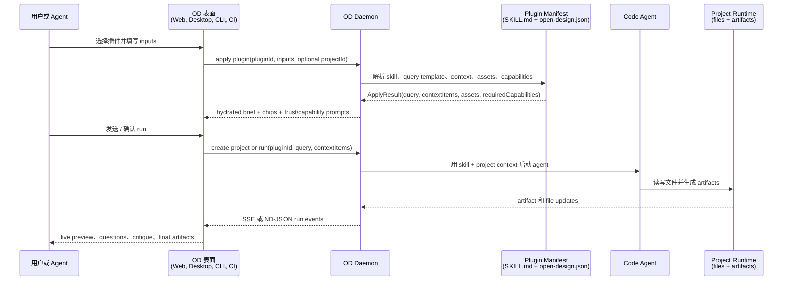
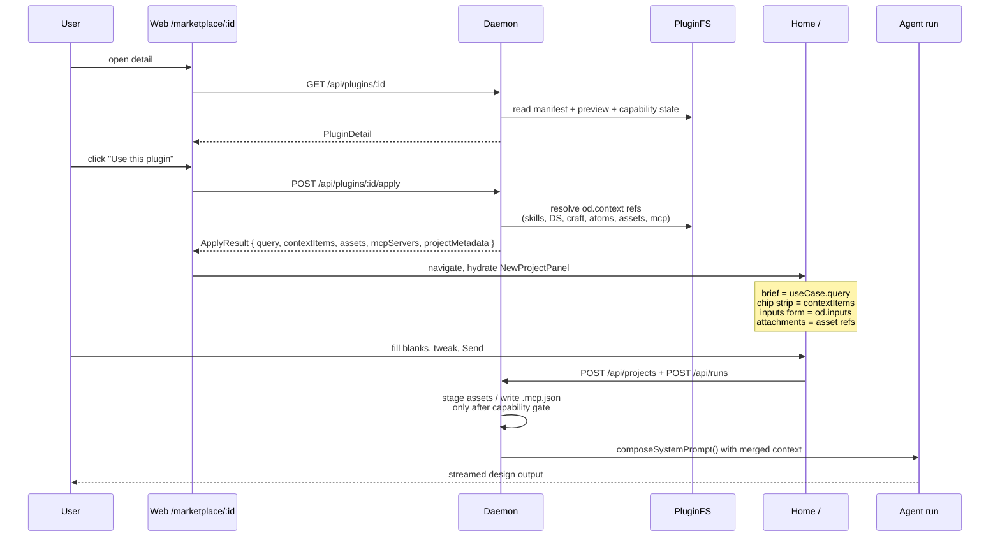
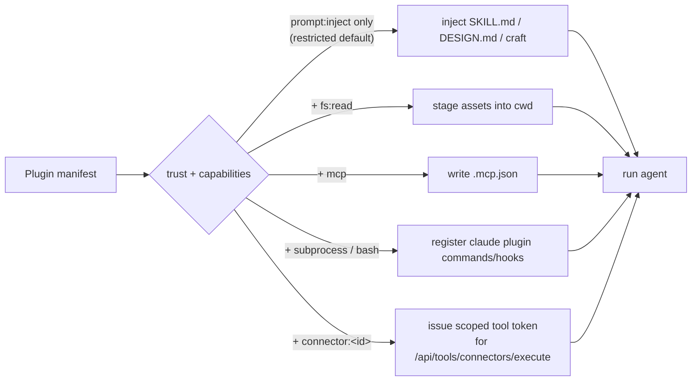

# Open Design 插件与 Marketplace 规范（v1）

> **一句话总结：** Open Design 插件把可移植的 `SKILL.md` 能力包装成 marketplace 可发现、一键可用的设计工作流，同时保留对现有 agent skill 生态、headless CLI 使用方式和自托管部署的兼容性。

**父文档：** [`spec.md`](spec.md) · **同级文档：** [`skills-protocol.md`](skills-protocol.md) · [`architecture.md`](architecture.md) · [`agent-adapters.md`](agent-adapters.md) · [`modes.md`](modes.md)

**Plugin（插件）** 是 Open Design 的分发单元。[Skill](skills-protocol.md) 描述的是 agent 可以执行的一项能力，而 Plugin 是围绕这项能力形成的可发布包：一个或多个 skills、可选 design system 引用、可选 craft 规则、可选 Claude-plugin 资产、预览、use-case query、资产文件夹，以及一个用于驱动 OD marketplace 表面的轻量机器可读 sidecar。插件始终以可移植的 `SKILL.md` 为锚点，因此可以不经修改地发布到现有 agent skill 生态。

> **兼容性承诺（扩展 [`skills-protocol.md`](skills-protocol.md)）：** 任何包含 `SKILL.md` 的插件文件夹，都可以作为普通 agent skill 在 Claude Code、Cursor、Codex、Gemini CLI、OpenClaw、Hermes 等工具中运行。添加 `open-design.json` 只是纯增量能力：它会解锁 OD 的 marketplace 卡片、预览、一键「使用」流程、类型化 context-chip strip，但不会改变底层 skill 的运行方式。**一个 repo，两种消费模式。**

## 给读者的全局梳理

这是一套 **agent 时代的插件系统**，不是 Figma 时代的 UI extension system。插件不会直接挂载到 canvas 里，不拥有本地面板生命周期，也不通过一套专用 `postMessage` / RPC 协议和宿主应用通信。插件本质上是一组可打包的意图与上下文：用户、UI、CLI 或另一个 agent 选中它之后，OD 把它解析成 query、context chips、assets、design-system 引用、MCP/tool capabilities 和 run metadata；之后由选定的 code agent 通过 OD 统一的 project/run pipeline 消费这些信息。

最短心智模型：

1. **插件作者发布可移植能力。** `SKILL.md` 仍然是可执行的 agent contract；`open-design.json` 增加 OD marketplace 元数据、输入字段、默认值、预览和上下文 wiring。
2. **用户或 agent 选择一个工作流。** 选择入口可以是 marketplace、首页输入框、已有 project chat、CLI，或者 CI。
3. **OD apply 插件，但插件不是 UI 进程。** Apply 返回 hydrated brief、类型化 context chips、assets 和 capability requirements；它不会启动隐藏的插件 runtime。
4. **agent 驱动生成。** daemon 创建或更新 project，启动 run，通过 SSE / CLI ND-JSON streaming events 输出过程，并记录 artifacts。
5. **UI 是协作表面。** Web/desktop UI 可以展示表单、预览、direction picker、critique panel 和 live artifacts，但同一个流程必须可以通过 `od` headless 完成。

### Figma 时代与 agent 时代的边界

| 问题 | Figma 时代插件假设 | Open Design v1 的答案 |
| --- | --- | --- |
| 谁消费插件？ | 宿主 UI runtime。 | code agent 通过 OD project/run pipeline 消费。 |
| 插件需要 live UI lifecycle 吗？ | 通常需要：挂载 panel、监听消息、修改 document。 | 不需要。插件是静态文件加 manifest；活跃进程是 agent run。 |
| 是否需要插件到 app 的 RPC 协议？ | 经常需要。 | 不是 primary contract。OD 内部用 HTTP，agent 用 CLI，合适的场景用 MCP，run events 用 SSE/ND-JSON。 |
| 「Use plugin」会发生什么？ | 打开或运行一个 UI extension。 | Hydrate query、context chips、assets、inputs 和 capability gates，然后创建或继续一次 agent run。 |
| 什么会被持久化？ | 宿主 document mutations。 | OD project metadata、artifacts、conversation/run history 和 plugin provenance。 |

### 核心交互时序



### 不同模式下的 query 用例

| 模式 | 入口 | 示例 query | 插件贡献什么 |
| --- | --- | --- | --- |
| Marketplace 详情页 | 用户在插件页点击「Use」 | `Make a 12-slide investor deck for a Series A SaaS startup targeting enterprise design teams.` | Deck skill、slide craft rules、示例 assets、必填 inputs、preview samples。 |
| 首页 inline input | 用户输入 brief 后选择推荐插件 | `Create a landing page for a new AI browser extension, use a dark neon visual direction.` | Landing-page skill、推荐 design system、prompt rewrite、starter assets。 |
| Project chat follow-up | 用户已经在生成好的 project 里 | `Turn this landing page into a launch announcement deck.` | 现有 project context、选中的 artifact refs、deck conversion skill、保留 brand tokens。 |
| Headless CLI / code agent | Claude Code、Cursor、Codex、CI 或脚本调用 `od` | `od run create --plugin make-a-deck --input audience=investors --input topic='AI design ops'` | 不打开 desktop，也得到同一套 manifest resolution、context chips 和 run events。 |
| 自托管 marketplace | 团队运行私有目录 | `Create an internal QBR deck using the Acme design system and sales metrics CSV.` | 私有 plugin index、可信内部 design system、asset attachments、受限数据策略。 |

关键产品变化是：**插件不是本地 UI addon，而是可复用的 agent workflow。** UI 组件可以和这些 workflow 协作，但消费与处理主体已经变成 agent run。

### 长程任务一键交付、原子管线与 devloop

OD 的核心不是「一次 prompt 一次输出」，而是 **long-running design agent 任务**：单个 run 通常经过 discovery → 方向选择 → 生成 → critique → 二次调优等多步，可能跨越数十分钟到数小时。插件的本质是把这条长程任务**切成可发布的单元**，让用户、UI、CLI 或另一个 agent 一键启动。

围绕这一点，spec 把已有的「一方 atoms」从扁平的 capability 列表升级为**可被插件组装的原子管线**：

- **Atom（§10）**：OD daemon 与 first-party tools 暴露的具名能力（discovery-question-form、direction-picker、todo-write、file-read/write、research-search、media-image、live-artifact、critique-theater 等）。
- **Pipeline（§5 / §10.1）**：插件通过 `od.pipeline` 把若干 atoms 组装成有序 stages；spec 默认提供一条「discovery → plan → generate → critique」的 reference pipeline，插件可以增删、重排或循环其中任何一步。
- **Devloop（§10.2）**：当一条 stage 标记 `repeat: true` 并附带 `until` 终止条件（critique score、用户确认、preview 加载成功等）时，agent 基于上一轮 artifact 自动进入下一轮，直到条件满足或显式取消。
- **Generative UI（§10.3）**：pipeline 的某个 stage 需要人类介入（提供信息、授权、方向选择、优化确认）时，agent 触发插件预先在 manifest `od.genui.surfaces[]` 中**声明**过的 surface；daemon 通过 OD 原生事件流广播给所有协作面（web / desktop / CLI / 其他 code agent），并可投影成 AG-UI canonical events 供外部 client 使用。用户回应后 daemon 把答案写回 project，run 继续。Surface 的 `persist` 字段决定答案在 run / conversation / project 三个层级中哪个层级被记住，让多轮对话不会反复打扰用户。

一句话：**插件描述「这次长程任务的 pipeline 该长什么样、需要哪些 GenUI surface 与用户协作」，daemon 提供 atoms 与 surface 总线，agent 在 pipeline 上跑 devloop，artifact 带 provenance（§11.5）记录这条长程任务跑过谁。**

**当前实现澄清：** `discovery -> plan -> generate -> critique` 是 reference pipeline 形态，不是一套写死的 wizard。插件 snapshot 可以携带 `od.pipeline.stages[].atoms[]`；daemon 解析 snapshot 后，把 active plugin block 与 active stage atom blocks 注入 system prompt，同时发出 stage events，让 agent 按 pipeline 推进。如果用户没有显式选择插件，OD 也**不是**启动一个通用裸 agent：Open Design 基础 designer prompt 与 discovery 规则始终存在。产品入口会在此基础上绑定合理默认值：Home 自由输入走内置隐藏的 `od-default` scenario，按类型创建新 project 时走对应 project kind 的 bundled scenario。`od-default` 是 router / task shaper；它的职责是把请求导回正常设计 pipeline，不应被理解成一个独立的「美化生成器」。

### 四类产品场景

| 场景 (`od.taskKind`) | 用户起点 | 插件贡献 | 典型 atom 序列 |
| --- | --- | --- | --- |
| `new-generation` | 一句话 brief 或 marketplace 选品 | 流程 + design system 推荐 + craft + starter assets | discovery → direction-picker → generate → critique |
| `code-migration` | 已有 repo / 本地路径 | 源代码摄取 atom + design tokens 抽取 + 重写策略 + diff preview | code-import → design-extract → rewrite-plan → generate → diff-review |
| `figma-migration` | Figma file URL / 截图 | figma-extract atom + token 映射 + 高保真 web 实现策略 | figma-extract → token-map → generate → critique |
| `tune-collab` | 已有 OD project 与 artifact | 在已有 artifact 上做 critique-tune、品牌切换、A/B、stakeholder review | direction-picker → patch-edit → critique → handoff |

四类场景共享同一份 ApplyResult、同一 run pipeline、同一 artifact provenance 契约（§11.5）；区别只在 inputs 形态、initial assets 与 pipeline 起点。

---

## 目录

0. [状态](#0-状态)
1. [愿景](#1-愿景)
2. [目标与非目标](#2-目标与非目标)
3. [兼容性矩阵](#3-兼容性矩阵--什么样的文件夹对哪些系统是合法插件)
4. [插件文件夹形态](#4-插件文件夹形态)
5. [`open-design.json` schema](#5-open-designjson--schema-v1)
6. [`open-design-marketplace.json` schema](#6-open-design-marketplacejson--联邦目录)
7. [发现与安装](#7-发现与安装)
8. [Apply pipeline](#8-apply-pipeline)
9. [信任与能力](#9-信任与能力)
10. [一方 atoms](#10-一方-atoms--open-design-的原子能力)
11. [架构：现有 repo 要改什么](#11-架构现有-repo-要改什么)
12. [CLI 表面](#12-cli-表面)
13. [公网 Web 表面](#13-公网-web-表面-open-designaimarketplace)
14. [发布与目录分发](#14-发布与目录分发)
15. [部署与可移植性：Docker，任意云](#15-部署与可移植性docker任意云)
16. [分阶段实现计划](#16-分阶段实现计划)
17. [示例](#17-示例)
18. [风险与开放问题](#18-风险与开放问题)
19. [为什么这是 Open Design 的重要一步](#19-为什么这是-open-design-的重要一步)
20. [Post-v1 可扩展性：artifact taxonomy、evaluators 与 production handoff](#20-post-v1-可扩展性artifact-taxonomyevaluators-与-production-handoff)
21. [场景覆盖矩阵与交付路线图](#21-场景覆盖矩阵与交付路线图)
22. [作者扩展点：基于 v1 substrate 实现未交付场景](#22-作者扩展点基于-v1-substrate-实现未交付场景)
23. [自举：把 OD 自己的硬流程做成一方 plugin](#23-自举把-od-自己的硬流程做成一方-plugin)

---

## 0. 状态

- 写作阶段：草稿，等待评审。
- 规划阶段锁定的默认选择（评审时可覆盖）：
  - **兼容性 = wrap-then-extend。** 现有 `SKILL.md` 与 `.claude-plugin/plugin.json` repo 原样可运行；`open-design.json` 是增量 sidecar。
  - **信任 = 分层且来源敏感。** 内置插件与官方 marketplace 插件默认 `trusted`；用户添加的第三方 marketplace、任意 GitHub / URL / local 插件默认 `restricted`，除非 marketplace 或插件被显式 trust。

## 1. 愿景

Open Design 变成一套 **server + CLI + atomic core engine + plugin/marketplace system**。产品表面发生反转：不再是「点一个按钮，填一个表单」，而是用户打开 marketplace，点击某个插件，输入框自动填入 query，并在上方注入类型化 context chips。相同的插件文件夹也同时是 Claude Code、Cursor、Codex、Gemini CLI、OpenClaw、Hermes 可消费的 agent skill，并且可以作为独立 GitHub repo 发布到：

- [`anthropics/skills`](https://github.com/anthropics/skills)
- [`anthropics/claude-code/plugins`](https://github.com/anthropics/claude-code/tree/main/plugins)
- [`VoltAgent/awesome-agent-skills`](https://github.com/VoltAgent/awesome-agent-skills)
- [`openclaw/clawhub`](https://github.com/openclaw/clawhub)
- [`skills.sh`](https://skills.sh/)

不同目录的收录格式不同，但它们都索引 `SKILL.md` 形态的文件夹。只要保持 `SKILL.md` 作为 canonical，`open-design.json` 作为严格 sidecar，一个 repo 就可以不做目标目录专用改写而进入所有生态目录。

同一愿景的第二条轴线：**CLI 是 Open Design 面向 agent 的 canonical API。** 代码 agent（Claude Code、Cursor、Codex、OpenClaw、Hermes、企业内部 orchestrator）通过 shell 调用 `od …` 驱动 OD，而不是直接请求 `/api/*`。CLI 用稳定的子命令 contract 包装所有 server 能力：project 创建、conversation/run 生命周期、plugin apply、project 文件系统操作、design library introspection、daemon control。HTTP server 是 desktop UI 与 CLI 自身的实现细节；agent 如果直接访问 HTTP，就绕过了 contract。

第三条轴线来自第二条：**OD 可以完全 headless 运行；UI 是效率层，而不是运行时依赖。** 用户只有 Claude Code（或 Cursor、Codex、Gemini CLI）和已安装的 `od`，也能浏览 marketplace、安装插件、创建 project、拉起任务、消费产物，全流程不需要启动 desktop app。OD desktop UI 的价值类似 Cursor IDE 相对于 `cursor-agent` CLI：更快发现、实时 artifact preview、chat/canvas 并排、marketplace 浏览、direction-picker GUI、critique-theater 面板。这些都是同一批 primitives 之上的体验增强。每个 UI 功能都必须先能表达为 CLI 子命令或 streaming event；UI 消费这些 primitives 并添加呈现层。这个解耦由架构规则强制（§11.7）。

第四条轴线是生态覆盖与商业价值的基础：**OD 是一个 Docker image，可以部署到任意云。** 因为第三条轴线里的 headless mode 没有 electron、没有 GUI 依赖，一个 multi-arch container image（`linux/amd64` + `linux/arm64`）就能在 AWS、Google Cloud、Azure、阿里云、腾讯云、华为云，或任何自托管 Kubernetes / docker-compose / k3s 环境里启动完整 daemon + CLI + web UI，不需要针对云厂商重写。自托管企业可以运行私有 marketplace；合作伙伴可以把 OD 嵌入自己的 stack；CI pipeline 可以拉起临时 OD container 来完成「为日报生成 slides」这类任务。技术 contract 见 §15。

第五条轴线是与 agent 共演进的产品形态：**UI 由 agent 请求，但由产品内的受控组件渲染 (Generative UI)，而不是任意 agent-authored frontend code。** 长程 design agent 在跑 pipeline 的过程中，会随时需要向用户索取信息（例：figma OAuth、确认目标受众）、寻求授权（例：批准一次 high-cost media 生成）、收敛方向（例：从 3 个 critique 选项里选一个）、补内容（例：缺失的品牌资产）；这些 UI **不是**预制的 marketplace chip strip，而是 plugin 在 manifest 中**声明**、agent 在 run 中**触发**、daemon 用 OD 原生事件**发布**给前端 / CLI 渲染，并通过 AG-UI adapter 供外部 client 消费的 surface（详见 §10.3）。OD v1 提供 4 类内置 surface（`form` / `choice` / `confirmation` / `oauth-prompt`）作为最小集；plugin 自带 React 组件必须经过 `genui:custom-component` capability gate 与 sandbox。对应这条轴线，project 表多记录一组 GenUI surface 的 **persisted state**：用户做过一次的授权与确认在同一 project 的多轮对话、多次 run 之间复用，不会被反复打扰；这是「插件 = 长程任务封装」与「project = 长期工作产物」的自然落点。

## 2. 目标与非目标

**目标**

1. 每个可运行、可分发的 OD 插件都是合法 agent skill（以 `SKILL.md` 或 `.claude-plugin/plugin.json` 为锚点）。不 fork skill spec。
2. 一个普通 skill 或 claude-plugin repo，只要添加可选 `open-design.json` sidecar，就成为 OD 插件；不改名、不改 body。
3. 支持四类安装源：本地文件夹、GitHub repo（可带 ref/subpath）、任意 HTTPS archive，以及联邦 `open-design-marketplace.json` index。
4. 一键「使用」会自动填充 brief 输入框，并在上方填充 `ContextItem` chips（skills、design-system、craft、assets、MCP、claude-plugin、atom）。
5. 默认分层信任；能力 scope 是声明式、可选的。
6. OD core engine、atomic capabilities、plugin runtime 全部可以通过 CLI 访问，因此任何 code agent 都能 headless 地驱动 Open Design。
7. **插件即长程任务封装**：每个插件覆盖四类产品场景之一（new-generation / code-migration / figma-migration / tune-collab），通过 `od.pipeline` 把 OD 一方 atoms 组装成有序 stages + 可选 devloop（§10）。
8. **可复现 + 可审计**：每次 apply 落一份不可变 `AppliedPluginSnapshot`（§8.2.1），run / artifact 通过 snapshot id 反查 plugin source；插件升级不破坏历史 run 的 prompt 还原。
9. **同一 artifact 跨协作面流转**：artifact manifest（§11.5.1）记录 plugin provenance + 各下游协作面（cli / 其他 code agent / 云 / 桌面端）的 export 与 deploy 历史，让后续二次调优、迁移、协作围绕同一 artifact 接续。
10. **Generative UI 是 plugin 一等输出**：插件在 manifest 中声明 `od.genui.surfaces[]`（§10.3），agent 运行时通过 OD 受控事件流发布 form / choice / confirmation / oauth-prompt 请求，产品 renderer 负责视觉样式；用户的回应按 `persist` 等级（run / conversation / project）落到 project metadata，被同 project 后续多轮对话、多次 run 复用。外部 AG-UI client 通过 adapter 消费同一条 run，而不是替换 OD 内部 renderer。

**非目标（v1）**

- 替代 SKILL.md / claude-plugin spec：OD 永不 fork。
- 托管插件二进制：OD 指向 GitHub / CDN URL；存储由发布者负责。
- 签名/PKI 生态：能力 gating 依赖用户授权，而不是签名。
- 一个由 Open Design SaaS 代表用户运行 agent 的 web-hosted marketplace：v1 只做 local-first / self-hostable。

## 3. 兼容性矩阵：什么样的文件夹对哪些系统是合法插件

| 存在的文件 | OD 可安装 | Claude Code / Cursor / Codex / Gemini CLI | OpenClaw / Hermes | awesome-agent-skills | clawhub | skills.sh |
| --- | --- | --- | --- | --- | --- | --- |
| 仅 `SKILL.md` | yes | yes | yes | yes | yes | yes |
| 仅 `.claude-plugin/plugin.json` | yes | yes (claude) | partial | listable | listable | listable |
| 仅 `open-design.json` | metadata-only | no | no | no | no | no |
| `SKILL.md` + `open-design.json` | enriched | yes | yes | yes | yes | yes |
| `.claude-plugin/...` + `open-design.json` | enriched | yes (claude) | partial | listable | listable | listable |
| `SKILL.md` + `.claude-plugin/...` + `open-design.json` | fully enriched | yes | yes | yes | yes | yes |

结论：**`SKILL.md` 是最低共同分母**。任何推荐用于分发的插件都应该包含 `SKILL.md`，这样它可以进入所有主流目录；再添加 `open-design.json` 来获得 OD 的产品表面。

仅包含 `open-design.json` 的文件夹在 v1 中不是可运行插件，而是 **metadata-only preset**：OD 可以读取它来展示市场卡片、聚合远端引用或作为未来 install stub，但它不能触发 agent run，也不能进入跨 agent catalog。`od plugin doctor` 必须把这种形态标记为 `metadata-only`，并提示作者补充 `SKILL.md` 或 `.claude-plugin/plugin.json` 才能发布为 runnable plugin。

## 4. 插件文件夹形态

```
my-plugin/
├── SKILL.md                          # required for portability; anchors agent behavior
├── .claude-plugin/                   # optional: claude-plugin compat (commands/agents/hooks/.mcp.json)
│   └── plugin.json
├── open-design.json                  # optional sidecar — unlocks OD product surface
├── README.md                         # standard catalog readme
├── preview/                          # OD preview assets
│   ├── index.html
│   ├── poster.png
│   └── demo.mp4
├── examples/                         # sample outputs (rendered on detail page)
│   └── b2b-saas/index.html
├── assets/                           # files staged into project cwd at run time
├── skills/                           # nested skills (bundle plugins)
├── design-systems/                   # nested DESIGN.md(s)
├── craft/                            # nested craft .md(s)
└── plugins/                          # nested claude-plugins (bundle plugins)
```

作者规则：

- `SKILL.md` body 不承载 OD 专属元数据；它保持干净、可移植。
- `open-design.json` 只**指向** SKILL.md / DESIGN.md / craft 文件；永不复制它们的正文。
- 当前 SKILL.md frontmatter 上已有的 OD 专属 `od:` namespace（已在 [`skills-protocol.md`](skills-protocol.md) 中描述，并在 [`skills/blog-post/SKILL.md`](../skills/blog-post/SKILL.md) 中使用）继续作为没有 `open-design.json` 的插件的 fallback。我们不废弃它，只在其上叠加。
- v1 的 runnable plugin 必须至少包含 `SKILL.md` 或 `.claude-plugin/plugin.json` 之一。`open-design.json` 本身不定义 agent 行为，只定义 OD 如何展示、解析和应用这些行为。

## 5. `open-design.json` — schema v1

```json
{
  "$schema": "https://open-design.ai/schemas/plugin.v1.json",
  "name": "make-a-deck",
  "title": "Make a deck",
  "version": "1.0.0",
  "description": "Generate a 12-slide investor deck from a one-line brief.",
  "author":   { "name": "Open Design", "url": "https://open-design.ai" },
  "license":  "MIT",
  "homepage": "https://github.com/open-design/plugins/make-a-deck",
  "icon":     "./icon.svg",
  "tags":     ["deck", "marketing", "investor"],

  "compat": {
    "agentSkills":   [{ "path": "./SKILL.md" }],
    "claudePlugins": [{ "path": "./.claude-plugin/plugin.json" }]
  },

  "od": {
    "kind": "skill",
    "taskKind": "new-generation",
    "mode": "deck",
    "platform": "desktop",
    "scenario": "marketing",
    "engineRequirements": { "od": ">=0.4.0" },

    "preview": {
      "type": "html",
      "entry":  "./preview/index.html",
      "poster": "./preview/poster.png",
      "video":  "./preview/demo.mp4",
      "gif":    "./preview/demo.gif"
    },

    "useCase": {
      "query": {
        "en": "Make a 12-slide investor deck for a Series A SaaS startup targeting {{audience}} on {{topic}}.",
        "zh-CN": "为一家面向 {{audience}}、主题是 {{topic}} 的 A 轮 SaaS 初创公司制作一份 12 页投资人 deck。"
      },
      "exampleOutputs": [
        { "path": "./examples/b2b-saas/", "title": "B2B SaaS deck" }
      ]
    },

    "context": {
      "skills":         [{ "ref": "./skills/deck-skeleton" }],
      "designSystem":   { "ref": "linear-clone" },
      "craft":          ["typography", "deck-pacing"],
      "assets":         ["./assets/sample-data.csv"],
      "claudePlugins":  [{ "ref": "./plugins/code-review" }],
      "mcp": [
        { "name": "tavily", "command": "npx", "args": ["-y", "@tavily/mcp"] }
      ],
      "atoms": ["discovery-question-form", "todo-write", "research-search"]
    },

    "pipeline": {
      "stages": [
        { "id": "discovery",  "atoms": ["discovery-question-form"] },
        { "id": "plan",       "atoms": ["direction-picker", "todo-write"] },
        { "id": "generate",   "atoms": ["file-write", "live-artifact"] },
        { "id": "critique",   "atoms": ["critique-theater"], "repeat": true,
          "until": "critique.score>=4 || iterations>=3" }
      ]
    },

    "genui": {
      "surfaces": [
        {
          "id": "audience-clarify",
          "kind": "form",
          "persist": "conversation",
          "trigger": { "stageId": "discovery", "atom": "discovery-question-form" },
          "schema": {
            "type": "object",
            "required": ["audience"],
            "properties": {
              "audience": { "type": "string", "enum": ["VC", "Customer", "Internal"] },
              "tone":     { "type": "string" }
            }
          }
        },
        {
          "id": "direction-pick",
          "kind": "choice",
          "persist": "conversation",
          "trigger": { "stageId": "plan", "atom": "direction-picker" },
          "schema": {
            "type": "object",
            "required": ["direction"],
            "properties": { "direction": { "type": "string" } }
          }
        },
        {
          "id": "media-spend-approval",
          "kind": "confirmation",
          "persist": "run",
          "trigger": { "atom": "media-image" },
          "capabilitiesRequired": ["mcp"]
        }
      ]
    },

    "connectors": {
      "required": [
        { "id": "slack",  "tools": ["channels.list", "messages.search"] },
        { "id": "notion", "tools": ["pages.create", "blocks.append"] }
      ],
      "optional": [
        { "id": "google_drive", "tools": ["files.list"] }
      ]
    },

    "inputs": [
      { "name": "topic",    "label": "Topic",    "type": "string", "required": true },
      { "name": "audience", "label": "Audience", "type": "select",
        "options": ["VC", "Customer", "Internal"] }
    ],

    "capabilities": ["prompt:inject", "fs:read", "connector:slack", "connector:notion"]
  }
}
```

### 5.1 字段说明

- `compat.*`：指向继承格式文件的相对路径。loader 会把它们的内容合并进 [`composeSystemPrompt()`](../apps/daemon/src/prompts/system.ts) 组装出的 OD prompt stack。
- `od.kind`：registry 里的分类（`skill` / `scenario` / `atom` / `bundle`）。
- `od.taskKind`：四类产品场景之一（`new-generation` / `code-migration` / `figma-migration` / `tune-collab`，§1「四类产品场景」）。决定 marketplace filter、初始 inputs 模板、推荐 pipeline 起点。
- `od.preview`：驱动 marketplace 卡片和详情页。`entry` 通过 daemon 以 sandboxed 方式服务（扩展现有 `/api/skills/:id/example` plumbing）。
- `od.useCase.query`：一键使用时进入 brief 字段的精确文本。它可以是兼容旧 manifest 的字符串，也可以是按 BCP-47 风格 locale key 组织的文本映射（例如 `{ "en": "...", "zh-CN": "..." }`）。apply 时会依次尝试请求的 locale、基础语言、`en`，最后回退到第一个可用值。`{{var}}` placeholder 绑定到 `od.inputs`。
- `od.context.*`：用于填充输入框上方 `ContextChipStrip` 的类型化 chips。每一项都会编译成一个 `ContextItem`（§5.2）。
- `od.context.atoms`：**无序集合**——声明插件需要的 atoms。daemon 仅以默认顺序使用它们；用于不需要自定义流程的简单插件。
- `od.pipeline`：**有序管线**——插件作者显式编排 atoms 的 stages、循环、终止条件（§10.1）。当 `od.pipeline` 与 `od.context.atoms` 同时出现时，pipeline 优先；context.atoms 仅作为 chip strip 展示。
- `od.genui.surfaces[]`：**Generative UI 声明**——agent 在 run 中可能触发的 surface 集合（§10.3）。每条 entry 的 `kind` 是 v1 内置的 `form` / `choice` / `confirmation` / `oauth-prompt` 之一；`persist` 决定回答的留存层级（`run` / `conversation` / `project`）；`trigger` 把 surface 绑定到具体 stage / atom，避免 agent 滥用；`schema` 是 JSON Schema，daemon 据此渲染默认表单并校验回答。**未在 manifest 中声明的 surface kind 不可在 run 中触发**——doctor 校验保证 plugin 不会动态产生未知 UI。
- `od.connectors`：**Connector 依赖声明**——`required[]` 列出 plugin 必须的 daemon-内置 connector（[`apps/daemon/src/connectors/`](../apps/daemon/src/connectors/)；当前由 Composio 驱动），每条 `{ id, tools[] }` 对应 catalog 里的 `ConnectorCatalogDefinition.id` 与 `allowedToolNames` 子集；`optional[]` 是「有就用、没有降级」。`od plugin doctor` 在 install / apply 时校验：(a) 每个 `id` 在 `connectorService.listAll()` 里存在；(b) 每个 `tools[]` 都在该 connector 的 `allowedToolNames` 内；(c) `required[].id` 必须有匹配的 `connector:<id>` capability（§5.3 / §9）。`required` 中的 connector 在 apply 时若未 connect，会自动派生一条 `oauth-prompt` GenUI surface（§10.3.1，`route: 'connector'`）；`optional` 不会，但 agent 可以在 run 中显式触发。**Plugin 不直接持有 OAuth token**——token 仍归 `<dataDir>/connectors/credentials.json` 管理，plugin 只声明依赖。
- `od.inputs`：详情页与 inline composer 中展示的表单字段；其值会 template 到 `useCase.query` 以及任何 string-valued context entry。
- `od.capabilities`：声明式能力；如果一个 `restricted` 插件省略此字段，默认是 `['prompt:inject']`。

### 5.2 `ContextItem` union（TypeScript）

```ts
export type ContextItem =
  | { kind: 'skill';         id: string; label: string }
  | { kind: 'design-system'; id: string; label: string; primary?: boolean }
  | { kind: 'craft';         id: string; label: string }
  | { kind: 'asset';         path: string; label: string; mime?: string }
  | { kind: 'mcp';           name: string; label: string; command?: string }
  | { kind: 'claude-plugin'; id: string; label: string }
  | { kind: 'atom';          id: string; label: string }
  | { kind: 'plugin';        id: string; label: string };
```

位于新的 `packages/contracts/src/plugins/context.ts`（仅 TypeScript、无 runtime deps，符合根 [`AGENTS.md`](../AGENTS.md) 的 contracts 边界）。

### 5.3 能力词表

| Capability | 授权后的效果 |
| --- | --- |
| `prompt:inject` | 把 SKILL/DESIGN/craft 内容注入 system prompt（永远允许） |
| `fs:read` | 在 project create / run start 阶段把插件 assets stage 到 project cwd |
| `fs:write` | 插件拥有的 post-run 写入（例如发布 artifacts） |
| `mcp` | daemon 在 run start 阶段写 `.mcp.json`，使插件里的 MCP servers 启动 |
| `subprocess` / `bash` | 执行 Claude-plugin hooks，开启 agent-callable bash tools |
| `network` | 插件脚本可以发起出站 HTTP |
| `connector` | 笼统能力：允许 plugin 通过 daemon 内置 connector 子系统（[`apps/daemon/src/connectors/`](../apps/daemon/src/connectors/)）调用任意已 connected 的 Composio tool |
| `connector:<id>` | 细粒度版（推荐）：仅允许调用 `id` 指向的单个 connector（如 `connector:slack`）。当 plugin 同时声明多个 `connector:<id>` 时，只有列出来的那些会被 `tool-tokens` 颁发；`connector:<id>` 优先级 > `connector` 笼统能力 |

能力不是孤立字符串，resolver 必须计算 **隐含 capability**：

- 声明 `mcp` 且 MCP command 不是 OD 内置 stdio tool 时，隐含需要 `subprocess`。
- MCP command 通过 `npx`、`uvx`、`pipx`、remote URL 或 package-manager 下载代码时，隐含需要 `network`。
- 声明 `.claude-plugin` hooks 时，隐含需要 `subprocess`；hook 如果读取 bundled assets，还需要 `fs:read`。
- `bash` 与 `subprocess` 是高危能力：一旦授予，插件理论上可以绕过细粒度 `fs:*` / `network` 限制。UI 和 CLI 必须把它们作为 elevated capabilities 单独确认，不得被 "Grant all low-risk" 默认勾选。
- 声明 `od.connectors.required[]` 时，每个 `required[].id` 隐含需要 `connector:<id>`；resolver 在 apply 阶段把缺失的 `connector:<id>` 加进 `capabilitiesRequired`，并在 `restricted` plugin 上拒绝 run（exit 66 / §9.1）。
- `connector:<id>` 不隐含 `network`：connector 调用全程经 daemon HTTP，不让 plugin 自己起网络请求。但 `connector` 笼统能力会被审视为 elevated（任意已 connected provider 都可触达），UI 和 CLI 必须显式确认。
- provider credentials 不是 v1 capability；插件不能直接声明访问 `ANTHROPIC_API_KEY`、media provider keys 或 connector secrets。需要 credentials 的能力必须通过 OD 自己的 first-party atom / tool 间接调用。

### 5.4 `SKILL.md` frontmatter 到 `PluginManifest` 的映射

当插件没有 `open-design.json`，但 `SKILL.md` 已经包含 [`skills-protocol.md`](skills-protocol.md) 中定义的 `od:` frontmatter 时，`adapters/agent-skill.ts` 会合成一个最小 `PluginManifest`。映射规则必须稳定，避免旧 skill 与新 plugin schema 出现两套语义：

| `SKILL.md` 字段 | Plugin manifest 字段 | 规则 |
| --- | --- | --- |
| `name` | `name`、fallback `title` | `title` 缺失时从 `name` humanize |
| `description` | `description` | 原样保留 |
| `od.mode` | `od.mode` | 原样保留；缺失时沿用 `skills-protocol.md` 的 keyword inference |
| `od.preview` | `od.preview` | `type` / `entry` / `reload` 中仅 `type`、`entry` 进入 v1 manifest；`reload` 保留为 adapter metadata，不进入公共 contract |
| `od.design_system.requires` | `od.context.designSystem` | `true` 表示运行时使用 active project design system；`sections` 作为 prompt-pruning hint 保留在 resolved context 中 |
| `od.craft.requires` | `od.context.craft` | slug 数组原样映射 |
| `od.inputs` | `od.inputs` | `string` → `string`，`integer` → `number`，`enum` → `select`，`values` → `options`；`min` / `max` 保留为 future metadata，v1 UI 可以忽略但不得丢失 |
| `od.parameters` | adapter metadata | v1 plugin apply 不渲染 live sliders；字段保留给 Phase 4，不进入 `ApplyResult.inputs` |
| `od.outputs` | `projectMetadata` hints | 用于 artifact bookkeeping 和 preview default，不作为用户可编辑 input |
| `od.capabilities_required` | `od.capabilities` | 只映射能表达的能力；未知 capability 保留为 `compatWarnings[]`，`od plugin doctor` 必须提示 |

如果 `open-design.json` 与 `SKILL.md` frontmatter 同时存在，`open-design.json` 优先，但 loader 必须保留 adapter 产生的 warnings。这样作者可以渐进迁移：先让旧 skill 原样可用，再逐步增加 OD marketplace 信息。

## 6. `open-design-marketplace.json` — 联邦目录

它镜像 [`anthropics/skills/.claude-plugin/marketplace.json`](https://raw.githubusercontent.com/anthropics/skills/main/.claude-plugin/marketplace.json) 的形态，因此现有社区 catalog 只需要重命名即可复用。

```json
{
  "name": "open-design-official",
  "owner":    { "name": "Open Design", "url": "https://open-design.ai" },
  "metadata": { "description": "First-party plugins", "version": "1.0.0" },
  "plugins": [
    { "name": "make-a-deck", "source": "github:open-design/plugins/make-a-deck", "tags": ["deck"] },
    { "name": "tweet-card",  "source": "https://files.../tweet-card-1.0.0.tgz",  "tags": ["marketing"] }
  ]
}
```

可以同时存在多个 marketplaces。用户通过 `od marketplace add <url>` 注册额外 index（Vercel 的、OpenClaw 的 clawhub、企业私有 catalog）。默认情况下，用户添加的 marketplace 只是 discovery source，它里面的插件仍然以 `restricted` 安装；只有官方内置 marketplace 或用户显式执行 `od marketplace add <url> --trust` / `od marketplace trust <id>` 后，来自该 marketplace 的插件才可以默认继承 `trusted`。

## 7. 发现与安装

### 7.1 发现层级（统一 legacy skill locations 与 plugin locations）

| Priority | 路径 | 资源形态 | 来源 |
| --- | --- | --- | --- |
| 1 | `<projectCwd>/.open-design/plugins/<id>/` | plugin bundle | 新增，与用户代码一起提交；必须显式安装到 project |
| 2 | `<projectCwd>/.claude/skills/<id>/` | legacy `SKILL.md` | 沿用 [`skills-protocol.md`](skills-protocol.md) 的 project-private skill 兼容路径 |
| 3 | `~/.open-design/plugins/<id>/` | plugin bundle | 新增，由 `od plugin install` 写入 |
| 4 | `~/.open-design/skills/<id>/` | legacy `SKILL.md` | OD canonical skill install path；可 symlink 到其它 agent |
| 5 | `~/.claude/skills/<id>/` | legacy `SKILL.md` | 外部 Claude Code / skills 工具写入的兼容路径，只读扫描 |
| 6 | repo root `skills/`, `design-systems/`, `craft/` | bundled resources | 现有一方资源，不变 |

冲突解决：按 normalized `name` / plugin id；数字越小优先级越高。legacy `SKILL.md` location 被 adapter 合成为 plugin record，但不会被复制到 `~/.open-design/plugins/`，除非用户显式执行 `od plugin install`。这样现有 Claude skills 继续零配置可用，新 plugin bundle 也有清晰的安装根。

### 7.2 安装源

```
od plugin install ./folder
od plugin install github:owner/repo
od plugin install github:owner/repo@v1.2.0
od plugin install github:owner/repo/path/to/subfolder
od plugin install https://example.com/plugin.tar.gz
od plugin install make-a-deck                   # via configured marketplaces
od marketplace add https://.../open-design-marketplace.json
```

GitHub install 使用 `https://codeload.github.com/owner/repo/tar.gz/<ref>`，不需要 git binary，同时包含 path-traversal guard 和可配置 size cap。

## 8. Apply pipeline

插件系统暴露两个 apply 表面；二者调用相同 daemon endpoint，并接收相同 `ApplyResult`。v1 中 **apply 默认是纯解析动作**：它只解析 manifest、模板化 query、返回 context chips、inputs、asset refs 与 MCP specs；不会写 project cwd、不会复制 assets、不会写 `.mcp.json`、不会启动任何进程。真正的副作用发生在后续 `POST /api/projects` 或 `POST /api/runs`，并由同一套 trust/capability gate 检查。

- **详情页 apply**（deep）：用户进入 `/marketplace/:id`，查看 preview 和 capability checklist，然后点击「Use this plugin」。composer 被 hydrate，用户回到 Home 或 project；如果用户随后取消发送，daemon 不需要清理任何 staged 文件。
- **Inline apply**（shallow，核心产品表面）：Home 输入框与现有 project 内的输入框（ChatComposer）都在下方渲染一个 **inline plugins rail**。点击 rail 中的插件卡片会在原地应用插件，不跳转、不丢上下文。brief input 预填，输入框上方 chip strip 填充，插件的 `od.inputs` 表单空项显示在 input 与 Send 按钮之间。用户填几个空、微调 brief、点击 Send。这个自然语言 + 填空的交互同时驱动 project 创建和已有 project 内的任务。

两个表面共享相同 primitives（`InlinePluginsRail`、`ContextChipStrip`、`PluginInputsForm`）和同一个 `applyPlugin()` state helper。唯一差别是最终 endpoint：Home 调 `POST /api/projects` 创建新 project；ChatComposer 调 `POST /api/runs` 在当前 project 内创建新任务。

### 8.1 Sequence diagrams

**Mode A — 详情页 apply（深入口，浏览 marketplace 后）：**



**Mode B — Inline apply（浅入口，主流程；运行在 Home 和 ChatComposer 内）：**

```mermaid
sequenceDiagram
  participant U as User
  participant Rail as InlinePluginsRail<br/>(below input)
  participant C as Composer<br/>(NewProjectPanel or ChatComposer)
  participant D as Daemon
  participant A as Agent run

  Note over C,Rail: User is staring at an input box;<br/>plugin cards listed below it
  U->>Rail: click plugin card (no navigation)
  Rail->>D: POST /api/plugins/:id/apply<br/>{ projectId? }
  D-->>Rail: ApplyResult
  Rail->>C: hydrate in place
  Note over C: brief = useCase.query<br/>chip strip = contextItems<br/>inputs form = od.inputs (visible blanks)<br/>attachments = asset refs
  U->>C: fill required blanks, edit brief, Send
  alt Home (no project yet)
    C->>D: POST /api/projects + POST /api/runs
  else Existing project
    C->>D: POST /api/runs { projectId, pluginId }
  end
  D->>D: stage assets / write .mcp.json<br/>only after capability gate
  D->>A: composeSystemPrompt() with merged context
  A-->>U: streamed design output
```

### 8.2 `ApplyResult` shape（新 contract）

```ts
export interface ApplyResult {
  query: string;
  contextItems: ContextItem[];
  inputs: InputFieldSpec[];
  assets: PluginAssetRef[];
  mcpServers: McpServerSpec[];
  pipeline?: PluginPipeline;
  genuiSurfaces?: GenUISurfaceSpec[];
  projectMetadata: Partial<ProjectMetadata>;
  trust: 'trusted' | 'restricted';
  capabilitiesGranted: string[];
  capabilitiesRequired: string[];
  appliedPlugin: AppliedPluginSnapshot;
}

export interface AppliedPluginSnapshot {
  snapshotId: string;
  pluginId: string;
  pluginVersion: string;
  manifestSourceDigest: string;
  sourceMarketplaceId?: string;
  pinnedRef?: string;
  inputs: Record<string, string | number | boolean>;
  resolvedContext: ResolvedContext;
  capabilitiesGranted: string[];
  assetsStaged: PluginAssetRef[];
  taskKind: 'new-generation' | 'code-migration' | 'figma-migration' | 'tune-collab';
  appliedAt: number;

  // §11.4 SQLite 同名列；snapshot 即使 plugin 升级后也保留 apply 时的视图，保证 replay 可复现
  connectorsRequired: PluginConnectorRef[];     // 来自 manifest od.connectors.required[]
  connectorsResolved: PluginConnectorBinding[]; // apply 时实际 connected 的 (id, accountLabel)
  mcpServers: McpServerSpec[];                  // apply 时启用的 MCP server set；与 mcpServers 字段同义但冻结到 snapshot
}

export interface PluginConnectorRef {
  id: string;          // 必须存在于 connector catalog
  tools: string[];     // 必须是 connector 的 allowedToolNames 子集
  required: boolean;   // false = 来自 od.connectors.optional[]
}

export interface PluginConnectorBinding extends PluginConnectorRef {
  accountLabel?: string;       // 取自 ConnectorDetail.accountLabel
  status: 'connected' | 'pending' | 'unavailable';
}

export interface PluginAssetRef {
  path: string;
  src: string;
  mime?: string;
  stageAt: 'project-create' | 'run-start';
}

export interface InputFieldSpec {
  name: string;
  label: string;
  type: 'string' | 'text' | 'select' | 'number' | 'boolean';
  required?: boolean;
  options?: string[];
  placeholder?: string;
  default?: string | number | boolean;
}
```

位于 `packages/contracts/src/plugins/apply.ts`，并从 [`packages/contracts/src/index.ts`](../packages/contracts/src/index.ts) re-export。

#### 8.2.1 Snapshot 持久化与可复现 run

`appliedPlugin` 不是装饰字段；它是「插件 → run」之间的**契约**。仅传 `pluginId` 不够，因为：

- 插件可能在两次 run 之间被 `od plugin update` 升级。
- 同一 `pluginId` 在不同 marketplace 上可能解析到不同 git SHA。
- `od.pipeline` / `od.context.*` 中的 ref 可能指向移动的 default branch。
- `assets` staging 计划与 `capabilitiesGranted` 必须与生成 prompt 时的视图一致。

因此 daemon 必须：

1. **Apply 时**：把 hydrated manifest 与 inputs 一起 hash 成 `manifestSourceDigest`，连同 `pluginVersion`、`pinnedRef`、`sourceMarketplaceId`、`resolvedContext`、`capabilitiesGranted`、`assetsStaged`、**`connectorsRequired` / `connectorsResolved`（参考 connector 子系统当前 `status`）**、**`mcpServers`（apply 时启用的 MCP server set）** 写入 `appliedPlugin`，返回给 caller。
2. **Project create / run start 时**：把客户端提交的 `appliedPlugin`（或 daemon 在 server-side 重新解析得到的 snapshot）写入 SQLite `applied_plugin_snapshots` 表（§11.4），并在 `runs` / `conversations` 表中以 FK 指向。
3. **Replay**：`od run replay <runId>` 与 `od plugin export <runId>` 必须从 snapshot 而非 live manifest 还原 prompt 与 assets，使老 run 在插件升级后仍可复现。
4. **Audit**：UI 的 ProjectView 顶端展示 snapshot id + version + digest；artifact provenance（§11.5 ArtifactManifest）通过 snapshot id 反查 plugin source。

`AppliedPluginSnapshot` 只在 daemon side 写入；CLI / UI 客户端只读。Plugin 升级或 marketplace ref 漂移触发 `od plugin doctor` 把受影响的历史 snapshot 标为 `stale`，但**永不重写**：reproducibility 优先于 freshness。

### 8.3 Inline `od.inputs` form

当 applied plugin 声明 `od.inputs` 时，composer 在 brief textarea 与 Send button 之间渲染 `PluginInputsForm`。行为如下：

- required fields 会 gate Send（按钮 disabled，并通过 tooltip 列出缺失字段）。
- 用户输入时，`useCase.query` 和任何 string-valued `context` entry 内的 `{{var}}` placeholders 会实时 re-render，用户在发送前看到最终 brief 和最终 chip labels。
- 默认表单紧凑：短字段 inline 呈现，像搜索栏；长文本字段折叠到「Add details」expander。
- 发送时，input values 会随 run request 一起传给 daemon；daemon 也会在 prompt 中加入一个小的 `## Plugin inputs` block，让 agent 看到用户提供的 literal values，而不只是 template 后的 brief。
- inputs 会保存在组件 state 中，直到用户清除 chip strip；在同一个 composer 里重新 apply 同一插件时，预填上次值。

### 8.4 在已有 project 内 apply（新 chat task）

ChatComposer（每个 project 的 conversation 输入组件，[`apps/web/src/components/ChatComposer.tsx`](../apps/web/src/components/ChatComposer.tsx)）在输入框下方渲染相同 `InlinePluginsRail`。rail 展示「下一步做什么？」类型插件，并按当前 project 的 `kind` / `scenario` / 当前 artifacts 过滤。点击卡片时，带当前 `projectId` 调 `POST /api/plugins/:id/apply`；daemon 基于 project 解析 context（跳过 project creation 时已经 pinned 的 context，例如 design system），返回 `ApplyResult`，其中 `query` 和 chips 原地 hydrate composer。Send 通过已有 `POST /api/runs` 创建新 run，新增可选 `pluginId`，因此 agent runtime 会带 plugin context 组装 prompt。

结果：同一个 project 可以被多个 plugin-driven tasks 连续引导——「先 apply make-a-deck，迭代；再 apply tweet-card，把相同 brief 包装成社交内容；再 apply critique-theater 给整套作品评分」——全程不离开 project。每个 task 是一个 chat turn；project history 就是 audit log。

### 8.5 Generative UI 运行时契约

`apply` 阶段已经把 plugin 声明的 `genuiSurfaces` 写进 `AppliedPluginSnapshot`，但**真正的 surface lifecycle 发生在 run 中**。完整 wire 与持久化协议见 §10.3，这里只钉住与 apply pipeline 的 4 条衔接：

1. **Apply 阶段不渲染任何 surface。** apply 仍然纯粹解析；UI 表面、CLI 表面在此时只是把 `genuiSurfaces` 转成「这个长程任务可能会问你这些问题」的告示卡。一旦 plugin 在 manifest 里声明了 `oauth-prompt`，详情页 capability checklist 上会增加一行「This plugin will ask you to authorize <provider>」，让用户在发送前知道 run 中可能弹出的 surface 类型。
2. **Run 中 agent 通过 atom 触发 surface。** 每条 surface 的 `trigger.atom`（与可选 `trigger.stageId`）是一组 allowlist：daemon 拒绝任何来自未声明 atom 的 `genui_surface_request` 事件——这是「未声明的 UI 不会被动态产生」的强制点（doctor + runtime 双重检查）。
3. **同 project 已存在的答复直接复用。** 当 surface 的 `persist` 是 `project` 或 `conversation`，daemon 在触发前先查 `genui_surfaces` 表（§11.4）；若已有 valid 状态（未过期、未失效），直接以 stored value 通过，不向用户广播请求。这正是「插件创建项目后多轮交互、多个会话也会用到」的具体落地。
4. **不响应 surface ≠ 阻塞 run。** 每个 surface 必须声明 `timeout`（默认 5 分钟）与 `onTimeout`（`abort` / `default` / `skip`）；CLI 在 ND-JSON 流中以 `genui_surface_request` event 暴露同一份 surface 描述，使 headless 自动化可以 `od ui respond --surface-id …` 在另一个进程中作答，或在不需要时优雅 skip（详见 §10.3）。

`ApplyResult.genuiSurfaces` 与 `appliedPlugin.snapshotId` 一起构成 plugin 与 project 之间的 GenUI 契约：snapshot 不可变；surface answer 落进 `genui_surfaces` 后归 project 拥有，被同 project 后续 plugin（甚至换插件、换 conversation）按 `surface.id` 查找复用，前提是当前 plugin 也声明了相同 surface id 与兼容的 `schema`。

## 9. 信任与能力



`restricted` 插件永远不能进入 P3/P4/P5，除非用户授权该能力——通过 `od plugin trust <id>` 或详情页上的「Grant capabilities」。默认 trusted 的来源只有两类：repo bundled first-party 插件，以及 OD 官方 marketplace。用户添加的第三方 marketplace 只提供 discovery；其中插件默认仍是 `restricted`，除非该 marketplace 本身被显式 trust，或某个插件按 id + version + capability 单独授权。

**Connector capability gate：** plugin 调用 connector tool 走 daemon HTTP（`/api/tools/connectors/execute`，由 `apps/daemon/src/tool-tokens.ts` 颁发 scoped token），与 MCP 是两条不同路径。`restricted` plugin 即使获得 `mcp` capability，**也不会**自动获得 connector 调用能力——必须通过 `connector` 笼统能力或具体 `connector:<id>` 显式授权。daemon 在颁发 tool token 时把 `applied_plugin_snapshot_id` + 当前 `capabilitiesGranted` 写入 token；执行 `/api/tools/connectors/execute` 时校验 `connector_id` 在 granted 列表里（trusted plugin 隐含 `connector:*`），否则返回 `403`。这条 gate 的 daemon 实现见 §11.3 的 `apps/daemon/src/plugins/connector-gate.ts`。

信任记录必须绑定 provenance，而不是只绑定名称：

- `pluginId`
- `version` 或 resolved git SHA / archive digest
- source marketplace id（如果有）
- granted capabilities
- granted at / updated at

当插件升级、resolved ref 变化或 source marketplace 变化时，高危能力（`mcp`、`subprocess`、`bash`、`network`、`connector`、`connector:<id>`）需要重新确认。

### 9.1 Headless capability grant flow（CLI / 自动化场景）

UI 上的 capability gate 是 modal + checklist；headless / CI / 第三方 code agent 则通过下面三种方式完成同一动作，其行为在 spec 里钉死，不依赖 interactive prompt：

1. **预先 trust**（推荐 hosted / CI）。

   ```bash
   od plugin trust make-a-deck --caps fs:read,mcp,subprocess
   od plugin trust make-a-digest --caps fs:read,connector:slack,connector:notion
   od plugin trust make-a-deck --caps all          # 等价于 manifest 中声明的全部 capability
   ```

   写入 SQLite `installed_plugins.capabilities_granted`，对所有后续 apply / run 生效，直到 plugin 升级或 source marketplace 变化（见 §9 provenance 规则）触发重新确认。`connector:<id>` 在 `--caps` 里写完整 id（`connector:slack`、`connector:notion`），不接受 glob。

2. **Per-call 临时 grant**。

   ```bash
   od plugin apply make-a-deck   --project p_abc --grant-caps fs:read,mcp --json
   od plugin apply make-a-digest --project p_abc --grant-caps fs:read,connector:slack --json
   od plugin run   make-a-deck   --project p_abc --grant-caps fs:read --follow
   ```

   仅作用于当前 apply 调用产生的 `AppliedPluginSnapshot`，写入 `snapshot.capabilitiesGranted`，**不**回写到 `installed_plugins`。

3. **不带授权直接调用 → recoverable error**。当 plugin 需要的 capability 未被任何上述路径授予时，daemon 不静默降级、不弹 prompt、不挂起：CLI 立即以 **exit code 66** 退出，并在 stderr 输出结构化 JSON：

   ```json
   {
     "error": {
       "code": "capabilities-required",
       "message": "Plugin make-a-deck requires capabilities not yet granted.",
       "data": {
         "pluginId": "make-a-deck",
         "pluginVersion": "1.0.0",
         "required": ["mcp", "subprocess"],
         "granted": ["prompt:inject", "fs:read"],
         "remediation": [
           "od plugin trust make-a-deck --caps mcp,subprocess",
           "or pass --grant-caps mcp,subprocess to this command"
         ]
       }
     }
   }
   ```

   Code agent 读到 exit 66 时可以选择重试（带 `--grant-caps`）、降级、或把 remediation 文本回报给上游用户。HTTP 等价响应是 `409 Conflict`，body 为同样 shape；用于 desktop UI 自动构建 capability checklist。

`bash` / `subprocess` / `network` / `connector`（笼统形态，**不带 `:<id>`**）等 elevated capabilities **绝不**支持 `--grant-caps all` shorthand 单独覆盖：CLI 强制要求显式列出每一项，避免脚本误授权。`connector:<id>` 是 elevated 的 scoped 形态，可以列在 `--caps all` 内，但 hosted operator 通常更偏好显式枚举每个 connector id 以审计。

### 9.2 Preview sandbox

插件 preview 可能来自未信任 GitHub / archive，因此不能与 OD app 共用同一执行权限。`od.preview.entry` 的 HTML 预览必须满足以下约束：

- preview iframe 使用 `sandbox="allow-scripts"` 起步；默认不允许 `allow-same-origin`、`allow-forms`、`allow-popups`、`allow-downloads`。如果某个 first-party preview 需要额外 flag，必须在 manifest 中声明并通过 `od plugin doctor` 标记为 elevated preview。
- preview 通过 daemon 的只读 preview endpoint 服务，不能读取 `/api/*`、不能携带 `Authorization` header、不能访问 provider credentials、不能访问 project 文件系统。
- preview 响应带独立 CSP：`default-src 'none'; img-src 'self' data: blob:; media-src 'self' data: blob:; style-src 'self' 'unsafe-inline'; script-src 'self' 'unsafe-inline'; connect-src 'none'; frame-ancestors 'self'`。如需远程字体、图片或 analytics，v1 一律拒绝。
- preview asset 路径必须经过 normalized relative path 检查：拒绝 absolute path、`..` traversal、symlink escape、hidden credential files、超过 size cap 的资源。
- restricted 插件的 preview 即使可渲染，也不代表插件能力已授权。预览只展示静态/前端演示；MCP、bash、network、asset staging 仍然只在 run start capability gate 后发生。

## 10. 一方 atoms：可被插件组装的原子管线

把 [`apps/daemon/src/prompts/system.ts`](../apps/daemon/src/prompts/system.ts) 与 daemon-backed bash tools 里已有的能力提升为**具名、可声明、可被插件组装**的 atoms。Atom 不是孤立的 capability tag——它是 OD 长程 design agent pipeline 的一个节点，可以被插件拼接成有序 stages，并通过 devloop 在 stage 内循环。v1 仍然是**声明式**：daemon 已经知道如何为每个 atom 发出 prompt fragment 与必要的 tool gating，插件只是声明 pipeline 拓扑。

| Atom id | 当前来源 | 作用 | taskKind 适用 |
| --- | --- | --- | --- |
| `discovery-question-form` | `system.ts` 中的 `DISCOVERY_AND_PHILOSOPHY` | 面向模糊 brief 的首轮 question form | new-generation, tune-collab |
| `direction-picker` | 同上 | final 前的 3–5 个方向选择 | new-generation, tune-collab |
| `todo-write` | 同上 | TodoWrite 驱动的计划 | all |
| `file-read` / `file-write` / `file-edit` | code-agent native | 文件操作 | all |
| `research-search` | `od research search`（[`apps/daemon/src/cli.ts`](../apps/daemon/src/cli.ts)） | Tavily web research | new-generation |
| `media-image` / `media-video` / `media-audio` | `od media generate` | 带 provider config 的媒体生成 | new-generation, tune-collab |
| `live-artifact` | MCP `mcp__live-artifacts__*` | 创建/刷新 live artifacts | all |
| `connector` | MCP `mcp__connectors__*` | Composio connectors | all |
| `critique-theater` | `system.ts` critique addendum | 5 维 panel critique；devloop 收敛信号 | all |
| `code-import` *(planned)* | tbd: repo handle ingestion | clone / read 已有 repo，抽取设计相关结构 | code-migration |
| `design-extract` *(planned)* | tbd | 从源代码 / Figma / 截图抽取 design tokens | code-migration, figma-migration |
| `figma-extract` *(planned)* | tbd: Figma REST + 节点遍历 | 抽取 Figma 节点树 + tokens + assets | figma-migration |
| `token-map` *(planned)* | tbd | 把抽取出来的 tokens 映射到 active design system | code-migration, figma-migration |
| `rewrite-plan` / `patch-edit` *(planned)* | tbd | 长程多文件改写规划与小步 patch | code-migration, tune-collab |
| `diff-review` *(planned)* | tbd | 把改写以 diff 形式呈现给用户/agent 评审 | code-migration, tune-collab |
| `handoff` *(planned)* | tbd | 把 artifact 推到 cli / 其他 code agent / 云 / 桌面端协作面 | tune-collab |

`(planned)` 标记代表 v1 不实现，但在 §10 的 ID namespace 与 §5 schema 里**先把名字钉住**，避免后续二次拆分。`GET /api/atoms` v1 只返回已实现 atom；planned atom 在 doctor 检查时给出明确「not yet implemented」warning 而非 unknown error。

### 10.1 `od.pipeline`：插件组装的有序原子管线

```ts
export interface PluginPipeline {
  stages: PipelineStage[];
}

export interface PipelineStage {
  id: string;
  atoms: string[];
  repeat?: boolean;
  until?: string;
  onFailure?: 'abort' | 'skip' | 'retry';
}
```

约束：

- `stages[*].id` 在一个 pipeline 内唯一；同名 atom 可以出现在多个 stages（典型例子：critique 在 generate 之后，又在最终 handoff 之前再跑一次）。
- 默认顺序就是数组顺序；v1 不支持 DAG 分叉（branching）——若插件需要分支，作者应拆分成多 plugin 串联。
- `until` 是 daemon 解析的轻量 expression（仅支持比较运算与已知信号变量：`critique.score`、`iterations`、`user.confirmed`、`preview.ok`），不是任意 JS。`od plugin doctor` 会校验语法。
- 当 `od.pipeline` 缺省时，daemon 按 `od.taskKind` 选择 reference pipeline（§1「四类产品场景」中各场景列出的典型序列）。

Pipeline 是声明式的；agent 不直接读 pipeline JSON。daemon 把每个 stage 编译成 system prompt 中一个有锚点 ID 的 block，并在 stage 进入/退出时发出 `pipeline_stage_started` / `pipeline_stage_completed` SSE/ND-JSON event（与 `PersistedAgentEvent` discriminated union 对齐），UI 与 CLI 可以渲染进度条 / stage timeline / devloop iteration 计数。

### 10.2 Devloop：基于 artifact 的迭代收敛

Stage 的 `repeat: true` 标志将单步执行升级为**循环**：

1. agent 完成 stage 一次。
2. daemon 评估 stage 的 `until` 条件——读取最近一轮 critique-theater 输出、`live-artifact` preview 状态、用户回复，或一个内置 `iterations >= N` 计数器。
3. 条件未满足 → 回到 stage 起点，把上一轮 artifact 作为 input 再跑一次；条件满足 → 进入下一 stage。
4. 用户通过 `od run respond <runId> --json '{"action":"break-loop"}'` 或 UI 中的「Stop refining」按钮可以随时打断。

Devloop 的两条硬约束：

- **必须有 `until`**：`repeat: true` 但缺 `until` 的 pipeline 在 `od plugin doctor` 中报错；daemon 拒绝执行。
- **iterations 上限**：daemon 强制 `iterations <= 10`（可通过 `OD_MAX_DEVLOOP_ITERATIONS` 调整），防止 plugin bug 导致无限循环烧 provider quota。

每一轮 devloop 都把当轮 artifact diff、critique 输出、消耗 tokens 写入 `runs.devloop_iterations`（§11.4 SQLite 扩展），用于审计与按 iteration 计费的未来商业模型。

`GET /api/atoms` 返回 atoms 与已知 reference pipelines。当前实现已经开始自举：一方 atom plugins 位于 `plugins/_official/atoms/**`，bundled scenario plugins 位于 `plugins/_official/scenarios/**`，`renderActiveStageBlock(stageId, bodies)` 会把 active stage 的 atom bodies 注入 prompt。因此 system prompt 现在已经 pipeline-aware，但还不是完全 data-driven：Open Design 基础 designer prompt、discovery philosophy 和部分入口默认逻辑仍在 daemon / product code 中。这足以支撑"插件组装核心管线"这条主张，但不假装所有行为字节都已经迁到插件。

### 10.3 Generative UI：AG-UI–inspired surfaces

OD 接受 [CopilotKit / AG-UI 协议](https://github.com/CopilotKit/CopilotKit) 中有价值的部分：agent 可以在 run 中请求交互 UI。OD **不**允许 agent 在主产品表面自由发明 app UI 或视觉样式。v1 提供自己的 `GenUISurface*` discriminated union，跟现有 `PersistedAgentEvent`、SSE / ND-JSON 流共用通道；`@open-design/agui-adapter` 会把这些事件投影成 AG-UI canonical events 供外部 client 使用。

产品规则是：**agent / plugin 输出的是数据，OD 掌握 renderer。** 插件可以声明 `form`、`choice`、`confirmation`、`oauth-prompt` surface，带 schema 与 prompt data；web / desktop / CLI renderer 决定 layout、typography、controls、validation、accessibility 和 persistence UX。这让插件 UI 能覆盖未来场景，同时保持产品系统一致。任意视觉或代码输出属于生成的 artifact，或者必须走独立 custom-component sandbox 与 `genui:custom-component` capability gate；它不能替换核心协作 UI 的内置 renderer。

#### 10.3.1 4 类内置 surface（v1）

| `kind` | 用途 | 默认渲染 | 触发方 atom（可选） | 默认 `persist` |
| --- | --- | --- | --- | --- |
| `form` | 收集结构化信息（受众、品牌、目标、分辨率等） | 用 `schema` 渲染 JSON-Schema 驱动的表单 | `discovery-question-form`、`media-image` 等需要参数的 atom | `conversation` |
| `choice` | 让用户在 N 个选项里挑一个（方向、命题、版本） | 卡片网格或单选列表 | `direction-picker`、`critique-theater` | `conversation` |
| `confirmation` | 二选一确认（继续 / 取消、批准 / 拒绝） | 行内 Yes/No 按钮 | 任何高代价 atom，例如 `media-image`、`subprocess` 类 hook | `run` |
| `oauth-prompt` | 拉起第三方 OAuth（Figma、Notion、Slack 等） | 弹窗 + 引导文案 | connector / MCP 的鉴权需要 | `project` |

每个 surface 有以下 v1 字段：

```ts
export interface GenUISurfaceSpec {
  id: string;                                  // 同一 plugin 内唯一
  kind: 'form' | 'choice' | 'confirmation' | 'oauth-prompt';
  persist: 'run' | 'conversation' | 'project';
  trigger?: { stageId?: string; atom?: string };
  schema?: object;                             // JSON Schema (form / choice 必填)
  prompt?: string;                             // 默认渲染时显示的 question / instruction
  capabilitiesRequired?: string[];             // 例：oauth-prompt with route='connector' 需要 'connector:<id>'
  timeout?: number;                            // ms，默认 300_000
  onTimeout?: 'abort' | 'default' | 'skip';    // 默认 'abort'
  default?: unknown;                           // onTimeout='default' 时的回退值

  // oauth-prompt only：决定 daemon 把回调路由到哪个现有子系统
  oauth?: {
    route: 'connector' | 'mcp';                // v1 仅这两条；'plugin' 留给 Phase 4
    connectorId?: string;                      // route='connector' 时必填，引用 od.connectors.required[].id
    mcpServerId?: string;                      // route='mcp' 时必填，引用 plugin 自带 MCP server 的 name
  };
}
```

**`oauth-prompt` 路由规则（v1 钉死）：**

| `oauth.route` | daemon 行为 | UI 行为 | 持久化 |
| --- | --- | --- | --- |
| `connector` | 复用现有 `apps/daemon/src/connectors/` flow：调 `POST /api/connectors/:connectorId/connect/start` 拿 redirect URL，OAuth 完成后 token 落到 `<dataDir>/connectors/credentials.json` | 弹窗或抽屉里展示 connector 卡片（沿用 [`apps/web/src/components/ConnectorsBrowser.tsx`](../apps/web/src/components/ConnectorsBrowser.tsx) 的视觉），用户点击触发 connector 标准 OAuth | `genui_surfaces.value_json = { connectorId, accountLabel }`；token 不进 SQLite |
| `mcp` | 复用 `POST /api/mcp/oauth/start` flow，token 落到 `<dataDir>/mcp-tokens.json` | 沿用 Settings → MCP servers 的 OAuth 视觉 | `genui_surfaces.value_json = { mcpServerId }`；token 不进 SQLite |
| `plugin`（Phase 4） | plugin 提供任意 third-party OAuth metadata；daemon 走通用 PKCE adapter | TBD | TBD |

`od plugin doctor` 在 install / apply 阶段强制：(1) `oauth.route === 'connector'` 时，`oauth.connectorId` 必须出现在同 plugin 的 `od.connectors.required[]` 或 `od.connectors.optional[]` 中；(2) `oauth.route === 'mcp'` 时，`oauth.mcpServerId` 必须匹配 plugin 自带的某个 MCP server name。

**与 `od.connectors.required[]` 的自动派生：** 如果 plugin 声明了 `od.connectors.required[]` 但**没有**显式 `oauth-prompt` surface，daemon 在 apply 阶段会自动为每个未 connected 的 required connector 派生一条 `kind: 'oauth-prompt'`、`persist: 'project'`、`oauth.route: 'connector'` 的 implicit surface（`id` 为 `__auto_connector_<connectorId>`）。这条 implicit surface 同样被记入 `AppliedPluginSnapshot.genuiSurfaces`，享受 §10.3.3 的跨 conversation 复用——**用户对同一个 connector 一次授权，整个 project 后续 run 不再被打扰**。Plugin 作者也可以显式声明同名 surface 覆盖 implicit 行为（提供自定义 `prompt` 或 schema）。

#### 10.3.2 运行时事件（与 SSE / ND-JSON `PersistedAgentEvent` 联合）

```ts
export type GenUIEvent =
  | { kind: 'genui_surface_request';   surfaceId: string; runId: string; payload: GenUIPayload; requestedAt: number }
  | { kind: 'genui_surface_response';  surfaceId: string; runId: string; value: unknown;          respondedAt: number; respondedBy: 'user' | 'agent' | 'auto' | 'cache' }
  | { kind: 'genui_surface_timeout';   surfaceId: string; runId: string; resolution: 'abort' | 'default' | 'skip' }
  | { kind: 'genui_state_synced';      surfaceId: string; runId: string; persistTier: 'run' | 'conversation' | 'project' };
```

事件流中 `genui_*` 事件与 `pipeline_stage_*`、`message_chunk` 共用同一 SSE 通道，但带专门的 schema 标记，便于 desktop / web / CLI / 其他 code agent 选择性订阅。

#### 10.3.3 跨 conversation / 跨 run 的 persisted state

```sql
-- §11.4 完整迁移见架构章节，这里仅展示外形
CREATE TABLE genui_surfaces (
  id                    TEXT PRIMARY KEY,         -- composite of (project_id, conversation_id?, surface_id) for project tier
  project_id            TEXT NOT NULL,
  conversation_id       TEXT,                     -- null when persist='project'
  run_id                TEXT,                     -- null when persist!='run'
  plugin_snapshot_id    TEXT NOT NULL,            -- §8.2.1
  surface_id            TEXT NOT NULL,            -- plugin-declared id
  kind                  TEXT NOT NULL,
  persist               TEXT NOT NULL,            -- run | conversation | project
  schema_digest         TEXT,                     -- JSON Schema 的 digest，schema 漂移时 invalidate
  value_json            TEXT,                     -- 用户 / agent 给出的回答；null 表示 pending
  status                TEXT NOT NULL,            -- pending | resolved | timeout | invalidated
  requested_at          INTEGER NOT NULL,
  responded_at          INTEGER,
  expires_at            INTEGER,                  -- 例：oauth token 的到期
  FOREIGN KEY (project_id)         REFERENCES projects(id)                  ON DELETE CASCADE,
  FOREIGN KEY (conversation_id)    REFERENCES conversations(id)             ON DELETE SET NULL,
  FOREIGN KEY (run_id)             REFERENCES runs(id)                      ON DELETE SET NULL,
  FOREIGN KEY (plugin_snapshot_id) REFERENCES applied_plugin_snapshots(id)  ON DELETE SET NULL
);

CREATE INDEX idx_genui_proj_surface ON genui_surfaces(project_id, surface_id);
CREATE INDEX idx_genui_conv_surface ON genui_surfaces(conversation_id, surface_id);
```

查找规则：

1. `persist='project'`：daemon 用 `(project_id, surface_id)` 找最新 `resolved`；命中且 `schema_digest` 匹配且未 `expires_at` 则直接复用，不广播。
2. `persist='conversation'`：用 `(conversation_id, surface_id)` 同样查；命中即复用。换会话则失效。
3. `persist='run'`：仅本 run 内有效。
4. **schema 漂移降级为 `invalidated`：** plugin 升级且 manifest 上 surface 的 schema 变了，旧 row 自动失效；新 surface 重新向用户问。
5. **用户主动撤销：** UI / CLI 提供 `od ui revoke <surface-id>`，把 row 翻到 `invalidated`。常用于 OAuth token 退出。

这条规则正面对接用户提出的需求："**同一个 project 用户授过权、做过确认，下一次（多轮 / 多会话）不要再问。**"

#### 10.3.4 Headless / CLI 行为

`od run watch` / `od run start --follow` 的 ND-JSON 流中包含 `genui_surface_request` event。第三方 code agent 有三种应对方式：

```bash
# Inspect pending surfaces on a run
od ui list --run <runId> --json

# Read a single surface (kind / schema / prompt) for rendering or auto-fill
od ui show <runId> <surface-id> --json

# Respond from any process; daemon writes to genui_surfaces, run continues
od ui respond <runId> <surface-id> --value-json '{"audience":"VC"}'
od ui respond <runId> <surface-id> --skip          # 触发 onTimeout='skip'
od ui revoke  <projectId> <surface-id>             # 跨 conversation 撤销
```

如果 CLI 调用方完全不响应，run 在 `surface.timeout` 后按 `onTimeout` 收敛，不会无限期挂起。Code agent 也可以为整个 plugin **预先回答**：

```bash
od ui prefill <projectId> --plugin <pluginId> --json '{"figma-oauth":"<token>","direction-pick":"editorial"}'
```

prefill 只把 row 写成 `resolved`，等待 plugin 触发时按 cache 读出（事件流上仍会发 `genui_surface_response { respondedBy: 'cache' }`，便于 audit）。

#### 10.3.5 与 AG-UI 协议的对齐路线

| 维度 | v1（OD 原生） | AG-UI adapter / 外部兼容 |
| --- | --- | --- |
| Wire format | OD 自有 SSE / ND-JSON `PersistedAgentEvent` | 同时输出 AG-UI canonical events（包括 `agent.message`、`tool_call`、`state_update`、`ui.surface_requested`、`ui.surface_responded`） |
| Surface kinds | 4 类内置 + plugin 在 manifest 中声明 | OD 内置 surface 仍是产品 source of truth；plugin React 组件路径必须经过 `genui:custom-component` gate 与 sandbox |
| Shared state | `genui_surfaces` 表 + `genui_state_synced` 事件 | 把 OD 持久化状态映射到 AG-UI 的 `state` channel，供外部消费者使用 |
| Frontend SDK 兼容 | OD desktop / web 自带 renderer | `@open-design/agui-adapter` 让 CopilotKit / 其他 AG-UI client 直接消费 OD run |

Adapter 是互操作表面，不是内部 UI 的 source of truth。除非另有外部 embed / demo / client 明确需要，否则 OD 不应把 CopilotKit 加成主产品依赖。v1 plugin **不需要改**就可以在 AG-UI ecosystem 内被消费，因为 adapter 是 OD 自有事件的一层投影。

## 11. 架构：现有 repo 要改什么

### 11.1 新 package：`packages/plugin-runtime`

纯 TypeScript，不依赖 Next/Express/SQLite/browser：

- `parsers/manifest.ts`：读取 `open-design.json` → `PluginManifest`（Zod-validated）。
- `adapters/agent-skill.ts`：读取 `SKILL.md` → 基于 [`skills-protocol.md`](skills-protocol.md) 里的 `od:` frontmatter 合成 `PluginManifest`。
- `adapters/claude-plugin.ts`：读取 `.claude-plugin/plugin.json` → 合成 `PluginManifest`。
- `merge.ts`：合并 sidecar + adapters，`open-design.json` 优先；foreign content 落到 `compat.*`。
- `resolve.ts`：针对 registry 解析 `od.context.*` refs → `ResolvedContext`。
- `validate.ts`：JSON Schema（同时驱动 runtime checks 和 `od plugin doctor`）。

### 11.2 新 contracts：`packages/contracts/src/plugins/`

`manifest.ts`、`context.ts`、`apply.ts`、`marketplace.ts`、`installed.ts`。从 [`packages/contracts/src/index.ts`](../packages/contracts/src/index.ts) re-export。只包含纯 TypeScript，遵守根 [`AGENTS.md`](../AGENTS.md) 的边界规则。

### 11.3 Daemon changes

| 文件 | 变更 |
| --- | --- |
| [`apps/daemon/src/skills.ts`](../apps/daemon/src/skills.ts)、[`design-systems.ts`](../apps/daemon/src/design-systems.ts)、[`craft.ts`](../apps/daemon/src/craft.ts) | 重构为委托给统一的 `apps/daemon/src/plugins/registry.ts`。现有 endpoints 继续兼容。 |
| 新 `apps/daemon/src/plugins/registry.ts` | 三层扫描、冲突解决、hot-reload watcher。 |
| 新 `apps/daemon/src/plugins/installer.ts` | github / https / local / marketplace install paths；tar/zip 解压；SQLite 写入。 |
| 新 `apps/daemon/src/plugins/apply.ts` | 实现 `ApplyResult` 组装：解析 refs、返回 asset refs / MCP specs / capability requirements / `appliedPlugin` snapshot；不执行写入。实际 staging 与 `.mcp.json` 写入由 project create / run start 在 capability gate 之后执行。 |
| 新 `apps/daemon/src/plugins/snapshots.ts` | §8.2.1 不可变 snapshot 写入与读取；`status='stale'` 标记由 `od plugin doctor` 触发；提供 replay helper 给 `POST /api/runs/:runId/replay`。 |
| 新 `apps/daemon/src/plugins/pipeline.ts` | 解析 `od.pipeline`（含 `until` expression 求值器）、调度 stages、控制 §10.2 devloop（含 `OD_MAX_DEVLOOP_ITERATIONS` 上限与 break 信号）。 |
| 新 `apps/daemon/src/genui/{registry,events,store}.ts` | §10.3 GenUI surface 注册（来自 `od.genui.surfaces[]`）、`genui_surface_*` event 发布、cross-conversation persisted state 读写、AG-UI–inspired event union 序列化。 |
| 新 `apps/daemon/src/plugins/connector-gate.ts` | §9 connector capability gate：(a) `apply.ts` 通过它解析 `od.connectors.required[]` → `connectorService.listAll()`，标记 `connectorsResolved` 与 implicit `oauth-prompt` GenUI surface（§10.3.1）；(b) 在 [`apps/daemon/src/tool-tokens.ts`](../apps/daemon/src/tool-tokens.ts) 颁发 connector tool token 之前注入 plugin trust × `connector:<id>` capability 校验（trusted 隐含 `connector:*`，restricted 必须显式列出）；(c) `/api/tools/connectors/execute` 执行前再校验一次（防止 token 颁发后被替换）。这条 gate 是 §9 中 P5 决策路径的实际落点。 |
| [`apps/daemon/src/prompts/system.ts`](../apps/daemon/src/prompts/system.ts) `composeSystemPrompt()` | 组装 OD 基础 designer/discovery prompt、可选 design system/craft/skill blocks、snapshot 派生的 `renderPluginBlock(snapshot)`，以及来自 `renderActiveStageBlock(stageId, bodies)` 的 active-stage atom blocks。现有层级顺序保持有意设计；plugin-block renderer 已在 contracts 中，但 plugin-driven fallback mode 仍按 §11.8 拒绝。 |
| 新 SQLite migration | `installed_plugins`、`plugin_marketplaces`、`applied_plugin_snapshots`、`run_devloop_iterations`，以及 `runs` / `conversations` / `projects` 上的 `applied_plugin_snapshot_id` ALTER（§11.4）。 |
| [`apps/daemon/src/server.ts`](../apps/daemon/src/server.ts) | 挂载新 endpoints（§11.5）；`POST /api/projects` 与 `POST /api/runs` 接受可选 `pluginId` / `pluginInputs` / `appliedPluginSnapshotId`；新增 `GET /api/applied-plugins/:snapshotId`、`POST /api/runs/:runId/replay`、`GET /api/runs/:runId/devloop-iterations`。 |
| [`apps/daemon/src/cli.ts`](../apps/daemon/src/cli.ts) | 新增 `plugin`、`marketplace`、`project`、`run`、`files` subcommand routers（Phase 1 含 plugin verbs + headless MVP project/run/files；§16）。 |

### 11.4 SQLite migrations

新增三张表（installed catalog、marketplace catalog、apply 时刻的不可变 snapshot），并在已有 `runs` / `conversations` 表上加可选 FK。

```sql
CREATE TABLE installed_plugins (
  id                   TEXT PRIMARY KEY,
  title                TEXT NOT NULL,
  version              TEXT NOT NULL,
  source_kind          TEXT NOT NULL,    -- bundled | user | project | marketplace | github | url | local
  source               TEXT NOT NULL,
  pinned_ref           TEXT,
  source_digest        TEXT,
  trust                TEXT NOT NULL,    -- trusted | restricted
  capabilities_granted TEXT NOT NULL,    -- JSON array
  manifest_json        TEXT NOT NULL,    -- cached open-design.json (or synthesized)
  fs_path              TEXT NOT NULL,
  installed_at         INTEGER NOT NULL,
  updated_at           INTEGER NOT NULL
);

CREATE TABLE plugin_marketplaces (
  id            TEXT PRIMARY KEY,
  url           TEXT NOT NULL,
  trust         TEXT NOT NULL,           -- official | trusted | untrusted
  manifest_json TEXT NOT NULL,
  added_at      INTEGER NOT NULL,
  refreshed_at  INTEGER NOT NULL
);

-- §8.2.1: 不可变 apply-time snapshot；run / artifact 通过 snapshot_id 反查
CREATE TABLE applied_plugin_snapshots (
  id                      TEXT PRIMARY KEY,            -- snapshot_id
  project_id              TEXT NOT NULL,
  conversation_id         TEXT,
  run_id                  TEXT,                        -- 可空：apply 后用户取消 send 时 run 不存在
  plugin_id               TEXT NOT NULL,
  plugin_version          TEXT NOT NULL,
  manifest_source_digest  TEXT NOT NULL,               -- 见 §8.2.1
  source_marketplace_id   TEXT,
  pinned_ref              TEXT,
  task_kind               TEXT NOT NULL,               -- §1: new-generation | code-migration | figma-migration | tune-collab
  inputs_json             TEXT NOT NULL,
  resolved_context_json   TEXT NOT NULL,
  pipeline_json           TEXT,                        -- materialized PluginPipeline，缺省时记录 reference pipeline
  capabilities_granted    TEXT NOT NULL,               -- JSON array
  assets_staged_json      TEXT NOT NULL,               -- 实际 stage 到 cwd 的资产清单
  connectors_required_json TEXT NOT NULL DEFAULT '[]', -- §5 od.connectors.required + optional 冻结视图：PluginConnectorRef[]
  connectors_resolved_json TEXT NOT NULL DEFAULT '[]', -- apply 时实际 connected 的 PluginConnectorBinding[]（{id, accountLabel, status}）
  mcp_servers_json        TEXT NOT NULL DEFAULT '[]',  -- apply 时启用的 MCP server set 冻结视图（McpServerSpec[]）
  status                  TEXT NOT NULL DEFAULT 'fresh', -- fresh | stale (plugin 升级后 doctor 标记)
  applied_at              INTEGER NOT NULL,
  FOREIGN KEY (project_id)      REFERENCES projects(id)      ON DELETE CASCADE,
  FOREIGN KEY (conversation_id) REFERENCES conversations(id) ON DELETE SET NULL,
  FOREIGN KEY (run_id)          REFERENCES runs(id)          ON DELETE SET NULL
);

CREATE INDEX idx_snapshots_project ON applied_plugin_snapshots(project_id);
CREATE INDEX idx_snapshots_run     ON applied_plugin_snapshots(run_id);
CREATE INDEX idx_snapshots_plugin  ON applied_plugin_snapshots(plugin_id, plugin_version);

-- runs / conversations / projects 上加可选指针；OD 主键不变，向后兼容
ALTER TABLE runs          ADD COLUMN applied_plugin_snapshot_id TEXT REFERENCES applied_plugin_snapshots(id);
ALTER TABLE conversations ADD COLUMN applied_plugin_snapshot_id TEXT REFERENCES applied_plugin_snapshots(id);
ALTER TABLE projects      ADD COLUMN applied_plugin_snapshot_id TEXT REFERENCES applied_plugin_snapshots(id);

-- §10.2 devloop 审计与按 iteration 的未来计费
CREATE TABLE run_devloop_iterations (
  id                      TEXT PRIMARY KEY,
  run_id                  TEXT NOT NULL,
  stage_id                TEXT NOT NULL,
  iteration               INTEGER NOT NULL,
  artifact_diff_summary   TEXT,
  critique_summary        TEXT,
  tokens_used             INTEGER,
  ended_at                INTEGER NOT NULL,
  FOREIGN KEY (run_id) REFERENCES runs(id) ON DELETE CASCADE
);

-- §10.3 GenUI surface persisted state；run / conversation / project 三档复用
CREATE TABLE genui_surfaces (
  id                    TEXT PRIMARY KEY,
  project_id            TEXT NOT NULL,
  conversation_id       TEXT,
  run_id                TEXT,
  plugin_snapshot_id    TEXT NOT NULL,
  surface_id            TEXT NOT NULL,            -- plugin-declared id
  kind                  TEXT NOT NULL,            -- form | choice | confirmation | oauth-prompt
  persist               TEXT NOT NULL,            -- run | conversation | project
  schema_digest         TEXT,
  value_json            TEXT,
  status                TEXT NOT NULL,            -- pending | resolved | timeout | invalidated
  responded_by          TEXT,                     -- user | agent | auto | cache
  requested_at          INTEGER NOT NULL,
  responded_at          INTEGER,
  expires_at            INTEGER,
  FOREIGN KEY (project_id)         REFERENCES projects(id)                  ON DELETE CASCADE,
  FOREIGN KEY (conversation_id)    REFERENCES conversations(id)             ON DELETE SET NULL,
  FOREIGN KEY (run_id)             REFERENCES runs(id)                      ON DELETE SET NULL,
  FOREIGN KEY (plugin_snapshot_id) REFERENCES applied_plugin_snapshots(id)  ON DELETE SET NULL
);

CREATE INDEX idx_genui_proj_surface ON genui_surfaces(project_id, surface_id);
CREATE INDEX idx_genui_conv_surface ON genui_surfaces(conversation_id, surface_id);
CREATE INDEX idx_genui_run          ON genui_surfaces(run_id);
```

Migration 仅新增；未触碰现有 `projects` / `runs` / `conversations` 列语义。daemon 在 install / apply / run start / stage 完成时按上面 schema 写入。`od plugin doctor` 在插件升级后比较 `manifest_source_digest` 把过期 snapshot 的 `status` 翻到 `stale`，但**永不删除或重写** snapshot 行——历史 run 的可复现性优先于存储成本。

### 11.5 新 HTTP endpoints

| Method | Path | Purpose |
| --- | --- | --- |
| GET | `/api/plugins` | 列出已安装插件（filters: kind, scenario, mode, trust） |
| GET | `/api/plugins/:id` | 详情（manifest、preview URLs、capability state） |
| GET | `/api/plugins/:id/preview` | 服务 preview HTML / poster / video |
| GET | `/api/plugins/:id/example/:name` | 服务 example output |
| POST | `/api/plugins/install` | body `{ source }`；通过 SSE stream 进度 |
| POST | `/api/plugins/:id/uninstall` | 删除并清理 db |
| POST | `/api/plugins/:id/trust` | grant capabilities |
| POST | `/api/plugins/:id/apply` | request `{ projectId? }`，返回 `ApplyResult` |
| GET | `/api/marketplaces` | 已配置 marketplaces |
| POST | `/api/marketplaces` | 添加 marketplace |
| POST | `/api/marketplaces/:id/trust` | trust / untrust marketplace（body trust is `trusted` or `untrusted`） |
| GET | `/api/marketplaces/:id/plugins` | catalog（paginated） |
| GET | `/api/atoms` | 列出一方 atoms |

`POST /api/projects` 与 `POST /api/runs`（当前在 `server.ts:2362` / `6009`）接受额外可选 `pluginId`、`pluginInputs`、`appliedPluginSnapshotId`（任一组合都可以；server 优先使用 `appliedPluginSnapshotId`，其次 fallback 到重新解析）。新增 endpoint：

| Method | Path | Purpose |
| --- | --- | --- |
| GET | `/api/applied-plugins/:snapshotId` | 读取一份不可变 snapshot；用于 audit、replay、`od plugin export` |
| POST | `/api/runs/:runId/replay` | 基于 run 的 snapshot id 重跑长程任务 |
| GET | `/api/runs/:runId/devloop-iterations` | 读取 §10.2 devloop iteration 历史 |
| GET | `/api/runs/:runId/genui` | 列出本 run 当前 pending / resolved 的 §10.3 surfaces |
| GET | `/api/projects/:projectId/genui` | 列出 project 级 surfaces（跨 conversation 复用）|
| POST | `/api/runs/:runId/genui/:surfaceId/respond` | 写入 surface 答复，触发 `genui_surface_response` event |
| POST | `/api/projects/:projectId/genui/:surfaceId/revoke` | 把 surface row 翻成 `invalidated`（OAuth logout 等场景）|
| POST | `/api/projects/:projectId/genui/prefill` | 一次性预填多个 surfaces；body `{ pluginId, values }` |

> **Transport equivalence（经验规则）。** 上面每个 endpoint 都同时暴露为 CLI subcommand，并在适合 MCP 语义的地方暴露为 MCP tool。代码 agent 应该使用 CLI；只有 desktop web app 和 `od …` 自己直接使用 HTTP。完整 CLI 表面见 §12。

#### 11.5.1 ArtifactManifest 扩展：plugin provenance

为支撑「迁移 / 二次调优 / 协作 / 部署」围绕同一 artifact 接续推进，已有 [`packages/contracts/src/api/registry.ts`](../packages/contracts/src/api/registry.ts) 的 `ArtifactManifest` 在保持现有字段（`sourceSkillId` 等）不变的前提下，**新增**以下 optional provenance 字段：

```ts
export interface ArtifactManifest {
  // ... existing fields kept verbatim ...

  /** §8.2.1 不可变 snapshot；读取这条就能 100% 还原产生此 artifact 的 plugin 状态 */
  sourcePluginSnapshotId?: string;

  /** 冗余字段，便于不 join 也能 filter / 在 marketplace 上聚合统计 */
  sourcePluginId?: string;
  sourcePluginVersion?: string;
  sourceTaskKind?: 'new-generation' | 'code-migration' | 'figma-migration' | 'tune-collab';
  sourceRunId?: string;
  sourceProjectId?: string;

  /** Stable output taxonomy used by preview, export, deploy, tuning, and handoff flows.
   *  These fields are optional in v1 but must be preserved by readers and writers. */
  artifactKind?:
    | 'html-prototype'
    | 'deck'
    | 'interactive-video'
    | 'design-system'
    | 'code-diff'
    | 'production-app'
    | 'asset-pack';
  renderKind?: 'html' | 'jsx' | 'pptx' | 'markdown' | 'video' | 'image' | 'diff' | 'repo';
  handoffKind?: 'design-only' | 'implementation-plan' | 'patch' | 'deployable-app';

  /** 该 artifact 已经被推送到哪些下游协作面，用于 §1 中提到的 "分发到 cli / 其他 code agent / 云 / 桌面端" */
  exportTargets?: Array<{
    surface: 'cli' | 'desktop' | 'web' | 'docker' | 'github' | 'figma' | 'code-agent';
    target: string;
    exportedAt: number;
  }>;

  /** 该 artifact 的部署目标（用于 hosted / cloud 场景） */
  deployTargets?: Array<{
    provider: 'aws' | 'gcp' | 'azure' | 'aliyun' | 'tencent' | 'huawei' | 'self-hosted';
    location: string;
    deployedAt: number;
  }>;
}
```

写入规则：

- run 完成时，daemon 把当前 `appliedPluginSnapshotId` + 冗余字段写入新生成的每个 artifact manifest。
- 当 plugin 声明 output hints 时，daemon 写入 `artifactKind`、`renderKind` 与 `handoffKind`；否则根据 `od.mode`、`od.preview.type` 和实际产出文件推断最保守的值。未知 reader 即使暂时不用这些字段，也必须原样 preserve。
- 每次 `od plugin export` / `od files upload --to <target>` / `od deploy ...` 追加一行 `exportTargets` / `deployTargets`，**不**修改 `sourcePluginSnapshotId`。
- 二次调优时（`tune-collab`）创建的 artifact 同时记录 `sourcePluginSnapshotId`（本轮 plugin）与 `parentArtifactId`（被调优的上一版），形成可回溯链。

这条契约让「同一个 artifact 在不同协作面之间流转」成为 first-class 操作：cli 上看到 artifact 一定能查到原 plugin、原 inputs、原 design system；云端协作者一定能复现本地生成；后续代码迁移 / Figma 迁移产出的 artifact 之间通过 `parentArtifactId` 串成链。

### 11.6 Web changes

Web 表面获得两个共存入口，并由相同 primitives 支撑：

- **Deep / browsing surface**：`/marketplace` 与 `/marketplace/:id`，用于发现、安装、能力审阅。
- **Shallow / inline surface**：Home（`NewProjectPanel`）输入框下方，以及每个 project 的 chat composer（`ChatComposer`）下方。这是 §8 描述的日常主流程：用户看着输入框，下面出现插件卡片，点击一个，填空，发送。

二者共享 `ContextChipStrip`、`PluginInputsForm`、`InlinePluginsRail`（Home 上是 strip/grid，ChatComposer 中是 slim row），以及 `applyPlugin(pluginId, projectId?)` state helper。

**当前 discovery surface 状态：** 已发布的 web app 里有两个相关但尚未统一的 discovery 投影。Home hero 的 chip rail（`Prototype`、`Live artifact`、`Slide deck`、`Image`、`Video` 等）是一组精选高频场景，目前仍由产品 UI 数据直接维护。Community / Plugins home filters 更接近数据驱动：它们从 plugin manifest 的 mode、task kind、scenario、tags、pipeline atoms 等元数据推导 counts 与 facets，再叠加 curated category taxonomy。目标扩展模型是一份 scenario registry / manifest projection 同时驱动 Home chips、plugin filters、composer tools 与 `@search`。在这件事落地前，Home rail 应被视为过渡性的产品快捷入口，而不是 plugin extension primitive。

| 文件 | 变更 |
| --- | --- |
| [`apps/web/src/router.ts`](../apps/web/src/router.ts) | 扩展 `Route` union，加入 `marketplace` 与 `marketplace-detail`。 |
| 新 `apps/web/src/components/MarketplaceView.tsx` | 插件卡片 grid（复用 ExamplesTab 卡片样式）。deep browsing surface。 |
| 新 `apps/web/src/components/PluginDetailView.tsx` | Preview、use-case query、context items、sample outputs、capabilities、install/use button。 |
| 新 `apps/web/src/components/InlinePluginsRail.tsx` | 直接显示在 Home 与 ChatComposer 输入框下方的 plugins。可过滤，按 recency / project relevance / `featured` 排序。点击卡片 → 原地调用 `applyPlugin()`。同一组件有两种布局：Home 为宽 grid；ChatComposer 为 slim horizontal strip + overflow scroll。 |
| 新 `apps/web/src/components/ContextChipStrip.tsx` | 渲染在 NewProjectPanel 与 ChatComposer brief input 上方的 chip strip。每个 chip 是一个 `ContextItem`；点击打开 popover；X 删除。 |
| 新 `apps/web/src/components/PluginInputsForm.tsx` | 把 `od.inputs` 渲染成 input 与 Send 之间的 inline form。required fields gate Send。inputs 变化时，`useCase.query` 和 chip labels 里的 `{{var}}` 实时 re-render。 |
| [`apps/web/src/components/NewProjectPanel.tsx`](../apps/web/src/components/NewProjectPanel.tsx) | 增加 `contextItems` + `pluginInputs` + `appliedPluginId` state。布局变成：上方 name input，其上 `ContextChipStrip`，input 与 Send 之间 `PluginInputsForm`（当插件被 apply），Send 下方 `InlinePluginsRail` 作为发现表面。Send 创建 project 和 first run，传入 `pluginId` 与 inputs。 |
| [`apps/web/src/components/ChatComposer.tsx`](../apps/web/src/components/ChatComposer.tsx) | 与 NewProjectPanel 相同的 composer 改造：上方 chip strip，input 与 Send 之间 inputs form，下方 plugins rail。Apply 带当前 `projectId` 调 `POST /api/plugins/:id/apply`；Send 带 `pluginId` 调 `POST /api/runs`，使 run 使用插件 prompt context。rail filters 从 project 的 `kind` / `scenario` 派生。 |
| [`apps/web/src/components/ExamplesTab.tsx`](../apps/web/src/components/ExamplesTab.tsx) | 保留。Phase 3 折叠进 Marketplace 的「Local skills」tab。里面的「Use this prompt」也改走 `applyPlugin()`，保证行为与 inline rail 一致。 |
| [`apps/web/src/state/projects.ts`](../apps/web/src/state/projects.ts) | 新增 `applyPlugin(pluginId, projectId?)` helper，命中 `POST /api/plugins/:id/apply`。新增 `setPluginInputs()`、`clearAppliedPlugin()`。 |
| 新 `apps/web/src/components/GenUISurfaceRenderer.tsx` | §10.3 4 类内置 surface 的默认 React renderer（form / choice / confirmation / oauth-prompt）；订阅 `genui_surface_request` event 渲染 inline 卡片或 modal；调 `POST /api/runs/:runId/genui/:surfaceId/respond`。 |
| 新 `apps/web/src/components/GenUIInbox.tsx` | Project 级面板，列出该 project 跨 conversation 持久化的 surface（如 figma OAuth、品牌确认）；提供 revoke 入口。 |
| [`apps/web/src/components/ProjectView.tsx`](../apps/web/src/components/ProjectView.tsx) | chat stream 中插入 `GenUISurfaceRenderer`；左侧 / 右侧抽屉挂 `GenUIInbox`。 |

### 11.7 Headless 与 UI：干净解耦

OD 运行在三种 operating modes，它们共享**同一个** daemon、**同一个** CLI、**同一个** plugin runtime。差异只是呈现方式。这与 Cursor 的形态一致：`cursor-agent`（CLI）自身足够运行；IDE 是增强层。

| Mode | 运行内容 | 适用场景 | 入口 |
| --- | --- | --- | --- |
| **Headless** | 仅 daemon process；无 web bundle、无 electron | CI、server、container、Claude-Code-driven flows | `od daemon start --headless`（Phase 2 新 flag） |
| **Web** | Daemon + local web UI（无 electron） | 纯浏览器部署、Linux 无 GUI dependencies | `od daemon start --serve-web`（Phase 2 新 flag） |
| **Desktop** | Daemon + web bundle + electron shell | 完整产品体验（当前默认） | `od`（当前默认，不变） |

此拆分由一条规则强制：

> **Decoupling rule.** 每个 UI 功能必须先能表达为 CLI subcommand 或 streaming event。desktop UI 可以把这些 primitives 渲染得更丰富，但不能引入没有 CLI 等价物的能力。任何增加 UI-only behavior 的 PR 都应被拒绝（对应 §12.6）。

实践含义：

- **Marketplace browsing**：UI 是 grid + filters + previews。CLI 是 `od plugin list/info`、`od marketplace search`、`od plugin info <id> --json`，返回 UI 渲染的同一份 manifest。
- **Plugin apply**：UI 是点击卡片、chips 与 inputs 原地 hydrate。CLI 是 `od plugin apply <id> --json`，返回完全相同的 `ApplyResult`。
- **Run streaming**：UI 是 chat bubbles、todo list、progress chrome。CLI 是 `od run start --follow`，从 UI 消费的同一 `PersistedAgentEvent` discriminated union 发出 ND-JSON events。
- **Direction picker / question form**：UI 渲染为 inline cards。CLI 发出结构化事件到 stdout；agent 或 scripted wrapper 通过 stdin 或 `od run respond <runId> --json '{...}'` 选择选项。
- **Live artifact preview**：UI 是 hot-reloading iframe。CLI 是 `od files watch <projectId> --path <relpath>`，stream change events；用户用自己的工具打开文件。
- **Critique theater**：UI 是 5-panel side-by-side。CLI 发出结构化 `critique` event，由 agent 或 wrapper 自行渲染。

解锁的能力：

- 用户只有 **Claude Code**（或任意 code agent）加 `npm i -g @open-design/cli`，再启动一个 headless daemon，就能完成 install plugin → create project → run → consume artifacts 全流程。不需要 OD desktop。
- OD desktop UI 安装相同 daemon 与相同 CLI；它只是加了一个窗口。用户之后安装 desktop 时，会看到 headless 流程创建的同一批 projects、plugins、history。不存在「headless project format」与「desktop project format」之分。都是同一个 `.od/projects/<id>/`、同一个 SQLite db。
- CI 是一等公民：GitHub Action 可以 `npm i -g @open-design/cli && od daemon start --headless && od plugin install … && od run start --project … --follow`。无 display、无 electron、无 UI scripting。
- 外部产品可以通过启动 headless daemon 并 shell out 嵌入 OD：`od` 是 public surface，internals 可以自由演进。

代价：少量 `od daemon` flags，以及一个新的 lifecycle subcommand（`od daemon start/stop/status`，带 `--headless` / `--serve-web`）。实现与 Phase 2 的 CLI parity slice 一起落地。

### 11.8 Prompt composition：v1 plugin runs 走 daemon，避免分叉

OD 当前有**两份** `composeSystemPrompt()` 实现：

- [`apps/daemon/src/prompts/system.ts`](../apps/daemon/src/prompts/system.ts)：daemon 模式下生成 system prompt，能读 design library / craft / project metadata。
- [`packages/contracts/src/prompts/system.ts`](../packages/contracts/src/prompts/system.ts)：web API-fallback 模式下，浏览器直接调 provider 时使用，依赖少，工作在 contracts pure-TS 边界内。

如果把 `## Active plugin` block 只加到 daemon composer，API fallback 模式生成的 prompt 会缺失 plugin context；如果两边各加一套，几乎必然漂移。spec 锁定如下规则：

1. **v1：plugin 驱动的 run 仅在 daemon-orchestrated mode 下支持**（desktop / web 走 daemon HTTP；headless / Docker 走 daemon directly）。Web API-fallback 模式（浏览器直连 provider，daemon 不在路径上）在 v1 中**不**支持 `pluginId`：当客户端在 fallback 模式下尝试创建带 `pluginId` 的 run 时，daemon 缺席使得请求落在 web sidecar 上，sidecar 检测到该 fallback path 必须回 `409 plugin-requires-daemon`，UI 提示用户启动 daemon 或切换到 desktop/headless。这条限制在 §16 Phase 2A validation 中明确测试。
2. **Phase 2A：把 plugin prompt block renderer 提到 contracts 共享层。** 纯函数 `renderPluginBlock(snapshot: AppliedPluginSnapshot): string` 位于 [`packages/contracts/src/prompts/plugin-block.ts`](../packages/contracts/src/prompts/plugin-block.ts)，并被 `apps/daemon/src/prompts/system.ts` 与 `packages/contracts/src/prompts/system.ts` 同时 import。daemon composer 会调用它；contracts composer 保留 import，但在 v1 fallback rejection 规则 (1) 下不调用它。这样 plugin context 的 prompt 表达只有一处定义，不再需要两边 byte-for-byte fixture 防漂移，同时保留 v1 fallback 拒绝策略。
3. **Phase 4：打开 fallback plugin support。** renderer 已在 contracts 中后，支持 fallback-mode plugin run 只需要在 contracts composer 里接线并移除 web sidecar 的 409；不再需要 prompt shape 重构或新的 cross-check guard。（最初计划是 Phase 4 才迁出 block，并在 Phase 1-4 之间用 CI fixture 防漂移；实施计划 PB1 已把迁移提前到 Phase 2A，因此 fixture 不再需要。）

由此，§14.2 列出的「skill-only consumption / headless OD / full OD」三种消费模式中，只有后两者拥有 plugin context；这与 §1 中「插件是 long-task design agent 的封装」一致——长程任务必须有 daemon 或 daemon 等价物（headless）才能被组装。

这也回答「没有选择插件」路径：没有 applied plugin 的 run 仍然会收到 OD 基础 prompt stack（`DISCOVERY_AND_PHILOSOPHY`、official designer instructions、project metadata、存在时的 active design system/craft，以及入口选择的默认 scenario routing）。Plugin context 是增量项。选择插件会追加 snapshot 派生的 `## Active plugin`、`## Plugin inputs` 与 active-stage atom blocks；它不是把一个非设计 agent 从零变成设计 agent 的唯一来源。

## 12. CLI 表面

CLI（`od …`）是 **Open Design 面向 agent 的 canonical API**。Plugin verbs 只是其中一部分；CLI 的其它部分包装 daemon core capabilities：projects、conversations、runs、file operations、design library introspection、daemon control，因此任何 code agent 都能通过 shell calls 端到端驱动 OD。这是「通过 CLI 用自然语言创建 project + task」的路径：code agent 读取用户请求，然后发出一串 `od …` 调用，而不是直接说 HTTP。

### 12.1 一个逻辑 API 的三种 transports

| Transport | Use case | Implementation |
| --- | --- | --- |
| HTTP (`/api/*`) | Desktop web app、internal tooling、CLI 自身使用 | [`apps/daemon/src/server.ts`](../apps/daemon/src/server.ts) |
| **CLI (`od …`)** | **Code agents shelling out、scripts、CI** | [`apps/daemon/src/cli.ts`](../apps/daemon/src/cli.ts) |
| MCP stdio | MCP-aware agents（Claude Code、Cursor 等） | `od mcp` 与 `od mcp live-artifacts`（现有） |

当新能力发布时，CLI subcommand 是 primary contract。HTTP route 用于支撑 CLI；MCP server 把一组精选 CLI subcommands 暴露为 tools。版本策略：subcommand names、argument names、`--json` schemas 由 `packages/contracts` 管理并在 CI 中测试；breaking changes 跟随 `od` bin 的 major-version bump。

### 12.2 Command groups

现有命令（[`apps/daemon/src/cli.ts`](../apps/daemon/src/cli.ts)）保留；在其下新增以下 groups。

#### Project lifecycle（新增）

```
od project create [--name "<title>"] [--skill <id>] [--design-system <id>]
                  [--plugin <id>] [--input k=v ...] [--brief "<text>"]
                  [--metadata-json <path|->] [--json]
od project list   [--json]
od project info   <id> [--json]
od project delete <id>
od project import <path> [--name "<title>"] [--json]   # wraps existing /api/import/folder
od project open   <id>                                 # opens browser at /projects/<id>
```

`od project create --json` 的结果：

```json
{ "projectId": "p_abc", "conversationId": "c_xyz", "url": "http://127.0.0.1:17456/projects/p_abc" }
```

#### Conversation lifecycle（新增）

```
od conversation list <projectId> [--json]
od conversation new  <projectId> [--name "<title>"] [--json]
od conversation info <conversationId> [--json]
```

#### Run / task lifecycle（新增）

```
od run start --project <projectId> [--conversation <conversationId>]
             [--message "<text>"] [--plugin <pluginId>] [--input k=v ...]
             [--agent claude|codex|gemini] [--model <id>] [--reasoning <level>]
             [--attachments <relpath,...>] [--follow] [--json]

od run watch  <runId>                # ND-JSON SSE-equivalent events on stdout
od run cancel <runId>
od run list   [--project <id>] [--status running|done|failed] [--json]
od run logs   <runId>                # historical tail; --since for incremental
```

`run start` 上的 `--follow` 是 `start && watch` 的 shorthand。二者 stream 相同 event schema，定义在 `packages/contracts/src/api/chat.ts`（现有 `PersistedAgentEvent` discriminated union，每行一个 event）。

#### Project 文件系统操作（新增）

daemon 当前已经拥有 `.od/projects/<id>/` 下的 project filesystems（或者 imported folder 的 `metadata.baseDir`）。这些命令以 project 为 scope：agent 不需要知道 project 在磁盘哪里。

```
od files list   <projectId> [--path <subdir>] [--json]
od files read   <projectId> <relpath>                   # writes to stdout
od files write  <projectId> <relpath> [< stdin]         # reads from stdin
od files upload <projectId> <localpath> [--as <relpath>]
od files delete <projectId> <relpath>
od files diff   <projectId> <relpath>                   # vs. last committed version (when imported from git)
```

当目标是 OD-managed projects 时，code agent 通常应该用 `od files read` / `od files write`，而不是 native file ops，因为 daemon 负责 artifact bookkeeping（[`packages/contracts/src/api/registry.ts`](../packages/contracts/src/api/registry.ts) 中的 `ArtifactManifest.sourceSkillId` 等）。

#### Plugin verbs

```
od plugin install   <source>                            # github: | https://… | ./folder | <name from marketplace>
od plugin uninstall <id>
od plugin list      [--kind skill|scenario|atom|bundle] [--trust trusted|restricted] [--json]
od plugin info      <id> [--json]
od plugin update    [<id>]
od plugin trust     <id> [--caps fs:write,mcp,bash,hooks]   # 永久授权，写入 installed_plugins
od plugin apply     <id> --project <projectId> [--input k=v ...] [--grant-caps fs:read,mcp ...] [--json]
                                                            # returns ApplyResult; pure (no run)
                                                            # --grant-caps: 仅作用于本次 apply 产生的 snapshot
od plugin run       <id> --project <projectId> [--input k=v ...] [--grant-caps ...] [--follow] [--json]
                                                            # shorthand: apply + run start --follow
od plugin replay    <runId> [--follow] [--json]             # 基于 run 的 applied_plugin_snapshot 重跑长程任务
```

#### Generative UI verbs (§10.3)

```
od ui list      [--run <runId> | --project <projectId>] [--status pending|resolved|timeout|invalidated] [--json]
od ui show      <runId> <surface-id> [--json]                 # surface kind / schema / prompt
od ui respond   <runId> <surface-id> --value-json '{...}'     # write answer, unblock the run
od ui respond   <runId> <surface-id> --skip                   # trigger onTimeout='skip'
od ui revoke    <projectId> <surface-id>                      # invalidate persisted answer (e.g. OAuth logout)
od ui prefill   <projectId> --plugin <pluginId> --json '{ "<surface-id>": <value>, ... }'
                                                              # bulk pre-answer, used before the run starts
od plugin export    <projectId> --as od|claude-plugin|agent-skill --out <dir>
od plugin doctor    <id>
od plugin scaffold
```

#### Marketplace verbs

```
od marketplace add     <url> [--trust]
od marketplace remove  <id>
od marketplace trust   <id>
od marketplace untrust <id>
od marketplace list    [--json]
od marketplace refresh [<id>]
od marketplace search  "<query>" [--tag <tag>] [--json]   # search across configured catalogs
```

#### Design library introspection（新增）

```
od skills list             [--json] [--scenario <s>] [--mode <m>]
od skills show             <id> [--json]
od design-systems list     [--json]
od design-systems show     <id> [--json]
od craft list              [--json]
od atoms list              [--json]                       # first-party atoms (§10)
```

#### Daemon control（新增）

```
od daemon start  [--headless] [--serve-web] [--port <n>] [--host <h>] [--namespace <ns>]
                                                           # explicit lifecycle (§11.7);
                                                           # default `od` (no args) keeps current behavior
od daemon stop   [--namespace <ns>]
od daemon status [--json]                                   # alias of `od status`
od status        [--json]                                   # daemon up? port? namespace? installed plugins count
od doctor                                                   # diagnostics: skills/DS/craft/plugins, providers, MCP
od version       [--json]
od config get|set|list|unset  [--key ...] [--value ...]     # backed by media-config.json + db
```

`od daemon start --headless` 是 §11.7 中 headless mode 的入口（无 web bundle、无 electron）。`od daemon start --serve-web` 增加本地 web UI 但不启用 electron。二者都沿用现有 tools-dev port conventions（[`OD_PORT`, `OD_WEB_PORT`](../AGENTS.md)）。

#### 现有 agent-callable tools（不变）

```
od research search ...
od media generate  ...
od tools live-artifacts ...
od tools connectors  ...
od mcp                       # stdio MCP server
od mcp live-artifacts        # specialized MCP server
```

### 12.3 输出约定

- 每个命令都支持 `--json` 结构化输出。默认输出为 human-readable。
- Streaming commands（`run watch`、`run start --follow`、`plugin install`）输出 ND-JSON：每行一个 JSON object，以 `\n` 终止。每个 event 匹配现有 `PersistedAgentEvent` schema 或一个小的 command-specific superset（如 install progress lines）。
- Exit codes：
  - `0`：成功。
  - `1`：通用失败（非结构化 stderr）。
  - `2`：bad usage / argument validation。
  - `64–79`：agent 可恢复的已知错误，带结构化 stderr（见 §12.4）。
  - `>=80`：daemon errors（HTTP 5xx 等）。

### 12.4 可恢复错误码（给 agents）

| Exit | Meaning | Recovery hint | Structured stderr `data` 字段（节选） |
| --- | --- | --- | --- |
| 64 | Daemon not running | `od status`，然后启动 daemon | `{ host, port, namespace }` |
| 65 | Plugin not found / not installed | `od plugin list` 后 `od plugin install <source>` | `{ pluginId, candidateSources[] }` |
| 66 | Plugin restricted, capability required | `od plugin trust <id> --caps …` 或重试时加 `--grant-caps …` | `{ pluginId, pluginVersion, required[], granted[], remediation[] }` |
| 67 | Required input missing on apply | 用每个缺失字段重新运行 `--input k=v` | `{ pluginId, missing[], schema }` |
| 68 | Project not found | `od project list` | `{ projectId }` |
| 69 | Run not found / already terminal | `od run list --project <id>` | `{ runId, status }` |
| 70 | Provider not configured | 为 provider key 执行 `od config set ...` | `{ provider, requiredKeys[] }` |
| 71 | Plugin requires daemon mode | 启动 daemon 或切换到 desktop / headless | `{ pluginId, mode: 'api-fallback' }`（§11.8） |
| 72 | Applied plugin snapshot stale | `od plugin replay <runId>` 或 `od plugin upgrade <id>` 后重新 apply | `{ snapshotId, pluginId, currentVersion, snapshotVersion }` |
| 73 | GenUI surface awaiting response | `od ui show <runId> <surface-id>` 后用 `od ui respond` 作答；或在调用前 `od ui prefill` | `{ runId, surfaceId, kind, schema, prompt, persist, timeoutAt }`（§10.3） |

当设置 `--json` 时，结构化错误输出是 stderr 上的 `{ "error": { "code": "<short-code>", "message": "<human>", "data": { ... } } }`。上面的 exit codes 保持稳定；human prose 可以演进。Exit 66 的 `data` shape 与 §9.1 中的 capability gate JSON 一致；agent 读到 66 后可以选择带 `--grant-caps` 重试，或回报给上游用户。

### 12.5 Code agent authoring patterns

一个通过 CLI 驱动 Open Design 的 code agent 通常这样做：

```bash
# 1. (Optional) Inspect what's available.
od skills list --json
od plugin list --json

# 2. Create a project bound to a skill or design system.
PID=$(od project create --skill blog-post --design-system linear-clone --json | jq -r .projectId)

# 3. Apply a plugin to preview the brief and context (pure; no run yet).
od plugin apply make-a-deck --project "$PID" --input topic="agentic design" --input audience=VC --json

# 4. Start the run, follow events live (ND-JSON on stdout).
od run start --project "$PID" --plugin make-a-deck \
             --input topic="agentic design" --input audience=VC \
             --message "Make it concise; investor-ready." --follow \
  | jq -r 'select(.kind == "message_chunk") | .text' \
  | tee run.log

# 5. Consume produced artifacts.
od files list "$PID" --json
od files read "$PID" index.html > out.html
```

这段 sequence 可以在本机、CI、Docker sidecar、另一个 agent loop 内等同运行。不需要 HTTP、不需要端口发现、不需要 auth tokens：CLI 把这些都藏在稳定 subcommand contract 之后。

### 12.6 对现有 CLI 的含义

上面每个 group 都是对 [`apps/daemon/src/cli.ts`](../apps/daemon/src/cli.ts) 的增量。当前默认 `od`（启动 daemon + 打开 web UI）保持不变。现有 `od media`、`od research`、`od tools`、`od mcp` 命令保持当前 contract。新增 groups 是对 `apps/daemon/src/server.ts` 中既有 desktop UI endpoints 的包装（project create/list、run start/watch、file upload/list/read），再加上 §11.5 的新插件/marketplace/atoms endpoints。

> **Implementation rule:** 如果 code agent 能通过 desktop UI 做某件事，它就必须能通过 `od …` 用相同参数和等价输出完成。不能有 silent UI-only capabilities。

## 13. 公网 Web 表面（open-design.ai/marketplace）

产品网站已经是 [open-design.ai](https://open-design.ai)。公网 marketplace 作为同一站点下的路径发布：`open-design.ai/marketplace`（canonical），并把 `open-design.ai/plugins` 作为 alias；不是单独域名。它是一个从官方 `open-design-marketplace.json` index 渲染出的 static-rendered catalog，插件详情页由每个 listed repo 内的同一份 `open-design.json` 支撑。视觉上它类似 [`skills.sh`](https://skills.sh/) 对 skills 的处理，但详情页会渲染 OD 专属 previews（`od.preview.entry` HTML、sample outputs、use-case query、chip preview）。

这个站点与 in-app marketplace 共享一个 source of truth：

- 同一组 JSON Schemas（`https://open-design.ai/schemas/plugin.v1.json`、`https://open-design.ai/schemas/marketplace.v1.json`）。
- 同一套联邦 listing format（`open-design-marketplace.json`）。
- 同一份 plugin manifests（每个 repo 内的 `open-design.json`）。

两个消费表面，一个 substrate：

| Surface | Audience | Primary CTA |
| --- | --- | --- |
| In-app marketplace（`/marketplace`，§11.6） | 已登录 OD 用户 | “Use this plugin” → apply in place |
| Public marketplace（`open-design.ai/marketplace`） | 匿名访客、SEO、分享 | Deep-link `od://plugins/<id>?apply=1`（自动在 desktop app 中安装并 apply），以及 “Copy install command” |

Deep-link contract（Phase 4 deliverable，但在这里先锁定 schema 支持）：

- `od://plugins/<id>`：在 in-app marketplace 打开 plugin detail。
- `od://plugins/<id>?apply=1[&input.k=v...]`：如果缺失则安装，然后用 supplied inputs apply。
- `od://marketplace/add?url=<urlencoded>`：注册新的联邦 catalog。

desktop app 注册 `od://` URL scheme；点击 `open-design.ai/marketplace` 上的按钮时，如果 desktop 已安装则启动 desktop，否则 fallback 到「How to install Open Design」流程。

**状态：不属于 v1 implementation scope。** 但这里锁定 JSON shapes 和 URL scheme，使 in-app marketplace 与公网站点可以独立开发而不分叉。

## 14. 发布与目录分发

每个插件一个 GitHub repo，同时可以被用户提到的所有 catalog 消费：

| Catalog | 它需要什么 | 我们在 repo 里发布什么 |
| --- | --- | --- |
| [`anthropics/skills`](https://github.com/anthropics/skills) | 带 `name`/`description` frontmatter 的 `SKILL.md` | `SKILL.md`（canonical anchor） |
| [`anthropics/claude-code/plugins`](https://github.com/anthropics/claude-code/tree/main/plugins) | `.claude-plugin/plugin.json` + standard structure | `.claude-plugin/plugin.json`（可选） |
| [`VoltAgent/awesome-agent-skills`](https://github.com/VoltAgent/awesome-agent-skills) | PR 增加一行指向 repo URL | repo URL，§14.1 中的 automation 辅助 |
| [`openclaw/clawhub`](https://github.com/openclaw/clawhub) | 通过 clawhub web app 或 PR 提交 | repo URL |
| [`skills.sh`](https://skills.sh/) | 一旦观察到 `npx skills add owner/repo` 即可被索引 | repo URL |
| `open-design-marketplace.json` | entry 指向 `github:owner/repo` | `open-design.json` 丰富 listing |

### 14.1 作者工具

- `od plugin scaffold`：写入 starter folder，包含 `SKILL.md`（行业标准，带 `od:` frontmatter 以向后兼容）和 `open-design.json`（OD enrichment，`compat.agentSkills` 指向 SKILL.md）。
- `od plugin doctor`：运行 JSON Schema、SKILL.md frontmatter parser，以及「它看起来是否能被 awesome-agent-skills / clawhub / skills.sh 收录？」lint，检查 README、license file、frontmatter 完整性。
- `od plugin publish --to <catalog>`（Phase 4）：打开浏览器进入 catalog PR template，预填 row。

### 14.2 Cross-agent consumption

任何通过 `SKILL.md` 消费文件夹的 code agent，都可以在没有 OD 的情况下运行。插件是一个 repo，有三种合法消费模式：

1. **Skill-only consumption（完全没有 OD）。** Cursor 用户执行 `npx skills add open-design/make-a-deck`。Cursor 读取 `SKILL.md` 并运行 workflow。没有 OD CLI、没有 OD daemon。插件的 marketplace polish（`open-design.json`）被忽略，Cursor 看到的是普通 skill。
2. **Headless OD（CLI + code agent，无 OD UI）。** 高阶用户继续使用自己偏好的 code agent：Claude Code、Cursor、Codex 等，但把 OD 作为 side service 加进来，获得 plugin context resolution、project bookkeeping、design library injection、artifact tracking。无 browser、无 electron。具体 pipeline 见 §14.3。
3. **Full OD（CLI + code agent + OD UI）。** 与 (2) 相同，但加上 desktop 或 web UI，用于 live preview、marketplace browsing、chat/canvas split-view 等。

插件作者只写一次 SKILL.md。三种模式都消费它。

### 14.3 具体 headless pipeline（Claude Code + `od` CLI，无 OD UI）

这与 cursor-agent + scripts 对 Cursor 的意义相同：code agent 做思考，OD CLI 提供 project / plugin / artifact substrate。

```bash
# One-time setup: install the OD CLI as an npm global (publishable as @open-design/cli).
npm install -g @open-design/cli

# Start the daemon in headless mode — no web bundle, no electron, no browser.
od daemon start --headless --port 17456

# Install the OD plugin you want to drive (or an upstream agent skill — both work).
od plugin install github:open-design/plugins/make-a-deck

# Create a project bound to the plugin. Inputs are templated into the brief.
PID=$(od project create \
        --plugin make-a-deck \
        --input topic="agentic design" \
        --input audience=VC \
        --json | jq -r .projectId)

# Drive the run with Claude Code (or any code agent). Two equivalent paths:

# Path A — let `od` orchestrate Claude Code as the run's agent:
od run start --project "$PID" --plugin make-a-deck \
             --agent claude --follow

# Path B — drive Claude Code directly inside the project cwd; OD only provides
# context resolution and artifact bookkeeping. Useful when the user's existing
# code-agent setup is opinionated.
CWD=$(od project info "$PID" --json | jq -r .cwd)
cd "$CWD"
# OD has already staged the merged SKILL.md / DESIGN.md / craft / atoms into
# .od-skills/ inside the cwd, exactly as the desktop run would.
claude code "Read .od-skills/ and produce the deliverables the active plugin describes."

# Consume the produced artifacts.
od files list "$PID" --json
od files read "$PID" slides.html > slides.html
open slides.html      # or however the user wants to view the file
```

这证明：

- 完整 marketplace → plugin → apply → run → artifact pipeline 可以在终端里用不到 10 行触达。
- OD daemon 不需要渲染任何东西；它作为 project + plugin + artifact server 工作。
- 同一个 project 之后在 OD desktop UI 中打开时，会显示 headless run 产生的完整 conversation history、files、artifacts，因为 storage layer 只有一套（[`spec.md`](spec.md) §4.6：`.od/projects/<id>/` + SQLite）。

### 14.4 类比：Cursor vs `cursor-agent`，OD desktop vs `od` CLI

心智模型：

| Layer | Cursor | Open Design |
| --- | --- | --- |
| Headless agent CLI | `cursor-agent`（驱动 agent loop） | `od run start --agent claude --follow` + `od plugin run` |
| Local services / db | Cursor 的 background indexing / state | OD daemon、SQLite、`.od/projects/<id>/` |
| GUI productivity layer | Cursor IDE | OD desktop / web UI（`apps/web` + `apps/desktop`） |
| Plugin / skill format | `.cursor/rules/`、MCP servers | `SKILL.md` + `open-design.json` + atoms |

两者以相同方式解耦：terminal flow 已经足够；IDE/desktop 是生产力倍增器。**插件作者不需要做选择**：他们写一个 SKILL.md 加可选 sidecar，就能覆盖三种消费模式。

## 15. 部署与可移植性：Docker，任意云

OD 以单个 multi-arch Docker image 发布，使完整 plugin/marketplace system 可以一条命令启动，并在每个主流云上不经修改地运行。这是生态与商业故事的 substrate：合作伙伴在自己的 VPC 内自托管；企业运行私有 marketplace；CI job 启动 per-job OD daemon。这个 image 是 §11.7 headless mode 的 ops 包装，并在设置 `--serve-web` 时可选择服务 §11.6 的 web UI。

### 15.1 Image shape

- **Tag**：`ghcr.io/open-design/od:<version>`，以及 moving `:latest` 与 `:edge`。
- **Architectures**：`linux/amd64` 与 `linux/arm64`（single manifest list）。
- **Contents**：
  - Node 24 runtime + daemon `dist/` bundle。
  - PATH 上的 `od` CLI。
  - Web UI bundle（apps/web build），因此同一个 image 同时服务 API 与 UI。
  - OD 支持作为 agent backends 的 bundled code-agent CLIs：Claude Code、Codex CLI、Gemini CLI。每次 run 可选；默认是 `OD_AGENT_BACKEND`。
  - 插件常假设存在的通用 runtime deps：`ffmpeg`、`git`、`ripgrep`。
- **Excluded**：electron、native macOS/Windows toolchains、dev tooling。

base image 是 `node:24-bookworm-slim`。container 内用户是 non-root（`uid 10001`）。

### 15.2 Persistence

operator 应挂载三个 volumes；它们映射到根 [`AGENTS.md`](../AGENTS.md) 中已有的 OD env vars，因此 daemon 不需要改代码。

| Mount path | Env var | Purpose |
| --- | --- | --- |
| `/data/od` | `OD_DATA_DIR` | Projects、SQLite、artifacts、installed plugins（`.od/` 与 `~/.open-design/plugins/` 合并到这里） |
| `/data/config` | `OD_MEDIA_CONFIG_DIR` | Provider credentials（`media-config.json`） |
| `/data/marketplaces` | （位于 `OD_DATA_DIR` 下） | Cached marketplace indexes |

只挂载 `/data/od` 是最小配置。推荐 hosted-mode 把 `/data/config` 拆开，使 secrets 与 data 的生命周期不同。

### 15.3 Configuration

所有配置通过 env vars 和可选预置 config file 传入。最小 hosted env：

```env
OD_PORT=17456
OD_BIND_HOST=0.0.0.0                 # 当前 daemon 已读取的变量名（[`apps/daemon/src/server.ts`](../apps/daemon/src/server.ts)）
OD_DATA_DIR=/data/od
OD_MEDIA_CONFIG_DIR=/data/config
OD_NAMESPACE=production              # multi-tenant isolation key
OD_TRUST_DEFAULT=restricted          # safe default for hosted (§9) — Phase 5 引入
OD_AGENT_BACKEND=claude              # default code agent backend
OD_API_TOKEN=<random>                # required when OD_BIND_HOST != 127.0.0.1 — Phase 5 引入 bearer middleware
ANTHROPIC_API_KEY=...                # provider keys; also storable via `od config set`
TAVILY_API_KEY=...
```

> **当前实现 vs. spec 的差异（migration note）：**
>
> - `OD_BIND_HOST` 已经存在于 daemon 代码（[`apps/daemon/src/server.ts`](../apps/daemon/src/server.ts)、[`apps/daemon/src/origin-validation.ts`](../apps/daemon/src/origin-validation.ts)）。早期 spec 草稿曾以 `OD_HOST` 引用同一变量；正确名称是 `OD_BIND_HOST`，本 spec 全部采用此名称。**不**新增 `OD_HOST` 别名，避免双名漂移。
> - `OD_TRUST_DEFAULT`、`OD_API_TOKEN` 与对应 bearer-token middleware 当前**尚未实现**；它们是 Phase 5「Cloud deployment + pluggable storage」的一部分（§15.7、§16 Phase 5）。在落地前 hosted deployments 仍依赖 reverse proxy / network ACL 做访问控制，hosted-mode security defaults 章节（§15.7）会显式调用此前置条件。

任何能通过 desktop UI 设置的内容，也都能通过 `docker exec od od config set ...` 设置，或通过把预置 `media-config.json` 挂载到 `/data/config`。

### 15.4 一条命令部署

本地 laptop：

```bash
docker run --rm -p 17456:17456 ghcr.io/open-design/od:latest
open http://localhost:17456
```

持久服务器：

```bash
docker run -d --name od \
  -p 17456:17456 \
  -v od-data:/data/od \
  -v od-config:/data/config \
  -e OD_DATA_DIR=/data/od \
  -e OD_MEDIA_CONFIG_DIR=/data/config \
  -e OD_BIND_HOST=0.0.0.0 \
  -e OD_API_TOKEN="$(openssl rand -hex 32)" \
  -e ANTHROPIC_API_KEY="$ANTHROPIC_API_KEY" \
  ghcr.io/open-design/od:latest
```

在 container 内触达相同 surfaces：

```bash
docker exec od od plugin install github:open-design/plugins/make-a-deck
docker exec od od project create --plugin make-a-deck --json
docker exec od od status --json
```

### 15.5 Multi-cloud portability

image 故意保持 cloud-agnostic。一个 container image 可以运行在每个主流云的 container service 上：

| Cloud | Container service | Persistent storage | Secrets |
| --- | --- | --- | --- |
| AWS | ECS / Fargate / EKS / App Runner | EFS (NFS), EBS, S3 adapter | Secrets Manager / SSM |
| Google Cloud | Cloud Run / GKE | Filestore, GCS-fuse | Secret Manager |
| Azure | Container Apps / AKS | Azure Files | Key Vault |
| Alibaba Cloud | SAE / ACK | NAS, OSS adapter | KMS |
| Tencent Cloud | CloudRun / TKE | CFS, COS adapter | SSM |
| Huawei Cloud | CCE / CCI | SFS, OBS adapter | KMS |
| Self-hosted | docker-compose, Docker Swarm, k3s, k0s | Bind mounts, NFS, Longhorn | env / SOPS / Vault |

OD 随 image 版本发布两个 reference manifests：

- 新 `tools/pack/docker-compose.yml`：daemon + optional reverse proxy + optional Postgres for §15.6。
- 新 `tools/pack/helm/`：Helm chart，values presets 用于每个云的 volume + secret patterns。chart 保持 generic；cloud-specific bootstrap（CloudFormation / Deployment Manager / ARM / Aliyun ROS / Tencent TIC / Huawei RFS）放在独立 `open-design/deploy` repo 中，允许单独演进。

### 15.6 Pluggable storage and database（Phase 5）

daemon 的 filesystem 与 SQLite 使用被封装在两个窄接口后：

- `ProjectStorage`：读/写/list project files。
- `DaemonDb`：SQLite typed wrapper（今天已经存在）。

v1 只发布 local-disk + SQLite 实现。Phase 5 增加：

- **S3-compatible blob stores 的 `ProjectStorage` adapter。** 适用于 AWS S3、GCS（S3-compatible mode）、Azure Blob（S3-compat shim 或 native）、Aliyun OSS、Tencent COS、Huawei OBS；它们都支持 S3 API 或薄 shim。
- **Postgres 的 `DaemonDb` adapter**，使多个 daemon replicas 可以共享 state。适合负载均衡后面或 serverless containers scale-to-zero 的场景。

adapter 之间保持相同 on-disk layout，因此 single-tenant deployment 迁移到 multi-replica 时不需要重新导入 projects。

### 15.7 Hosted-mode security defaults

当 daemon 跑在 container 中时，默认行为偏安全：

- 推荐默认 `OD_TRUST_DEFAULT=restricted`。能力（`mcp`、`subprocess`、`bash`、`network`）需要 operator 通过 `od plugin trust <id>` 显式 opt-in，或通过 `OD_TRUSTED_PLUGINS` allow-list env var 授权。
- image 以 non-root user 运行；plugin sandboxes 继承这一点。
- HTTP API 监听 `OD_BIND_HOST`；当设置为 `0.0.0.0` 时，**Phase 5 落地后**必须设置 `OD_API_TOKEN`，并且每个 request 都通过 `Authorization: Bearer <token>` 检查。若缺失，daemon 拒绝绑定 public interface 并退出。在 Phase 5 之前（即当前实现），hosted deployments 必须依赖 reverse proxy / network ACL 隔离 daemon 端口。
- 未来 hardening pass（Phase 5）可选地把每个 plugin 的 bash/MCP work 跑在 per-run nested containers（firecracker / gVisor / sysbox）中，使不可信插件不能逃出 run boundary。v1 single-tenant deployments 不要求。
- **Authentication scope（v1）：** 仅 single-tenant：一个共享 `OD_API_TOKEN`。**Multi-tenant auth**（per-user OAuth、RBAC、project ownership、billing）**明确不属于 v1**，作为 §18 中的开放问题跟踪。

### 15.8 解锁的生态动作

1. **Self-hosted enterprise。** 企业托管私有 OD instance，注册内部 `open-design-marketplace.json`（`od marketplace add https://internal/...`），限制插件只来自内部审过的集合。设计师和 PM 本地使用 desktop client；CI 使用 `docker exec od od …`。
2. **Partner integrations。** 厂商（CMS、设计工具、BI 平台、SaaS dashboards）把 OD 嵌入自己的 stack，增加 design generation。一个 image，无需 per-vendor port。
3. **Cloud-native CI。** 「为日报生成 slides」变成 GitHub Action / GitLab pipeline / Tekton task：启动 ephemeral OD container，apply plugin，把 artifacts 放到 S3 / OSS / COS / OBS。
4. **Sovereign-cloud reach。** OD 可以在阿里云 / 腾讯云 / 华为云上不经修改运行，服务受监管区域客户；不需要重写，也不需要单独分发渠道。

## 16. 分阶段实现计划

### Phase 0 — Spec freeze（1–2 天）

- 本文档落地为 `docs/plugins-spec.md`（当前）。
- JSON Schemas：`docs/schemas/open-design.plugin.v1.json` 与 `open-design.marketplace.v1.json`。
- Pure-TS contracts：`packages/contracts/src/plugins/{manifest,context,apply,marketplace,installed}.ts`。
- Migration note：现有 `skills/`、`design-systems/`、`craft/` 100% 向后兼容。SKILL.md frontmatter 不变。

Validation：`pnpm guard`、`pnpm typecheck`、`pnpm --filter @open-design/contracts test`。

### Phase 1 — Loader, installer, persistence + headless MVP CLI 闭环（5–7 天）

> **设计原则：** Phase 1 完成时，外部 code agent（Claude Code、Cursor、Codex、CI 脚本）必须能**完整**走完 `install plugin → create project → run → consume artifact` 闭环，不依赖任何 UI。spec 强调 CLI 是 canonical agent-facing API（§12），所以最小 CLI 闭环必须与 plugin verbs 一起在 Phase 1 落地，不能拖到 Phase 2C。

Phase 1 内容（合并原 Phase 1 + Phase 2C 的最小子集）：

- `packages/plugin-runtime`，包含 parsers/adapters/merger/resolver/validator。
- `apps/daemon/src/plugins/{registry,installer,apply}.ts`；重构现有 skills/DS/craft loaders 以委托给它。
- SQLite migration：`installed_plugins` 与 `plugin_marketplaces`。`applied_plugin_snapshots` schema 也在此 phase 落地（即使 §10 pipeline 完整支持要等 Phase 2A）。
- Endpoints：`GET /api/plugins`、`GET /api/plugins/:id`、`POST /api/plugins/install`（folder + github tarball）、`POST /api/plugins/:id/uninstall`、`POST /api/plugins/:id/apply`、`GET /api/atoms`、`GET /api/applied-plugins/:snapshotId`。
- **Plugin CLI verbs：** `od plugin install/list/info/uninstall/apply/doctor`。`od plugin apply --json` 是 Phase 2 inline rail 与外部 code agents 的必要能力，必须在此返回包含 `appliedPlugin: AppliedPluginSnapshot` 的 `ApplyResult`。
- **Headless MVP CLI 闭环（新提前）：** `od project create/list/info`、`od run start/watch/cancel`（含 `--follow` 与 ND-JSON streaming）、`od files list/read`。这些包装 desktop UI 今天已经使用的 endpoints（`POST /api/projects`、`POST /api/runs`、`GET /api/runs/:id/events`、project list/read endpoints），不新增 HTTP surface，只新增 CLI surface。
- `~/.open-design/plugins/<id>/` 写入路径，带 safe extraction（path-traversal guard、size cap、symlink rejection）。

Validation：

- `pnpm --filter @open-design/plugin-runtime test`（parser fixtures：pure SKILL.md、pure claude plugin、metadata-only open-design.json、三者组合、SKILL frontmatter mapping）。
- `pnpm --filter @open-design/daemon test`。`pnpm guard`、`pnpm typecheck`。
- **End-to-end headless smoke**（与 §12.5 walkthrough 等价）：`od plugin install ./fixtures/sample-plugin` → `od project create --plugin <id> --json` → `od run start --project <pid> --plugin <id> --follow` → `od files read <pid> <artifact>`。要求 produced artifact bytes 与同一插件在 Phase 2A UI 流程下产出**完全相同**。
- **Apply 纯净性 smoke：** 仅 `od plugin apply <id>` 后取消 send，project cwd 无 staged assets、无 `.mcp.json`、`applied_plugin_snapshots` 行存在但未被任何 run/project 引用。

### Phase 2A — Inline UI + 完整 snapshot 持久化 + Daemon-only plugin runs（4–6 天）

- 新 components：`ContextChipStrip`、`InlinePluginsRail`、`PluginInputsForm`（§11.6）。
- Inline rail 先集成进 `NewProjectPanel`；`ChatComposer` integration 留到 Phase 2B。
- `applyPlugin()` wiring；`POST /api/plugins/:id/apply` 返回带 `inputs: InputFieldSpec[]` 与 `appliedPlugin` 的完整 `ApplyResult`。
- `POST /api/projects` 与 `POST /api/runs` 接受 `pluginId` / `pluginInputs` / `appliedPluginSnapshotId`（§11.5），落库时把 `applied_plugin_snapshot_id` 关联到 `runs` / `conversations` / `projects`。
- daemon `composeSystemPrompt()` 接受 `ResolvedContext`，发出 `## Active plugin — <title>` 与 `## Plugin inputs` block。
- **Web API-fallback mode 拒绝 plugin runs**（§11.8）：当 web sidecar 检测到 fallback path + `pluginId` 时，返回 `409 plugin-requires-daemon`；UI 显示「启动 daemon 或切换到 desktop / headless」。
- **§10.3 GenUI 最小集落地：**
  - `apps/daemon/src/genui/`：4 类内置 surface（form / choice / confirmation / oauth-prompt）的 registry / event publisher / `genui_surfaces` store。
  - SQLite 迁移：`genui_surfaces` 表 + 三个索引。
  - HTTP：`GET /api/runs/:runId/genui`、`GET /api/projects/:projectId/genui`、`POST /api/runs/:runId/genui/:surfaceId/respond`、`POST /api/projects/:projectId/genui/:surfaceId/revoke`、`POST /api/projects/:projectId/genui/prefill`。
  - SSE / ND-JSON 流加 `genui_surface_request`、`genui_surface_response`、`genui_surface_timeout`、`genui_state_synced` event。
  - Web：`GenUISurfaceRenderer` 嵌入 `ProjectView` chat stream；`GenUIInbox` drawer 列出 project 级 persisted surfaces；revoke 入口可用。
  - CLI：`od ui list/show/respond/revoke/prefill`；`od run watch` ND-JSON 包含 `genui_*` event；exit code 73 接通。
  - **Persistence 行为验证：** 同一 project 完成一次 `oauth-prompt` 后，第二个 conversation 触发同 surface id 时**不**广播 request，事件流上仍发 `genui_surface_response { respondedBy: 'cache' }`。
- **§9 connector capability gate 落地：**
  - 新 `apps/daemon/src/plugins/connector-gate.ts`（§11.3 表）：apply 阶段读 `od.connectors.required[]`、调 `connectorService.listAll()` 计算 `connectorsResolved`、为未 connected 的 required connector 派生 implicit `oauth-prompt` GenUI surface（§10.3.1，`oauth.route='connector'`）。
  - SQLite 迁移：`applied_plugin_snapshots` 加 `connectors_required_json` / `connectors_resolved_json` / `mcp_servers_json`（§11.4）。
  - [`apps/daemon/src/tool-tokens.ts`](../apps/daemon/src/tool-tokens.ts) 颁发 connector tool token 之前调 `connector-gate` 校验 plugin trust × `connector:<id>`；`/api/tools/connectors/execute` 执行前再校验一次。
  - `od plugin doctor`：(a) `od.connectors.required[].id` 必须存在于 `connectorService` catalog；(b) `tools[]` 是该 connector `allowedToolNames` 子集；(c) `oauth.route='connector'` 时 `oauth.connectorId` 必须出现在同 plugin 的 connector 声明里。
  - exit code 66 / `409 capabilities-required` 的 `data.required` 含 `connector:<id>` 形态。
  - `od plugin trust` / `od plugin apply --grant-caps` 接受 `connector:<id>` 形态（§9.1）。

Validation：e2e in `e2e/`：

(a) install local plugin → Home inline rail → click plugin → home prefilled → run produces design；run 在 SQLite 中携带 `applied_plugin_snapshot_id`，`applied_plugin_snapshots` 行包含 `manifest_source_digest` 与 `inputs_json`。

(b) apply 后取消发送，project cwd 无 staged assets，`.mcp.json` 不存在。

(c) `od plugin replay <runId>` 即使在源 plugin 已被 `od plugin update` 升级后，仍能产生与原 run **完全一致**的 prompt（snapshot 不可变）。

(d) Web API-fallback mode（OD daemon 关闭、浏览器直连 provider）下，UI 中 inline rail 渲染 plugin 卡片但点击「Use」时弹出 daemon-required 提示；daemon 启动后再点击恢复正常。

(e) Plugin 声明 `oauth-prompt` 与 `confirmation` 两种 surface：在 conversation A 完成后，conversation B 在同 project 内重新 apply 同插件，run 中 `oauth-prompt`（`persist=project`）走 cache；`confirmation`（`persist=run`）重新询问。`od ui revoke` 后下一次 run 又重新询问 `oauth-prompt`。

(f) **Connector trust gate**：local plugin 声明 `od.connectors.required = [{ id: 'slack', tools: ['channels.list'] }]`，**不**显式 grant `connector:slack`：

  - apply（无 `--grant-caps`） → exit 66 / 409，`data.required` 含 `connector:slack`，`data.remediation` 含 `od plugin trust <id> --caps connector:slack`。
  - apply 带 `--grant-caps connector:slack`，但 connector 尚未 connected → daemon 派生一条 implicit `oauth-prompt`（surface id `__auto_connector_slack`，`persist=project`），用户在 UI 完成现有 connector OAuth flow 后 surface 落 `resolved`，`applied_plugin_snapshots.connectors_resolved_json` 包含 `{ id:'slack', accountLabel:..., status:'connected' }`。
  - 同 project 第二次 apply 同插件：`connector:slack` 已 connected → 不再派生 oauth-prompt；snapshot `connectors_resolved_json[0].status='connected'` 命中 cache。
  - 第二个 plugin 声明 `od.connectors.required = [{ id: 'notion', tools: [...] }]` 但**未声明** `connector:notion` capability → apply 失败 exit 66；额外验证 plugin trust × connector tool 的 token 颁发：手动 `curl /api/tools/connectors/execute` 模拟绕过尝试，daemon 返回 `403 connector-not-granted`。

### Phase 2B — Marketplace deep UI + ChatComposer apply（4–6 天）

- 新 routes `/marketplace`、`/marketplace/:id`。
- 新 components：`MarketplaceView`、`PluginDetailView`（§11.6）。
- `ChatComposer` 集成 inline rail（§8.4）。
- 通过 `/api/plugins/:id/preview` 渲染 preview（镜像现有 `/api/skills/:id/example`），并实现 §9.2 preview sandbox。

Validation：e2e in `e2e/`：install local plugin → marketplace → detail preview sandbox → "Use" → Home or ChatComposer prefilled → run produces design。restricted preview 不能访问 `/api/*`。

### Phase 2C — 剩余 CLI / files write / 高级 watch（2–3 天）

> 原 Phase 2C 中"最小 project + run + files CLI"已经提前到 Phase 1。此阶段只剩**进阶**操作。

- `od project delete/import`、`od run list/logs --since`、`od files write/upload/delete/diff`、`od conversation list/new/info`。
- 这些包装现有 endpoints，不引入新 HTTP surface。

Validation：扩展 §12.5 的 walkthrough：`od project import` 一个本地文件夹 → `od plugin apply` → `od run replay <runId>` 在 import 出来的 project 上重跑。

### Phase 3 — Federated marketplace + tiered trust（3–5 天）

- `od marketplace add/remove/trust/untrust/list/refresh`；`od plugin install <name>` 通过 marketplaces 解析。
- `GET /api/marketplaces`、`POST /api/marketplaces`、`GET /api/marketplaces/:id/plugins`。
- `PluginDetailView` 上的 Trust UI（capability checklist + "Grant" action）。
- Apply pipeline 通过 `trust` + `capabilities_granted` gate。
- Bundle plugins（一个 repo 内多个 skills + DS + craft）：installer fan out 到 namespaced ids 的 registry。
- `od plugin doctor <id>` 执行完整 validation。

Validation：从本地 mock marketplace.json 安装 plugin、rotate ref、uninstall。Restricted plugin 在点击 "Grant" 前不能启动 MCP server。

### Phase 4 — Atoms, publish-back, full CLI parity（1–2 周，可拆）

- 在 `docs/atoms.md` 中记录 atoms；通过 `GET /api/atoms` 暴露。
- `od plugin export <projectId> --as od|claude-plugin|agent-skill`：从已有 project 生成 publish-ready folder。
- `od plugin run <id> --input k=v --follow`：apply + run start + watch 的 shorthand wrapper。
- `od plugin scaffold` interactive starter。
- `od plugin publish --to anthropics-skills|awesome-agent-skills|clawhub` 打开 PR template。
- **剩余 CLI parity：** `od conversation list/new/info`、`od skills/design-systems/craft/atoms list/show`、`od status/doctor/version`、`od config get/set/list`、`od marketplace search`。这些基本都是纯 CLI 工作，endpoints 已存在或很轻量。
- 可选：把 atoms 提取到 `skills/_official/<atom>/SKILL.md`。只在 Phases 1–3 稳定后做。
- **§10.3.5 AG-UI 完整对齐：**
  - 新 package `@open-design/agui-adapter`：把 OD 的 `PersistedAgentEvent` + `GenUIEvent` 双向映射到 AG-UI canonical events（`agent.message`、`tool_call`、`state_update`、`ui.surface_requested`、`ui.surface_responded`）。
  - daemon 增加可选 `/api/runs/:runId/agui` SSE 端点，输出 AG-UI canonical events，使 CopilotKit / 其他 AG-UI client 直接消费 OD run。
  - Plugin manifest 升级允许 `od.genui.surfaces[].component`：相对路径指向 plugin 内 React 组件（capability gate `genui:custom-component`），由 desktop / web renderer 在 sandbox 中加载。
  - Open-Ended (MCP-Apps / Open-JSON) 模式：让 plugin 通过 MCP server 推送任意 JSON UI tree，desktop / web 以受限 schema 渲染。

Validation：  
(a) install a published plugin → export from a real project that used it → diff produced manifest against original。  
(b) 「UI vs CLI parity test」：挑 5 个 desktop-UI workflows，仅通过 `od …` 重放，byte-for-byte 比较 produced artifacts（对应 §12.6 implementation rule）。

### Phase 5 — Cloud deployment + pluggable storage（并行，可拆）

此 phase 独立于 Phases 1–4；Phase 1 落地后即可并行，因为 headless mode 与 daemon contract 从 Phase 1 起就稳定。

- **Container image（第 1 周）：** multi-arch `linux/amd64` + `linux/arm64` Dockerfile，内容见 §15.1；CI 在每次 main commit 推 `:edge`，tag 时推 `:<version>`。
- **Reference manifests：** `tools/pack/docker-compose.yml` 与 `tools/pack/helm/`。compose file 展示 daemon + reverse proxy pattern；Helm chart 参数化任意云的 volume + secret patterns。
- **Bound-API-token guard（Phase 5 新增能力）：** daemon 在没有 `OD_API_TOKEN` 时拒绝绑定 `OD_BIND_HOST=0.0.0.0`；`/api/*` 上 bearer-token middleware（仅 loopback host 跳过）。
- **S3-compatible blob stores 的 `ProjectStorage` adapter**（适用于 AWS S3、GCS S3-compat、Azure Blob via shim、Aliyun OSS、Tencent COS、Huawei OBS）。
- **Postgres 的 `DaemonDb` adapter**（让 multi-replica deployments 共享 state）。
- **Per-cloud one-click templates** 放在独立 `open-design/deploy` repo（CloudFormation、Deployment Manager、ARM、Aliyun ROS、Tencent TIC、Huawei RFS），非阻塞，单独跟踪。

Validation：

- `docker run` smoke：image starts、web UI renders、`od plugin install` works inside the container。
- Multi-cloud smoke：把 compose file 部署到 AWS Fargate、GCP Cloud Run、Azure Container Apps、Aliyun SAE、Tencent CloudRun、Huawei CCE；运行固定 plugin → produced artifact bytes across clouds identical。
- Pluggable storage smoke：同一 plugin、同一 project，在 local-disk + SQLite 与 S3 + Postgres adapters 间切换；produced artifacts identical。

## 17. 示例

### 17.1 最小可行插件（只有 SKILL.md）

OD 通过 [`skills-protocol.md`](skills-protocol.md) 中现有 `od:` frontmatter loader 把它当作插件读取。不需要 `open-design.json`：这个插件缺少 marketplace polish，但完全可运行。

```
my-plugin/
└── SKILL.md
```

```yaml
---
name: my-plugin
description: One-paragraph what+when.
od:
  mode: prototype
  scenario: marketing
---
# My Plugin
Workflow steps...
```

### 17.2 Enriched plugin（可跨目录发布，完整 OD 产品表面）

```
my-plugin/
├── SKILL.md
├── README.md
├── open-design.json
├── preview/
│   ├── index.html
│   ├── poster.png
│   └── demo.mp4
└── examples/
    └── b2b-saas/index.html
```

`SKILL.md` 保持可移植：Cursor / Codex / OpenClaw 可直接读取。`open-design.json` 增加 preview、query、chip strip、capabilities。这个 repo 可以不经修改地列入 §14 的所有 catalog。

### 17.3 Bundle plugin（一个 repo 中包含多个 skills + DS + craft）

```
my-bundle/
├── SKILL.md                          # bundle-level overview (catalog uses this)
├── open-design.json                  # kind: 'bundle'; lists nested skills
├── skills/
│   ├── deck-skeleton/SKILL.md
│   └── deck-finalize/SKILL.md
├── design-systems/linear-clone/DESIGN.md
└── craft/deck-pacing.md
```

installer 会把 nested skills/design-systems/craft fan out 到 registry 的 namespaced ids（`my-bundle/deck-skeleton` 等），因此其它插件可以单独引用其中任一项。

## 18. 风险与开放问题

| Risk | Mitigation |
| --- | --- |
| OD plugin schema 与更广义 skill spec 发生 drift | `open-design.json` 仅为 sidecar；永不修改 SKILL.md。CI against public anthropics/skills repo。 |
| 任意 GitHub install = supply-chain risk | 默认 `restricted`；bash/hooks/MCP 前必须 capability prompt；记录 pinned-ref。 |
| `composeSystemPrompt()` 已经超过 200 行 | `## Active plugin` block 追加在现有位置；不重排 layers。 |
| ExamplesTab 与 Marketplace overlap | Phase 2 保持 ExamplesTab；Phase 3 折叠为 Marketplace 的「Local skills」tab。 |
| Atoms-as-plugins 范围大 | Entry slice 已落地：bundled atom SKILL.md bodies 与 `renderActiveStageBlock()` 已存在；OD 基础 designer/discovery prompt 仍留在 daemon code，等待 §23 剩余迁移完成。 |
| Project-local plugins 被提交到用户 repo | 仅发现 `<projectCwd>/.open-design/plugins/`；通过 `od plugin install --project` opt-in。 |
| Trust model 让 community plugins 默认半功能 | 详情页提供清晰 capability checklist 与一键「Grant all」；restricted 行为显式，不静默。 |
| 插件自带 MCP servers 可能无法启动 | `od plugin doctor` dry-launch declared MCP commands；在「Use」前暴露失败。 |
| `applied_plugin_snapshots` 表无界增长 | 按 PB2（已决）：未被引用的 snapshot 默认 30 天后过期；被 run / conversation / project 引用的 snapshot 永久 pin（reproducibility 优先）；GC worker 与 `od plugin snapshots prune --before <ts>` 提供清理通道。 |
| daemon `composeSystemPrompt` 与 contracts `composeSystemPrompt` 漂移 | 按 PB1（已决）：plugin block renderer 从 Phase 2A 起位于 `packages/contracts/src/prompts/plugin-block.ts`；两份 composer import 同一个函数，不再需要 byte-for-byte fixture。 |
| `od.pipeline` devloop 无限循环烧 quota | `until` 必填且 syntax 受限；`OD_MAX_DEVLOOP_ITERATIONS` 上限（默认 10）；UI 与 CLI 提供「Stop refining」打断。 |
| `OD_HOST` / `OD_BIND_HOST` 命名漂移 | Spec 全部使用现有 daemon 已读取的 `OD_BIND_HOST`；不引入 `OD_HOST` 别名；§15.3 显式标注与历史草稿的差异。 |
| 没有 bound-API-token guard 的 hosted deployments 可能公开泄露 API（Phase 5 之前依赖 reverse proxy） | Phase 5 落地后 daemon 在无 `OD_API_TOKEN` 时拒绝绑定 `OD_BIND_HOST=0.0.0.0`；`/api/*` enforce bearer-token middleware；§15.3 / §15.7 记录当前 vs. 目标差异。 |
| Sovereign-cloud customers（阿里云 / 腾讯云 / 华为云）需要 provider-specific secret + storage integrations | S3-compatible adapter 覆盖三者的 blob storage（Phase 5）；env-var secrets 各云都可用；cloud-specific KMS integrations post-v1。 |
| Multi-cloud testing matrix 太大 | Phase 5 先发布一个 canonical compose smoke（单云），再逐步加云；per-cloud one-click templates 放在 `open-design/deploy` 独立演进（§15.5）。 |
| 恶意 plugin 通过 GenUI surface 钓鱼用户敏感信息 | `od.genui.surfaces[]` schema 必须列入 manifest 并由 `od plugin doctor` 校验；运行时拒绝未声明 surface kind / surface id；`oauth-prompt` 与 `confirmation` 的 issuer / capability 信息显示「来自 plugin <id>，由 marketplace <id> 验证」；restricted 插件触发 `oauth-prompt` 前还需要 `network` capability 显式 grant（§9）。 |
| AG-UI 协议生态可能演进，OD 自有 wire-format 与 AG-UI canonical 漂移 | OD-native `GenUIEvent` 仍是内部 source of truth；`@open-design/agui-adapter` 是外部投影层，因此 upstream 协议升级不绑死 daemon 或 web renderer release cadence。 |
| `genui_surfaces` 表 跨 conversation 复用导致用户「忘记自己授过权」 | UI 的 `GenUIInbox`、CLI 的 `od ui list --project <id>` 必须列出所有 `persist=project` 的 resolved row 与 revoke 入口；hosted mode 提供 `OD_GENUI_PROJECT_TTL_DAYS` 让 operator 设置默认过期；revoke 操作写 audit 日志。 |

落代码前值得确认的开放问题：

- **Default trust tier**：保持 tiered（当前），还是从 day 1 就切到 capability-scoped？
- **Marketplace JSON shape**：是否偏离 anthropic 的 `marketplace.json` shape，还是保持 byte-compatible，从而复用现有 claude-plugin marketplaces？（默认：保持 byte-compatible。）
- **`od plugin run` headless contract**：当前是否足够，还是也为非 CLI agents 暴露 HTTP POST endpoint？（默认：v1 只 CLI；Phase 4 如需要再补 HTTP。）
- **Multi-tenant auth（per-user OAuth、RBAC、project ownership、billing）** 明确不属于 v1。Docker image 设计为 single-tenant（一个 `OD_API_TOKEN`）。Multi-tenancy 是 post-v1 story，需要单独 spec。请确认 first ecosystem release 这个 scope 是否可接受。
- **Hosted mode 的 trust propagation**：当前 spec 已锁定 arbitrary GitHub / URL / local 插件默认 `restricted`，第三方 marketplace 也默认不传递 trust。还需确认 hosted deployments 是否允许 operator 通过 `OD_TRUSTED_PLUGINS` 直接 trust 单个插件，还是必须先 trust 它所属 marketplace。
- **Discovery-time hot reload**：daemon 是否 watch `~/.open-design/plugins/`（开发体验好），还是只在 `od plugin install/update/uninstall` 后 reload（稳定性高）？（默认：watch，500ms debounce。）
- **Versioning policy**：安装时 pin tag/SHA，还是默认跟踪 default branch 并提供 opt-in pin？（默认：安装时 pin resolved ref；`od plugin update` 重新 resolve。）
- ~~**Plugin prompt block 提到 contracts 共享层的时机**~~：**已按 PB1 解决。** Phase 2A 已把 `renderPluginBlock(snapshot)` 放到 `packages/contracts/src/prompts/plugin-block.ts`；两份 composer import 同一函数；v1 fallback rejection 规则保留。
- ~~**`AppliedPluginSnapshot` 留存策略**~~：**已按 PB2 解决。** 被 run / conversation / project 引用的 snapshot 永久 pin；未引用 snapshot 默认 30 天过期；`OD_SNAPSHOT_RETENTION_DAYS` 是 operator opt-in；`od plugin snapshots prune` 保留为强制清理出口。
- **Devloop 计费颗粒度**：每次 stage 的 `iteration` 是否单独按 token 计费 / 单独 audit / 单独 cancellable？（默认：单独 audit + 可单独 cancel；计费颗粒度跟随 provider 实际消耗，不在 spec 层定义新颗粒。）
- **`od.taskKind` 是否成为 marketplace 一等过滤维度**：现有 `kind` / `mode` / `scenario` 是否需要为新增的 `taskKind` 重排 UI filter？（默认：marketplace 顶部增加 `taskKind` tab；现有 filter 保留为二级。）
- ~~**`od.genui.surfaces[].component` 是否进 v1**~~：**已作为 gated extension path 解决。** Manifest schema 接受该字段，`od plugin doctor` 校验 `genui:custom-component` 与 path traversal；内置 `form` / `choice` / `confirmation` / `oauth-prompt` renderer 仍是主产品默认。
- **GenUI persisted state 与 `AppliedPluginSnapshot` 的耦合**：当 plugin 升级且 `surface.schema` 变了，旧 row 自动 `invalidated`；但是否要同时**强制重新 apply** plugin（生成新 `AppliedPluginSnapshot`），还是允许仅 surface 失效、其余 snapshot 不变？（默认：仅 surface 失效；`od plugin doctor` 提示 schema drift；replay 仍走旧 snapshot。）
- ~~**AG-UI 协议引入时机**~~：**已解决。** `@open-design/agui-adapter` 与 `GET /api/runs/:runId/agui` 已作为可选互操作表面交付；OD-native GenUI 仍是内部 renderer，CopilotKit 不是主产品必需依赖。

## 19. 为什么这是 Open Design 的重要一步

- **继承供给。** `anthropics/skills`、`awesome-agent-skills`、`clawhub`、`skills.sh` 上的每个 public agent skill，只需一个可选 `open-design.json` 就能成为 OD 插件；反过来，每个 OD 插件也能不经修改发布到这些 catalog。
- **边界干净。** 新代码落在两个 pure-TS packages（`packages/plugin-runtime`、`packages/contracts/src/plugins/*`）和一个 daemon module group（`apps/daemon/src/plugins/`）；无跨 app coupling，无 contracts package leaks，无 SKILL.md fork。遵守根 [`AGENTS.md`](../AGENTS.md) 的约束。
- **可逆重构。** 现有 loaders（[`apps/daemon/src/skills.ts`](../apps/daemon/src/skills.ts) 等）与 `composeSystemPrompt()` 保持 public shape；Phase 1 是 drop-in delegate，Phase 2 只**追加** prompt block。
- **CLI 从 day 1 存在。** 每个新 endpoint 都有对应 `od plugin …` subcommand，因此同一 surface 可被任何 code agent 访问，不依赖 desktop app。
- **Marketplace-first 产品叙事。** 从 Phase 2 开始，home screen 变成「input + chip strip + deep marketplace」；这正是 brief 中描述的反转：主交互 = 输入框 + 插件社区。

## 20. Post-v1 可扩展性：artifact taxonomy、evaluators 与 production handoff

本节有意作为 **contract reservation**，而不是 v1 implementation commitment。Plugin runtime、pipeline 与 marketplace 可以在 evaluator 与 production-handoff stack 完整落地前先发布，但核心数据模型必须为这些能力留下稳定位置，避免后续 preview / export / deploy 逻辑各自分叉。

### 20.1 Artifact taxonomy

每个 plugin 产出的 artifact 最终都应该携带三组互相独立的标签：

| Field | 含义 | 初始取值 |
| --- | --- | --- |
| `artifactKind` | 这个 artifact 作为产品对象是什么 | `html-prototype`, `deck`, `interactive-video`, `design-system`, `code-diff`, `production-app`, `asset-pack` |
| `renderKind` | OD 应该如何 preview 或打开它 | `html`, `jsx`, `pptx`, `markdown`, `video`, `image`, `diff`, `repo` |
| `handoffKind` | 它对下游交付承诺到什么程度 | `design-only`, `implementation-plan`, `patch`, `deployable-app` |

§11.5.1 的 v1 `ArtifactManifest` 扩展已经预留这些 optional 字段。v1 producer 可以保守推断；v1 consumer 必须 preserve 未知值。这样后续阶段不需要依赖文件名 sniffing（`index.html`、`slides.json`、`diff.patch`），也不需要把 export 与 handoff 决策硬塞进 `od.mode`。

### 20.2 Evaluator atoms

现有 `critique-theater` 与 devloop stage 是正确入口，但「critique」不能长期停留在纯 LLM 主观评价。后续 evaluator 能力应该作为 first-party atoms 接入 `od.pipeline.stages[]`：

- `visual-diff` 对比截图或 Figma capture 与生成后的 HTML。
- `responsive-check` 校验常见 viewport breakpoints。
- `accessibility-check` 运行自动化 a11y checks，并总结需要人工判断的问题。
- `brand-consistency-check` 根据 active `DESIGN.md` 对比颜色、字体、间距和语气。
- `build-test` 为 code outputs 运行 package-scoped build / typecheck / lint commands。
- `screenshot-regression` 记录并比较 devloop iterations 之间的 preview snapshots。

Evaluator 结果应该先作为 run events 落库；稳定后，再在 artifact manifest 上汇总为 `evaluationSummary` 并链接到详细 reports。它们不需要新 plugin primitive：它们就是 atoms，像其他 atom 一样走 capability gate，也能参与现有 `repeat` / `until` devloop condition。

### 20.3 Production handoff

`code-migration` 与 `figma-migration` 初期可以先产出 `html-prototype`、`code-diff` 或 `implementation-plan` artifacts。后续 production-handoff phase 会把这条路径升级为可交付业务代码 workflow，但不需要改变 plugin substrate：

1. **Target stack contract.** Run 记录 framework、package manager、styling system、component library、routing model 与 test command assumptions。
2. **Design-token mapping.** 生成的 tokens 映射到现有 app tokens；如果无法直接映射，先生成 migration plan，再 patch code。
3. **Component mapping.** Agent 把 artifact-level components 映射到 repo 内已有组件、shadcn-style primitives，或新建符合 ownership boundary 的 local components。
4. **Patch safety.** 输出是可 review 的 diff，并附 build/test evidence，而不是 opaque generated repo overwrite。
5. **Delivery evidence.** 最终 artifact 携带 `handoffKind: 'patch'` 或 `handoffKind: 'deployable-app'`、evaluator summaries，以及 export/deploy targets。

这让 v1 的承诺保持诚实：plugins 已经可以组织 design-to-code workflows，但完整 production delivery 是建立在 `artifactKind`、evaluator atoms 与 repo-aware patch orchestration 之上的更严格 contract。

## 21. 场景覆盖矩阵与交付路线图

本节是对 §1 已声明的四个产品场景（"Four product scenarios"：`new-generation` / `code-migration` / `figma-migration` / `tune-collab`）与 v1 实际交付能力之间的**诚实对账**。它不引入新的设计面，而是把 §10（atoms，部分标 `(planned)`）、§16（分阶段计划）、§18（开放问题）、§20（post-v1 reservation）中已经隐含的 gap 集中到一处，作为未来实施时不需要重读全文就能 reconcile 的单点表格。

为方便阅读，这里把 OD 产品锁定的"四个核心 agent-native 设计问题"重申一次：

1. **存量 Figma → HTML / artifact 迁移**，并基于代码做调优、设计体系一致性、协作。
2. **存量代码库刷新** —— 让旧仓库变得"更好看"且 patch-safe。
3. **从 0 到 1 的设计** —— 类 Figma 设计、好看的原型、PPT、交互式视频，从 brief 起步。
4. **设计 → 可交付业务代码** —— 把生成出来的设计落成可上线的业务级代码。

### 21.1 一览表：v1 覆盖度

| # | 场景 | `taskKind` | spec 是否覆盖契约 | v1 实现状态 | 阻挡 "v1 一键 native" 的关键缺口 |
| --- | --- | --- | --- | --- | --- |
| 1 | Figma 迁移 | `figma-migration` | 是（§1，§10 atom 占位） | **部分** —— `figma-extract` / `token-map` 在 §10 标 `(planned)`；pipeline shape 与 provenance 已就绪 | 需要补这两个 `(planned)` atom；其他（DS 注入、GenUI OAuth、devloop、snapshot）v1 已经具备 |
| 2 | 存量代码库刷新 | `code-migration` | 是（§1、§10、§20.3） | **v1 不交付** —— `code-import` / `rewrite-plan` / `patch-edit` / `diff-review` 全部 `(planned)`；`build-test` evaluator 在 §20.2 | 需要 §20.3 整套契约（target stack / token mapping / component mapping / patch safety / build evidence） |
| 3 | 0→1 设计（原型 / PPT / 交互式视频） | `new-generation` | 是（§1 默认 reference pipeline） | **v1 已交付** —— 所需的 `discovery-question-form`、`direction-picker`、`todo-write`、`live-artifact`、`media-image/video/audio`、`critique-theater` 全部 implemented | 可选：把 §20.2 的 `visual-diff` / `brand-consistency-check` 提前到 Phase 2，让 critique 有客观信号 |
| 4 | 设计 → 可交付业务代码 | `tune-collab`（handoff 侧） | 部分（§20.3 显式 post-v1） | **v1 不交付** —— v1 的 `handoffKind` 上限是 `'design-only' \| 'implementation-plan' \| 'patch'`；`'deployable-app'` 是 post-v1 | 要么完整落 §20.3，要么把 §14.3 的 OD ↔ 外部 code-agent 接力正式化为 v1 的"设计→生产代码"路径 |

阅读规则：**只有场景 3 在 v1 完全 native 命中**。场景 1、2 的契约和命名 v1 已经预留，但需要补 atom 实现；场景 4 显式 post-v1，过渡期靠 §14.3。

### 21.2 v1 真正解决的 "agent-native 设计" 问题

v1 在 native 完整性上停在场景 3，但它交付的 substrate 对四个场景都是正确的 substrate。下列 5 条契约是未来场景工作不需要重新设计就能直接继承的部分：

1. **plugin = workflow contract，不是 UI extension**（§1，§13）。Figma 时代的 "plugin 拥有宿主的一个 panel" 假设被替换成 "plugin 是 manifest + atoms + assets，agent 通过 `ApplyResult` 消费"。场景 1、2、4 都直接继承这条；迁移和生产 handoff 都不需要重开这个决策。
2. **`od.pipeline` + devloop 收敛**（§10.1，§10.2）。`repeat: true` + `until` 是场景 1、2、3 共用的收敛机制：场景 3 收敛在 critique 评分，场景 1 收敛在 token-map 保真度，场景 2 收敛在 `build-test` 通过。同一个 loop primitive 跑三个场景，差异仅在 `until` 信号。
3. **GenUI 跨对话持久化状态**（§10.3，§11.4 `genui_surfaces` 表）。一次性 Figma OAuth、品牌确认、目标技术栈确认、direction pick 都在 `project` / `conversation` / `run` 层级被记住，并在后续多轮对话中复用。场景 1（Figma OAuth）和场景 2（目标栈确认）依赖这条；没有它，每次新对话都重新追问，体验直接崩塌。
4. **`AppliedPluginSnapshot` 不可变 + 重放**（§8.2.1）。跨 plugin 升级的可重放性是场景 1、2 半年后仍可审计的关键 —— "哪个 figma 文件 → 哪个 token map → 哪个生成的 diff" 可以从一行 snapshot 完整复现。场景 3 受益较小，但成本为零。
5. **CLI-first headless 模式**（§11.7，§14.3）。这是 v1 阶段场景 4 的 fallback：OD 把 SKILL.md / DESIGN.md / craft / 生成 artifact 都 stage 到 project cwd，由 Cursor / Claude Code / Codex 在那个 cwd 内完成 patch。这条接力在 §14.3 已规定；§21.5 把它升格为 v1 的"设计→生产代码"明确契约。

v1 显式**不解决**的部分（一次性写明，避免歧义）：

- native 的 `figma-extract` / `token-map` atom 对（场景 1）。
- native 的 `code-import` / `rewrite-plan` / `patch-edit` / `diff-review` 链路加 `build-test` evaluator（场景 2，及场景 4 的 patch 端）。
- §20.3 的 production-handoff 完整契约（场景 4 的 native 路径）。
- 在 OD 内部做的 repo-aware 多文件 diff 编排 + build evidence（场景 4 的 native 路径）。

### 21.3 逐场景 gap 分析

#### 21.3.1 场景 1：Figma 迁移（`figma-migration`）

**v1 已经免费给到的：**

- `figma-migration` 的 `taskKind` 在 `AppliedPluginSnapshot`（§8.2.1）、`ArtifactManifest`（§11.5.1）和 marketplace filters（§18 关于一级 `taskKind` filter 的开放问题）中是一等枚举成员。
- 推荐 pipeline shape 已锁定：`figma-extract → token-map → generate → critique`（§1）。
- 现有 `composeSystemPrompt()` 链路负责把 active design system 注入 prompt；只要 `token-map` 落地，"与所选 DESIGN.md 的一致性" 就是下游效果，不需要新基础设施。
- 只要注册 Figma connector，Figma OAuth 就走 GenUI 的 `oauth-prompt` surface kind + `oauth.route='connector'`（§10.3.1）；跨对话持久化通过 `genui_surfaces`（§10.3.3）自动生效。
- `parentArtifactId` 链（§11.5.1）允许迁移产物直接成为后续 `tune-collab` run 的种子，无需重新抽取。

**v1 native 落地仍缺：**

- `figma-extract` atom —— 通过 Figma REST 从 Figma file URL 抽出 node tree、tokens、assets。spec 占了 id；实现不在 v1 范围。
- `token-map` atom —— 把抽出来的 tokens 映射到 active OD design system（`design-systems/<id>/DESIGN.md`）。spec 占了 id。
- 如果 `apps/daemon/src/connectors/` 里还没有 Figma connector，则需要补；如果已有，那么仅缺前两个 atom。

**为什么这是三个 "缺失" 场景里最容易落地的：**

- 输入边界明确：Figma 文件 URL + OAuth token。不需要应付"任意仓库结构"。
- 输出边界是 HTML / artifact，不是真实 repo patch；patch-safety 不在关键路径。
- 第一版 critique 可以保持 LLM 主观；客观 evaluator（如对原 Figma 导出做 `visual-diff`）可以增量加上。

**建议落地路径：** 先把 `figma-extract` + `token-map` 作为 out-of-tree plugin 发布（这样能独立迭代，不阻塞 daemon 发版节奏）；等 Figma REST 表面与 token-mapping 启发式稳定后，再升级为一方 atom。

#### 21.3.2 场景 2：存量代码库刷新（`code-migration`）

**v1 已经免费给到的：**

- `code-migration` 的 `taskKind` 与推荐 pipeline shape `code-import → design-extract → rewrite-plan → generate → diff-review` 已预留。
- `ArtifactManifest` 已支持 `artifactKind: 'code-diff'`、`renderKind: 'diff' | 'repo'`、`handoffKind: 'patch'`（§11.5.1）。
- `tune-collab` 与 `parentArtifactId` 链是"先生成候选刷新方案，再在同一个 artifact 上迭代"的正确 primitive，v1 已交付。

**v1 native 落地仍缺（基本就是 §20.3 全部）：**

- `code-import` atom —— clone 或读取已有仓库，抽出与设计相关的结构（当前组件树、token 使用、routing model）。仅占 id。
- `design-extract` atom —— 从源代码 / Figma / 截图抽取 design tokens。仅占 id。
- `rewrite-plan` atom —— 长时多文件重写规划，对接 §20.3 的 "Component mapping" 与 "Target stack contract"。仅占 id。
- `patch-edit` atom —— 遵循 rewrite plan 做小步 file patch，并正确产出 `parentArtifactId`。仅占 id。
- `diff-review` atom —— 把重写渲染成可 review 的 diff。仅占 id。
- `build-test` evaluator atom（§20.2）—— 对代码产物运行 package 范围的 build / typecheck / lint / test，并发出 critique 信号。仅占名字。

**为什么是三个 "缺失" 场景里最难的：**

- 输入是"任意 repo + 任意 build/test 配置"；agent 不能瞎猜。
- 输出是带 build evidence 的 repo patch；patch-safety 在关键路径上。
- devloop 的 `until` 信号是 "build + test pass + visual-diff 阈值"，把三个缺失 atom 耦合在一起。

**v1 fallback（同时见 §21.5）：** 不在 OD 内部端到端跑这条，而是引导用户走 §14.3 的 headless pipeline —— OD 产出 `html-prototype` 或 `implementation-plan` artifact；Cursor / Claude Code 在用户自己的 repo cwd 里 apply patch 并跑 build/test。v1 不阻挡这条路径，只是不拥有 patch-application 这一步。

#### 21.3.3 场景 3：0→1 设计（`new-generation`）

**v1 已经免费给到的（这是 v1 native 命中的场景）：**

- 所有依赖 atom 已 implemented：`discovery-question-form`、`direction-picker`、`todo-write`、`live-artifact`、`media-image` / `media-video` / `media-audio`、`critique-theater`。见 §10 atom 表。
- 默认 reference pipeline `discovery → plan → generate → critique` 与典型 `new-generation` 流程一致；plugin 不需要声明 `od.pipeline` 也能拿到一条工作 pipeline。
- 四个 GenUI 内置 surface kind（`form` / `choice` / `confirmation` / `oauth-prompt`）都直接服务这个场景。
- `live-artifact` 的 live preview 与 `od files watch`（§12）合在一起，让 hot reload 和 CLI co-watch 在 v1 都能跑通。

**唯一值得提前的优化：**

- §20.2 evaluator atoms —— 特别是 `visual-diff`、`responsive-check`、`accessibility-check`、`brand-consistency-check`、`screenshot-regression`。v1 critique 是 `critique-theater` 的 5 维 LLM panel，主观；`until: critique.score>=4` 也因此是主观信号。把 `visual-diff` 与 `brand-consistency-check` 提前到 §16 Phase 2 是 ROI 最高的一步：它给 devloop 一个客观收敛信号，让 "好看 + 设计体系一致" 在所有 plugin 之间都能 scale。

**结论：** v1 已覆盖此场景，无需进一步设计工作。把 §20.2 提前视作可选的 Phase 2 质量提升，不是 blocking gap。

#### 21.3.4 场景 4：设计 → 可交付业务代码（扩展的 `tune-collab`）

**事实陈述（§20.3 对此已显式说明）：**

- v1 的 `handoffKind` 上限是 `'design-only' | 'implementation-plan' | 'patch'`。`'deployable-app'` 在 `ArtifactManifest`（§11.5.1）中预留，但**没有 §20.3 契约就在 v1 内不可实现**。
- §20.3 的五条要求（target stack contract、design-token mapping、component mapping、patch safety、delivery evidence）整体上预设场景 2 的 atom 链已就位 —— `build-test`、`rewrite-plan`、`patch-edit`、`diff-review` 缺一不可。没有场景 2，场景 4 的 native 路径无法落地。

**v1 契约（锁定，详见 §21.5）：**

- "设计 → 生产代码" 在 v1 是一个**双产品接力**：OD 拥有 design substrate（SKILL.md / DESIGN.md / craft / 生成 artifact 都被 stage 进 project cwd，加上 `od files` 管理的 artifact 簿记）；用户原本的 code agent（Cursor / Claude Code / Codex / Gemini CLI）在用户的 repo cwd 内拥有真实 repo patch。
- handoff 表面是 §14.3 的 headless pipeline，外加 `od files read` / `od files watch` 让 code agent 内联消费 artifacts。

**native v1 交付需要：**

- 端到端实现场景 2（即 §21.3.2 全部）。
- 加上在 OD 内部做的 repo-aware 多文件 patch 编排，并捕获 build evidence（这一步本身比 §20.3 还多迈一步）。
- 加上"review patch、apply 或 reject"的 UI / CLI surface（v1 不交付）。

因此，本场景是"spec 描述的能力" 与 "v1 native 交付能力" 之间最大的 gap。未来 spec patch 在宣称这个场景为 native 之前，应当先落 §20.3，再补 repo-aware 编排。

### 21.4 建议交付顺序

§16 的分阶段计划保持不变；本节是只补不改的 delta roadmap，把 §21.3 中的 gap 映射到增量 phase 上，不重构既有计划。

| 序号 | Phase | 范围 | 为什么是这个顺序 |
| --- | --- | --- | --- |
| 1 | §16 Phase 1 + Phase 2A（已计划） | 端到端落地场景 3，按现有规范 | 在最干净的场景上验证 plugin-as-workflow-contract thesis |
| 2 | §16 Phase 2A++（小幅增补） | 把 §20.2 的 `visual-diff`、`brand-consistency-check` 提前到 Phase 2A | 让 `critique-theater` 的 `until` 拥有客观信号，使 1、2、3 三个场景都能基于更强的标准收敛 |
| 3 | §16 Phase 2B + Phase 3（已计划） | Marketplace 深页 UI + 联邦 trust | 在任何跨产品接力规范化之前先打通三方 plugin 分发 |
| 4 | 新增 "Phase 6 — Figma 迁移 native 路径" | 实现 `figma-extract` 与 `token-map`，稳定后升级为一方 atom；发布官方 `figma-migration` plugin | 三个缺失场景里最容易；输入输出边界清晰；复用 GenUI OAuth + `parentArtifactId` 链，无需新 primitive |
| 5 | 新增 "Phase 7 — 生产 handoff 契约（§20.3 §21.3.2）" | 实现 `code-import`、`design-extract`、`rewrite-plan`、`patch-edit`、`diff-review`、`build-test`；冻结目标技术栈契约；冻结 design-token mapping 契约 | 把场景 2 落成 native，并解锁场景 4 的 native 路径 |
| 6 | 新增 "Phase 8 — 原生生产代码交付" | 在 OD 内部做 repo-aware 多文件 patch 编排；提供 native "review and apply" 表面；把 `handoffKind: 'deployable-app'` 从预留升格为实现 | 闭环场景 4 native 路径；依赖 Phase 7 |

Phase 6、7、8 故意排在 §16 既有 Phase 5（云部署）之后，避免与 headless / Docker 稳定线索相互干扰。它们之间的内部顺序固定：7 必须先于 8；6 可与 7 并行，因为两个场景仅共享 `parentArtifactId` 链，不共享 atom 实现。

### 21.5 OD ↔ code-agent 接力作为 v1 的生产代码路径

在 Phase 6、7、8 落地之前，生产代码体验对用户而言走的是 §14.3 headless pipeline。本节把这个模式升格为 v1 的契约，使外部 code-agent 集成不需要重读 §14.3 就可以依赖它。

契约锁定四点：

1. **OD 把 design substrate stage 进 project cwd。** 按 §14.3，daemon 把 SKILL.md / DESIGN.md / craft 写入 `.od-skills/`，把生成 artifact 通过 `od files` 写入 project cwd。cwd 通过 `od project info <id> --json | jq -r .cwd` 可发现。
2. **用户的 code agent 在该 cwd 或自己的 repo cwd 内操作。** OD 不在 IDE 里跑；它作为 daemon 与 IDE 并列。Cursor / Claude Code / Codex / Gemini CLI 是 patch-application 的表面。
3. **簿记留在 OD。** `ArtifactManifest`（§11.5.1）记录 `sourcePluginSnapshotId`、`sourceTaskKind: 'tune-collab'`（Phase 7 落地后还有 `'code-migration'`）、`handoffKind: 'patch'`；`od files` 记录每一字节的 artifact。哪怕 patch 由 code agent 完成，OD 仍是 audit log 的拥有者。
4. **重新进入 OD 是 single-step。** 用户随时可以通过 inline rail（§8）或 `od plugin apply ... --project <id>` 在同一个 project 上重新 apply 任意 plugin（或不同 plugin）。`parentArtifactId` 链（§11.5.1）跨越 OD ↔ code-agent 边界保留 lineage。

这就是用户层面问题"v1 阶段我能不能用这套 plugin 体系交付业务代码？"的回答：**可以，但交付方式是 OD substrate + 外部 code-agent 接力，不是 OD native 一键**。Phase 8（§21.4）才是 native 一键交付的路径。

### 21.6 阅读契约

本节是关于"四个场景下哪些已交付、哪些是预留"的**唯一信息源**。未来 spec patch 在新增 atoms、evaluators、生产 handoff primitive 时，必须在同一次 patch 中更新 §21.1 的对应行与 §21.3 的对应小节。Reviewer 应当拒绝任何"新加 atom 但没更新 §21"的 phase 变更 —— 这是防止 spec 退化回 "看起来都覆盖了，实际上什么都没交付" 的关键护栏。§22（第三方可作者性）与 §23（自举）在各自范围内承担同样的更新义务；三节合在一起构成 spec 的 openness contract。

## 22. 作者扩展点：基于 v1 substrate 实现未交付场景

§21 记录的是 v1 native 交付到哪。本节记录的是**开放性的另一半**：即便 v1 只为场景 3（`new-generation`）交付了完整的 native pipeline，第三方 plugin 作者今天就可以在 v1 substrate 上为场景 1、2、4 写出可运行的 plugin，**而不必等 §21.4 的 Phase 6 / 7 / 8 落地**。两半合起来 ——OD 一方交付（§21）+ substrate 给第三方的可达性（§22）—— 才能把"插件系统真的开放吗？"这个问题答成具体的"是"。

### 22.1 substrate 与 implementation

本节正式区分这对概念：

- **substrate**（底层基础）= v1 spec 给 plugin 作者的 primitive：manifest 字段、capability 词汇表、atom catalog、pipeline / devloop / GenUI / connector / MCP / `od files` / `parentArtifactId` / `AppliedPluginSnapshot`（§5–§11.5.1）。
- **implementation**（实现）= 哪些 atom 已经作为 daemon 内置项可以一行写进 `od.pipeline`（§10）。

只有 substrate 与 implementation 都到位，场景才算 "v1 native"。当 substrate 到位、缺的 implementation 可以由 plugin 作者用 substrate 提供的逃生通道补上时，场景就属于 "v1 community-buildable"。场景 1、2、4 今天都是 community-buildable —— 缺口在 atom ergonomics，不在 capability gate。

### 22.2 扩展点 cookbook

plugin 作者实际会用到的填补一方缺失的方式：

| plugin 作者的需求 | v1 提供的对应 primitive | spec 出处 |
| --- | --- | --- |
| 调一个 OD 没有的工具（Figma REST、AST 解析、SVG 转换…） | 在 `od.context.mcp[]` 里捆绑一个 MCP server | §5 / §5.3（`mcp` + `subprocess` + `network`） |
| 调用第三方 API（Slack / Notion / GitHub / Figma / Drive） | `od.connectors.required[]`，借现有 Composio 子系统 | §5 / §9 / §10.3.1 `oauth.route='connector'` |
| 在用户真实仓库上工作 | `od project import <path>` 把 repo 装进 OD 的 project model；之后 `od files` 与 agent 文件操作就地可用 | §12 / §11.7 / §14.3 |
| 跑任意 build / test / lint / 自定义脚本 | `bash` / `subprocess` capability | §5.3 |
| 拉起一段第三方 OAuth | GenUI `oauth-prompt` surface，route=`connector` 或 `mcp` | §10.3.1 |
| 自定义 HITL 表单 / 选项 / 确认 | GenUI `form` / `choice` / `confirmation` surface 声明 | §10.3 |
| 让答案跨对话 / 跨 run 不再追问 | `genui_surfaces` 表 + `persist: 'project' \| 'conversation' \| 'run'` | §10.3.3 |
| 多阶段 + 迭代收敛 | `od.pipeline.stages[]` + `repeat: true` + `until` | §10.1 / §10.2 |
| 承载 artifact 血缘 | `ArtifactManifest.parentArtifactId` + `sourcePluginSnapshotId` | §11.5.1 |
| 半年后仍可重放 | `AppliedPluginSnapshot` 不可变 + `od plugin replay` | §8.2.1 / §12 |
| 教 agent 一整套领域工作流 | `SKILL.md` body 注入 prompt + `od.context.assets[]` 携带例子 | §11.3 `composeSystemPrompt()` |

总结成一条规则：**OD 一方 atom 缺位 → plugin 作者用 `MCP server + bash + SKILL.md` 三件套替代**。代价是 ergonomics（每个 plugin 各自重新发明命名和 prompt fragment），不是能力。

### 22.3 真实例子

下面给出三个 "v1 not native" 场景的 plugin 作者落地草图。

#### 22.3.1 不依赖一方 `figma-extract` / `token-map` 的 Figma 迁移 plugin

manifest 草图：

```jsonc
{
  "od": {
    "taskKind": "figma-migration",
    "context": {
      "designSystem": { "ref": "linear-clone" },
      "mcp": [
        { "name": "figma-rest", "command": "npx",
          "args": ["-y", "@community/figma-mcp"] }
      ]
    },
    "connectors": { "required": [{ "id": "figma", "tools": ["files.get"] }] },
    "genui": {
      "surfaces": [
        { "id": "figma-oauth", "kind": "oauth-prompt", "persist": "project",
          "oauth": { "route": "connector", "connectorId": "figma" } },
        { "id": "file-pick",   "kind": "form",         "persist": "conversation",
          "schema": { "type": "object",
            "properties": { "fileUrl": { "type": "string" } } } }
      ]
    },
    "pipeline": { "stages": [
      { "id": "discovery", "atoms": ["discovery-question-form"] },
      { "id": "extract",   "atoms": ["todo-write", "file-write"] },
      { "id": "generate",  "atoms": ["file-write", "live-artifact"] },
      { "id": "critique",  "atoms": ["critique-theater"],
        "repeat": true, "until": "critique.score>=4 || iterations>=3" }
    ]},
    "capabilities": ["prompt:inject", "fs:read", "fs:write", "mcp",
                     "subprocess", "network", "connector:figma"]
  }
}
```

配套 SKILL.md 教 agent："收到 figma URL → 调 `figma-rest.get_file` → 遍历 node tree → 读 active design system 的 DESIGN.md → 在 cwd 里写 HTML，保留 figma 布局但用 DESIGN.md 的 token → live-artifact 预览 → critique 循环"。**不需要等 OD 实现 `figma-extract` / `token-map`**；它们只是把 SKILL.md 的指令压成可复用的 prompt fragment。

#### 22.3.2 不依赖一方 `code-import` / `rewrite-plan` / `build-test` 的代码库刷新 plugin

前置：用户先 `od project import /path/to/old-repo`，project cwd 就是真实仓库。

manifest 声明 `bash` + `subprocess` + `fs:write`；SKILL.md 引导 agent：

1. 通过 agent-native file-read 扫文件，抽出当前的 tokens、组件惯例、routing model。
2. GenUI `form` surface 让用户确认 target stack（Next/Vite/Remix、shadcn/MUI、包管理、test 命令）。
3. `todo-write` 写多文件 refactor 计划。
4. `repeat: true` 的 devloop stage：每轮 `file-edit` 一小批 → `bash pnpm typecheck && pnpm test` → 把 build/test 成败编码进一个 `critique-theater` 事件，分数反映通过情况（5 = 都通过，1 = build 挂）。devloop 在 `critique.score>=4 || iterations>=8` 终止。
5. 最后再做一次 `critique-theater`，覆盖视觉 + token 一致性。

相对 native（§21.4 Phase 7）的两个 ergonomic gap：

- build/test 结论被编码进 `critique.score` 而非自己的 `until` 信号 —— 能跑通，但读 run log 的人必须知道这个约定。
- 没有 native diff-review UI；plugin 用一个 `confirmation` surface 配合 prompt 里的原始 diff 文本。

两个 gap 都被 Phase 7 修复 —— 把 `build-test` 与 `diff-review` 升格为一方 atom，附带它们各自的 pipeline 与 surface 语义；同时 §22.4 limit-1 的 patch 让 `until` 接受 atom 自带的命名信号。

#### 22.3.3 通过 OD ↔ code-agent 接力实现 设计→生产代码

plugin 作者在 v1 不应该试图把整段 handoff 都在 OD 内部完成。正确的形态是：

- plugin 在 project cwd 里产出 `artifactKind: 'code-diff'` + `handoffKind: 'patch'` 的 artifact。
- 最后一个 stage 触发一个 `confirmation` GenUI surface："准备 apply 吗？把 project cwd 在 Cursor / Claude Code / Codex 中打开，按附带的指令执行。"
- `od files` 留下 audit；`parentArtifactId` 把 patch artifact 接到 design artifact 上。

这就是 §21.5 的契约；plugin 作者写 SKILL.md 引导 agent 产出 handoff 形态的 artifact，到 OD 内部跑 patch 这一步就此打住。

### 22.4 substrate 级硬限制（plugin 作者绕不开）

下面三条不是 ergonomics gap，而是 v1 substrate 的封闭词汇决策，需要未来 spec patch 才能放开：

1. **`until` 信号词汇表是封闭的**（§10.1）。只接受 `critique.score`、`iterations`、`user.confirmed`、`preview.ok`。plugin 想用 `build.passing`、`tests.passing`、`visual_diff.delta < 0.05` 这种自定义信号，必须塞进 `critique.score`（语义模糊）或塞进 `confirmation` surface（失去自动化）。Phase 7（§21.4）与 §23.3.1 的 patch 1 联合放开这条 —— 让 atom 可以声明自己的命名信号；在那之前，场景 2 的"build/test 通过即收敛"无法 native 表达。
2. **atom registry 是封闭的**。`od.pipeline.stages[*].atoms[]` 必须命中 §10 catalog（implemented + reserved）。plugin 作者无法注册新 atom 名字。变通：把新能力封成 MCP tool，挂到最近的通用 atom（`file-write` / `todo-write` / `critique-theater`）下；daemon 发出的 `pipeline_stage_started` / `pipeline_stage_completed` 事件流就丢失这一步的粒度。
3. **核心 GenUI surface kind 在 v1 是封闭枚举**（§10.3.1）。产品自有 renderer 只有 `form` / `choice` / `confirmation` / `oauth-prompt` 四类内置 surface。plugin 作者想要分屏 diff review、画板涂改、3D 预览或其他高保真 UI，只能在可用时走独立的 gated `od.genui.surfaces[].component` sandbox path；不能新增内置 surface kind，也不能覆盖主 renderer 的 styling contract。

第 1 条对场景 2 影响最大，第 3 条对场景 4 影响最大，第 2 条所有人都受一点影响、但通过 MCP 最容易绕过去。

### 22.5 promotion 路径：out-of-tree → 一方

这是把 §21.3.1 的 Figma 例子推广为整张路线图通则的写法：

1. **先发 out-of-tree plugin**。社区作者用 §22.2 的逃生通道发布社区 plugin，迭代节奏不绑 daemon 发版。
2. **稳定契约**。SKILL.md 指令、MCP tool surface、pipeline shape 稳定后，提取成候选一方 atom 契约：atom id、prompt fragment、tool gating、可选的 `until` 信号、可选的 GenUI surface 默认值。
3. **晋升一方 atom**。把该 atom 加入 §10 catalog（从 `(planned)` 转 implemented），并在 §23 的 bundled scenario plugin 里使用它。晋升对原 plugin 透明：原 plugin 可以继续走 SKILL.md 路径，也可以改用新的 atom 名。
4. **更新 §21 与 §23**。按 §21.6，coverage matrix 必须在晋升 atom 的同一次 patch 中更新；按 §23.6，任何 kernel 边界的变化（例如扩 `until` 信号词汇表）也必须同步反映到 §23.3。

这就是 spec 保持诚实的方式：缺一方 atom 永远不是永久 gap，只是社区工作还没被蒸馏的"晋升前"状态。

## 23. 自举：把 OD 自己的硬流程做成一方 plugin

§22 确立了**第三方** plugin 在 v1 substrate 上的可扩展性。本节确立对称性质：**OD 自己写死的流程也可以被重新表达为运行在同一份 substrate 上的一方 plugin**，没有任何只有 OD 能用、第三方触不到的特权路径。plugin substrate 是真正的"地板"，OD-the-product 只是它上面的一种配置。

§10.2 最初为 atom 暗示了这条路径；当前实现已经落下 entry slice。Bundled atom plugins 位于 `plugins/_official/atoms/**`，bundled scenario plugins 位于 `plugins/_official/scenarios/**`，active stage blocks 已经可以从 atom bodies 渲染。本节继续明确 kernel/userspace 边界，并记录在 prompt 与入口选择完全自举前还剩什么。

### 23.1 kernel/userspace 边界

OD 今天做的事可以归到三类：

| 类别 | 自举之后住在哪里 | 今天 daemon 里的例子 |
| --- | --- | --- |
| **A. 用户态（可移到 plugin）** | 一方 plugin 的 manifest + SKILL.md | atom prompt fragment、默认 reference pipeline、atom 自带的 MCP server、critique 评分坐标、discovery 提问措辞 |
| **B. 内核（必须留在 daemon）** | `apps/daemon/src/...` | snapshot SQLite 写表、GenUI 持久化与复用、capability gate + tool-token 颁发、devloop scheduler + `until` 求值 + ceiling、OAuth token 存储、`composeSystemPrompt()` *作为 assembler*、project metadata block |
| **C. v1 已经是 plugin 驱动** | 已经在 `~/.open-design/plugins/...` 或 per-project plugin 文件夹 | 当前 SKILL.md、DESIGN.md、craft .md、plugin 声明的 MCP server、plugin 声明的 GenUI surface、plugin 声明的 pipeline |

B 类的清单是**内核边界**：不是"难以 plugin 化"，而是"出于安全、持久化、运行时状态原因必须留在 daemon"。一个让 plugin 直接写 `applied_plugin_snapshots` 行或颁发 connector tool token 的 plugin runtime 是坏掉的 runtime。

A 类是 spec 承诺自举之后**会移动**的部分。今天它们大都是 `apps/daemon/src/prompts/system.ts` 里的字符串常量。

### 23.2 v1 已经自举的部分（容易的一半 + 第一批 atom slice）

C 类是 v1 已交付的那一半；A 类的第一批也已经移动。截至本 spec：

- 当前 SKILL.md、DESIGN.md、craft .md 由 `apps/daemon/src/skills.ts` / `design-systems.ts` / `craft.ts` 加载，§11.3 已把它们重构为委托 `apps/daemon/src/plugins/registry.ts`。Phase 1 之后，prompt 中所有进入的行为内容都是 plugin-loaded 的，即使内容本身是 bundled。
- plugin 声明的 MCP server、connector 需求、GenUI surface、`od.pipeline.stages[]` 全部走的是和第三方 plugin 同一套 registry / resolver 路径。
- 驱动 §1 产品 brief 里"一致性"的 active design system + craft 注入，已经是 plugin substrate 的读：一方 DESIGN.md 没有比第三方 DESIGN.md 多任何特权路径。
- `plugins/_official/atoms/**` 下的一方 atom plugins 已经携带 atom SKILL.md body 与 manifest metadata；`packages/contracts/src/prompts/atom-block.ts` 可以从这些 bodies 渲染 active stage blocks。
- `plugins/_official/scenarios/**` 下的 bundled scenario plugins 已经携带默认 pipeline 形态，其中包括用于 Home 自由输入 routing / task shaping 的 `od-default`。`packages/plugin-runtime/src/pipeline-fallback.ts` 会在 plugin 省略 `od.pipeline` 时，通过这些 bundled scenarios 解析 applied pipeline。
- `@open-design/agui-adapter` 与 `/api/runs/:runId/agui` 提供外部 AG-UI event projection，同时不改变 OD 内部 GenUI renderer。

这就是 §22 成立的原因：substrate 已经在 plugin artifacts、snapshots、GenUI declarations、pipeline declarations、bundled scenarios 与第一条 atom-body injection path 上自举。剩余硬编码部分更窄，也更偏产品入口：OD 基础 designer/discovery prompt、部分 stage-entry 选择逻辑、Home curated scenario rail，以及 §22.4 中列出的封闭 signal / surface 词汇表。

### 23.3 v1 还在硬编码的部分（完成自举要做的工作）

下面这些 patch 继续把 A 类从 daemon 里抽出来。部分已经以 entry slice 形式落地，所以应把它们读成完成清单，而不是“现在还不存在”。做完之后，整套 prompt + pipeline 都由 plugin manifest 驱动；`composeSystemPrompt()` 变成纯 assembler，自身不再携带任何行为内容。

#### 23.3.1 Patch 1 —— `od.kind: 'atom'` 的正式契约

§5 的 `od.kind` 枚举里有 `'atom'`，但从未定义 atom plugin 的形态。这条 patch：

- atom plugin 是带 `open-design.json`（`od.kind: 'atom'`）+ `SKILL.md` 的目录。
- `SKILL.md` 正文就是该 atom 的 prompt fragment；当某个 stage 用 id 引用了该 atom，daemon assembler 把它注入。
- 可选的 `od.context.mcp[]` 声明该 atom 用到的 MCP tool（如 `live-artifact`、`connector`）。
- 可选的 `od.atom.untilSignals[]` 声明该 atom 发出的命名信号变量，贡献到 §10.1 的 `until` 词汇表。这正是 patch 1 同时放开 §22.4 limit 1 的方式：每个 atom 自带信号（例如 `build-test` 声明 `build.passing` 和 `tests.passing`），`until` 求值器对照当前 stage 的 atoms 而非硬编码列表来查表。
- 可选的 `od.atom.toolGating[]` 声明该 atom 期望可用的 agent 端工具（file-read/write/edit、bash）。

#### 23.3.2 Patch 2 —— 完成把 atom prompt fragment 从 `system.ts` 迁出

Atom SKILL.md fragments 与 active-stage block renderer 现在已经存在，但迁移尚未完成。`apps/daemon/src/prompts/system.ts` 中剩余的字符串常量（`DISCOVERY_AND_PHILOSOPHY`、base official designer prompt、critique addenda、TodoWrite policy、file-ops policy 等）要么迁到 `plugins/_official/atoms/<atom>/SKILL.md`，要么被显式重新归类为 kernel-level assembly policy。`composeSystemPrompt()` 解析当前 stage 的 `atoms[]`，逐个 atom plugin 读 SKILL.md fragment，按 stage 顺序拼接，并加稳定 header（`## Active stage: <stage-id>` 后跟 atom fragment）。

迁移是机械工作：`system.ts` 里每条 prose 常量都有一对一的目的地 `plugins/_official/atoms/<atom>/SKILL.md`。Reviewer 应当拒绝 patch 落地后仍把行为类 prose 常量留在 `system.ts` 里的迁移。

#### 23.3.3 Patch 3 —— 完成把默认 reference pipeline 迁到 bundled scenario plugin

Bundled scenario plugins 与 pipeline fallback resolver 现在已经存在。剩余工作是移除任何仍然手写 default stage list 的产品入口，让它们改为选择 scenario plugin。目标仍然是：当 `od.pipeline` 缺省时，daemon / product code 根据 `taskKind` 或显式入口 route 解析一个 bundled scenario plugin，然后使用该 scenario 的 `od.pipeline`。

- `plugins/_official/scenarios/od-new-generation/open-design.json`
- `plugins/_official/scenarios/od-figma-migration/open-design.json`（Phase 6 后）
- `plugins/_official/scenarios/od-code-migration/open-design.json`（Phase 7 后）
- `plugins/_official/scenarios/od-tune-collab/open-design.json`

每个 plugin 只 ship 一个 `od.pipeline` 加（可选）一些 scenario 默认的 `od.genui.surfaces[]`。daemon 解析变成："没传 `od.pipeline` + 有 `taskKind` → 查匹配 `taskKind` 的 bundled scenario plugin → 用它的 `od.pipeline`"。

这条 patch 之后，**替换或 fork `od-new-generation`** 是 ship 一个不同 OD 风味产品的标准做法。

#### 23.3.4 Patch 4 —— 新的 `bundled` trust 等级

§9 今天把 "随 daemon 一起 bundled" 与 "来自官方 marketplace" 都叫 `trusted`。这条 patch 把它们分开：

| trust 等级 | 来源 | 安装时是否 capability prompt | 是否可被 marketplace upgrade 替换 | SQLite `source_kind` |
| --- | --- | --- | --- | --- |
| `bundled` | `<repo-root>/plugins/_official/**` | 否 —— daemon 内部 allowlist 直接授权 | 否 —— 仅随 daemon 升级一同替换 | `bundled` |
| `trusted` | 一方 / 显式 trust 的 marketplace | 否 —— 安装即自动授权 | 是 —— `od plugin update` 可以拉新版本 | `marketplace` |
| `restricted` | 其他来源（GitHub URL、任意 marketplace、本地文件夹） | 是 —— 需 capability checklist | 是 | `github` / `url` / `local` / `marketplace` |

`bundled` 等级让 patch 2 与 patch 3 安全：daemon 不会就自己一直拥有的 capability 来给自己提示，恶意 marketplace plugin 也无法靠重用 bundled atom 的 id 来冒充。

#### 23.3.5 Patch 5 —— `plugins/_official/` 目录约定 + 首次启动自动安装

daemon 启动多一步：

1. 走 `<repo-root>/plugins/_official/**`，把每个 plugin 注册到 `installed_plugins` 中：`source_kind='bundled'`、`trust='bundled'`、capabilities = 该 plugin 声明的 `od.capabilities`。
2. bundled plugin **不**复制到 `~/.open-design/plugins/`；它们直接从 repo path 加载并热重载，daemon 升级时与 daemon 代码同步替换。
3. `od plugin uninstall` 拒绝 uninstall `bundled` plugin（会让 daemon 失能）；`od plugin update` 对 bundled 是 no-op。
4. 用户可以安装一个 id 与 bundled 相同的 `trusted` 或 `restricted` plugin；正常 apply 时用户 copy 胜出，但 daemon 保留 bundled copy 作为 fallback，给那些 pin 了 bundled 版本的旧 `AppliedPluginSnapshot` replay 用。

### 23.4 自举之后的 kernel：纯 assembler

5 条 patch 全部落地之后，`apps/daemon/src/prompts/system.ts` 的 `composeSystemPrompt()` 变成纯 assembler，形态如下（只示意，不是规范）：

```ts
function composeSystemPrompt(input: PromptInput): string {
  const stack: string[] = [];
  stack.push(renderProjectMetadata(input.project));         // kernel 独有
  stack.push(renderResolvedDesignSystem(input.context));    // 已经 plugin 驱动
  stack.push(renderResolvedCraft(input.context));           // 已经 plugin 驱动
  for (const stage of input.pipeline.stages) {
    stack.push(`## Active stage: ${stage.id}`);
    for (const atomId of stage.atoms) {
      const atom = registry.getAtomPlugin(atomId);          // bundled plugin
      stack.push(atom.skillFragment);                       // SKILL.md body
    }
  }
  stack.push(renderResolvedSkillBody(input.context));       // 已经 plugin 驱动
  stack.push(renderPluginInputs(input.appliedPlugin));      // 已经 plugin 驱动
  return stack.join('\n\n');
}
```

这个函数里没有任何行为内容。所有行为内容都住在 `plugins/_official/...`（一方）或 user-installed plugin 文件夹（第三方）。B 类 kernel 责任（snapshot、GenUI 持久化、capability gate、devloop、OAuth）不受影响 —— 它们是 runtime 关切，不是 prompt 组装关切。

### 23.5 这件事在产品上的意义

3 条具体收益足以证明这套 patch 序列值得做：

1. **审计 surface 收敛**。所有进入 agent 系统 prompt 的字节都从 plugin manifest + SKILL.md 可达。读 `plugins/_official/...` 就能完整回答"OD 今天在指挥 agent 干什么"，不需要 grep 代码。
2. **风味可替换**。企业部署、行业版本（地产 / 游戏 / 法律 / 财报）、伙伴集成可以替换自己的 `plugins/_official/scenarios/od-<taskKind>` 而不需要 fork daemon。产品风味（discovery 提问风格、critique 维度、默认 pipeline 形态）从代码关切变成内容关切。
3. **一方工作走的是和第三方一样的路径**。OD 落 Phase 6 / 7 / 8（§21.4）的时候，那些场景就是住进 `plugins/_official/scenarios/` 的一方 plugin，跑的是任何社区 plugin 都在跑的 loader / resolver / snapshot / GenUI runtime。如果一方撞 ergonomics 墙，第三方撞得只会更狠 —— 这是最强的 dogfooding 压力来源。

### 23.6 与 §21、§22 的关系

三节合在一起回答"插件系统是什么、谁能用、边界在哪"：

| 章节 | 回答的问题 | 受众 |
| --- | --- | --- |
| §21 | OD 在 v1 里 native 交付了什么？哪些场景是 covered / partial / post-v1？ | 计划 §16 分阶段交付的 maintainer |
| §22 | 不等 OD 多 ship native atom，第三方 plugin 作者在 v1 substrate 上能走多远？ | 评估这套平台的 plugin 作者与集成方 |
| §23 | OD 自己的硬流程能不能在 plugin substrate 内重新表达？kernel 边界在哪？ | 确保没有特权后门的架构师与 reviewer |

未来 spec patch 在新增 atoms、evaluators、scenarios 或 kernel 责任时，必须在同一次 patch 中更新对应章节。§21 记录已交付的内容，§22 记录从外部可达的内容，§23 记录从内部可达的内容；三节合起来构成 spec 的 openness contract。

---

*规范结束。请 inline review 与 refine。进入任何非 markdown 改动前，请先确认 plan 和 Phase 0。*
